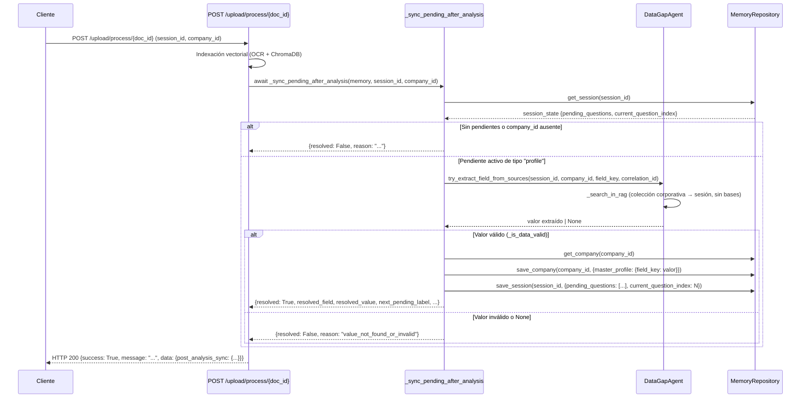

# Diseño Técnico: Auto-Resolve Pending on Upload

## Visión General

El **AutoResolveHook** (`_sync_pending_after_analysis`) es el mecanismo central de esta feature. Ya existe en `backend/app/api/v1/routes/upload.py` y cubre el camino feliz. Este diseño formaliza su contrato, robustece sus casos de borde y define la estrategia de pruebas con Hypothesis.

El objetivo es que al finalizar `POST /upload/process/{doc_id}`, el sistema:

1. Detecte si hay un pendiente activo de tipo `profile` en la sesión.
2. Intente extraer el valor del campo desde el documento recién indexado vía `DataGapAgent.try_extract_field_from_sources`.
3. Si lo encuentra y es válido, lo persista en `master_profile`, avance la cola de pendientes y notifique al usuario con un mensaje contextual.
4. Si no lo encuentra, retorne HTTP 200 con un mensaje que invite al usuario a escribirlo por chat — sin bloquear ni propagar errores.



---

## Arquitectura

### Componentes involucrados

| Componente | Archivo | Rol |
|---|---|---|
| `_sync_pending_after_analysis` | `backend/app/api/v1/routes/upload.py` | AutoResolveHook — orquesta la resolución |
| `process_document` | `backend/app/api/v1/routes/upload.py` | Endpoint que invoca el hook y construye la respuesta |
| `DataGapAgent` | `backend/app/agents/data_gap.py` | Extrae el valor del campo desde el RAG |
| `ChatbotRAGAgent._apply_saved_pending_value` | `backend/app/agents/chatbot_rag.py` | Referencia de lógica de avance de cola (debe ser idéntica) |
| `MemoryRepository` | `backend/app/repositories/memory.py` | Persistencia de sesión y perfil de empresa |
| `VectorDbServiceClient` | `backend/app/services/vector_db.py` | Búsqueda semántica en ChromaDB |

### Principio de diseño: separación de responsabilidades

El hook **no** construye mensajes de usuario — eso es responsabilidad del endpoint `process_document`. El hook solo retorna un dict estructurado (`AutoResolveResult`) y el endpoint decide el mensaje según el resultado. Esto facilita el testing unitario del hook de forma aislada.

---

## Componentes e Interfaces

### Contrato de retorno del AutoResolveHook

```python
class AutoResolveResult(TypedDict):
    resolved_current_pending: bool      # True si se resolvió y persistió exitosamente
    resolved_field: Optional[str]       # field_key resuelto (None si no se resolvió)
    resolved_value: Optional[str]       # Valor persistido (None si no se resolvió)
    next_pending_label: Optional[str]   # Label del siguiente pendiente (None si no hay más)
    next_pending_question: Optional[str] # Pregunta del siguiente pendiente (None si no hay más)
    reason: str                         # Razón del resultado (ver tabla de razones)
```

### Tabla de razones (`reason`)

| Valor | Condición |
|---|---|
| `"missing_company_id"` | `company_id` es `None` o vacío |
| `"no_pending_questions"` | `pending_questions` vacío o ausente en `session_state` |
| `"current_pending_not_profile"` | El pendiente activo tiene `type != "profile"` |
| `"missing_field_key"` | El pendiente activo tiene `field` vacío o nulo |
| `"value_not_found_or_invalid"` | `DataGapAgent` retornó `None` o el valor no pasó `_is_data_valid` |
| `"persistence_error"` | `memory.save_company` o `memory.save_session` lanzó excepción |
| `"timeout"` | `DataGapAgent.try_extract_field_from_sources` tardó más de 30 segundos |
| `"resolved_and_advanced"` | Resolución exitosa — pendiente eliminado y cola avanzada |

### Firma robustecida del hook

```python
async def _sync_pending_after_analysis(
    memory: Any,
    session_id: str,
    company_id: Optional[str],
    *,
    correlation_id: str = "",
    timeout_seconds: float = 30.0,
) -> AutoResolveResult:
    ...
```

Los parámetros `correlation_id` y `timeout_seconds` son nuevos respecto a la implementación actual. `correlation_id` se propaga a `DataGapAgent` para trazabilidad. `timeout_seconds` permite controlar el timeout de extracción.

### Lógica de avance de cola (idéntica a `ChatbotRAGAgent._apply_saved_pending_value`)

```python
# Leer estado fresco (atomicidad)
fresh_s = await memory.get_session(session_id) or {}
fresh_pending = list(fresh_s.get("pending_questions") or [])
safe_idx = max(0, min(int(fresh_s.get("current_question_index") or 0), max(0, len(fresh_pending) - 1)))

# Eliminar por posición (no por índice ciego +1)
new_pending = fresh_pending[:safe_idx] + fresh_pending[safe_idx + 1:]

# Recalcular índice
new_idx = max(0, min(safe_idx, len(new_pending) - 1)) if new_pending else 0

fresh_s["pending_questions"] = new_pending
fresh_s["current_question_index"] = new_idx
await memory.save_session(session_id, fresh_s)
```

**Decisión de diseño:** se usa `fresh_s = await memory.get_session(session_id)` justo antes de modificar `session_state` (no el objeto leído al inicio del hook) para minimizar la ventana de condición de carrera con el `ChatbotRAGAgent`.

---

## Modelos de Datos

### `session_state` (campos relevantes)

```python
{
    "pending_questions": [
        {
            "field": str,           # Clave en master_profile (e.g., "razon_social")
            "label": str,           # Etiqueta legible (e.g., "Razón Social")
            "question": str,        # Pregunta al usuario
            "document_hint": str,   # Hint de documento esperado
            "type": str,            # "profile" | "economic_price" | ...
        }
    ],
    "current_question_index": int,  # Índice del pendiente activo
}
```

### `master_profile` (campo en modelo `Company`)

```python
{
    "razon_social": str,
    "rfc": str,
    "cedula_representante": str,
    # ... otros campos del perfil
}
```

El hook actualiza **un solo campo** por ejecución, preservando todos los demás.

---

## Mensajes de Respuesta al Usuario

El endpoint `process_document` construye el mensaje según el resultado del hook:

### Caso 1: Resuelto con siguiente pendiente

```
"He revisado el archivo **{filename}** y ya pude extraer **{field_label}**. 
¡Listo! Ahora, para seguir avanzando, necesito: **{next_label}**."
```

Condición: `sync["resolved_current_pending"] == True` y `sync["next_pending_label"]` no vacío.

### Caso 2: Resuelto sin más pendientes

```
"He revisado el archivo **{filename}** y ya pude extraer **{field_label}**. 
¡Listo! Ya no hay pendientes en cola por este bloque."
```

Condición: `sync["resolved_current_pending"] == True` y `sync["next_pending_label"]` vacío o `None`.

### Caso 3: No encontrado

```
"Reprocesé el archivo **{filename}**, pero aún no encuentro **{pending_label}** con claridad. 
¿Podrías escribírmelo aquí?"
```

Condición: `sync["reason"] == "value_not_found_or_invalid"`. El `pending_label` se toma de `sync["next_pending_label"]` (que en este caso contiene el label del pendiente activo no resuelto, ya que el hook lo rellena antes de intentar la extracción).

### Caso 4: Sin pendientes o sin company_id

Mensaje estándar de confirmación de análisis sin mencionar pendientes:

```
"Documento '{filename}' analizado con éxito."
```

---

## Propiedades de Corrección

*Una propiedad es una característica o comportamiento que debe mantenerse verdadero en todas las ejecuciones válidas del sistema — esencialmente, una declaración formal sobre lo que el sistema debe hacer. Las propiedades sirven como puente entre especificaciones legibles por humanos y garantías de corrección verificables por máquina.*

### Propiedad 1: Ausencia de company_id siempre retorna missing_company_id

*Para cualquier* `session_state` con `pending_questions` arbitrarias (incluyendo listas no vacías con pendientes de tipo `"profile"`), invocar el hook con `company_id=None` o `company_id=""` debe retornar `resolved_current_pending=False` y `reason="missing_company_id"`, sin modificar `session_state` ni `master_profile`.

**Valida: Requisito 1.4**

---

### Propiedad 2: Sin pendientes activos siempre retorna no_pending_questions

*Para cualquier* `company_id` válido y `session_state` con `pending_questions` vacío (`[]`) o ausente (`None`), el hook debe retornar `resolved_current_pending=False` y `reason="no_pending_questions"`, sin invocar a `DataGapAgent`.

**Valida: Requisito 2.1**

---

### Propiedad 3: Tipo no-profile siempre retorna current_pending_not_profile

*Para cualquier* `session_state` con un pendiente activo cuyo `type` sea distinto de `"profile"` (incluyendo `"economic_price"`, strings arbitrarios no vacíos), el hook debe retornar `resolved_current_pending=False` y `reason="current_pending_not_profile"`, sin invocar a `DataGapAgent`.

**Valida: Requisitos 2.2, 8.4**

---

### Propiedad 4: El índice calculado siempre está en rango válido

*Para cualquier* lista de pendientes no vacía de longitud `N` y cualquier entero `current_question_index` (incluyendo negativos, cero, valores mayores que `N-1`, y `N` mismo), el índice calculado como `max(0, min(current_question_index, N - 1))` debe estar en el intervalo `[0, N-1]`.

**Valida: Requisito 2.4**

---

### Propiedad 5: Valor inválido no modifica master_profile ni session_state

*Para cualquier* `field_key`, `session_state` con pendiente activo de tipo `"profile"`, y valor retornado por `DataGapAgent` que no pase `_is_data_valid` (incluyendo `None`, strings vacíos, strings de longitud < 2, strings con `"["` o `"placeholder"`), el hook debe retornar `reason="value_not_found_or_invalid"` y `master_profile` y `session_state` deben permanecer sin cambios.

**Valida: Requisitos 3.2, 3.3**

---

### Propiedad 6: Persistencia preserva campos existentes de master_profile

*Para cualquier* `master_profile` con un conjunto arbitrario de campos `{k1: v1, k2: v2, ..., kN: vN}` y un `field_key` nuevo o existente con un valor válido, después de que el hook actualice `master_profile[field_key]`, todos los campos `ki` distintos de `field_key` deben conservar sus valores originales `vi`.

**Valida: Requisito 4.3**

---

### Propiedad 7: Avance de cola reduce la lista en exactamente un elemento

*Para cualquier* lista de pendientes `pending` de longitud `N ≥ 1` y cualquier índice válido `idx ∈ [0, N-1]`, después de resolver el pendiente en `idx`, la nueva lista `new_pending` debe tener longitud `N-1` y el nuevo índice `new_idx` debe satisfacer `new_idx == max(0, min(idx, N-2))` si `N > 1`, o `new_idx == 0` si `N == 1`.

**Valida: Requisitos 5.1, 5.2**

---

### Propiedad 8: El resultado incluye el label y question del siguiente pendiente activo

*Para cualquier* lista de pendientes `pending` con `N > 1` elementos y cualquier índice válido `idx`, después de resolver el pendiente en `idx`, `next_pending_label` y `next_pending_question` en el resultado deben corresponder exactamente al `label` y `question` del elemento en la posición `new_idx` de `new_pending`.

**Valida: Requisito 5.4**

---

### Propiedad 9: El endpoint siempre retorna HTTP 200 independientemente del reason del hook

*Para cualquier* `reason` retornado por el hook (incluyendo `"missing_company_id"`, `"no_pending_questions"`, `"current_pending_not_profile"`, `"missing_field_key"`, `"value_not_found_or_invalid"`, `"persistence_error"`, `"timeout"`, `"resolved_and_advanced"`), el endpoint debe retornar HTTP 200 con `success=True`.

**Valida: Requisito 7.2**

---

### Propiedad 10: Los mensajes de respuesta contienen los valores de contexto correctos

*Para cualquier* combinación de `filename` (string no vacío), `field_label` (string no vacío) y `next_label` (string no vacío o vacío), el mensaje generado por el endpoint debe:
- Si `next_label` no vacío: contener `filename`, `field_label` y `next_label` como substrings.
- Si `next_label` vacío: contener `filename` y `field_label` como substrings, y no contener referencias a un siguiente pendiente.
- Si `reason == "value_not_found_or_invalid"`: contener `filename` y el `pending_label` del pendiente activo como substrings.

**Valida: Requisitos 6.1, 6.2, 6.3**

---

### Propiedad 11: Idempotencia del hook

*Para cualquier* estado inicial válido de sesión y empresa donde el hook resuelve exitosamente un pendiente en la primera ejecución, ejecutar el hook una segunda vez sobre el mismo `session_id` y `company_id` debe retornar `reason="no_pending_questions"` (porque el pendiente ya fue eliminado) y `master_profile[field_key]` debe conservar el valor guardado en la primera ejecución sin ser sobreescrito.

**Valida: Requisito 7.4**

---

### Propiedad 12: Equivalencia de lógica de avance de cola con ChatbotRAGAgent

*Para cualquier* lista de pendientes `pending` de longitud `N ≥ 1` y cualquier índice `idx ∈ [0, N-1]`, la operación `pending[:idx] + pending[idx+1:]` seguida de `max(0, min(idx, len(result)-1))` debe producir el mismo resultado tanto en el hook como en `ChatbotRAGAgent._apply_saved_pending_value`.

**Valida: Requisito 8.2**

---

## Manejo de Errores

### Jerarquía de errores y respuestas

```
_sync_pending_after_analysis
├── company_id ausente → reason: "missing_company_id" (retorno temprano, sin I/O)
├── pending_questions vacío → reason: "no_pending_questions" (retorno temprano, sin I/O)
├── type != "profile" → reason: "current_pending_not_profile" (retorno temprano, sin I/O)
├── field vacío → reason: "missing_field_key" (retorno temprano, sin I/O)
├── DataGapAgent timeout → reason: "timeout" (asyncio.wait_for con timeout_seconds)
├── DataGapAgent retorna None o inválido → reason: "value_not_found_or_invalid"
├── save_company falla → reason: "persistence_error" (sin modificar session_state)
├── save_session falla → reason: "persistence_error" (master_profile ya guardado — inconsistencia aceptable)
└── Excepción no controlada → capturada en process_document → log WARNING + respuesta estándar
```

### Manejo de timeout

```python
import asyncio

try:
    extracted = await asyncio.wait_for(
        dg.try_extract_field_from_sources(session_id, company_id, field_key, correlation_id),
        timeout=timeout_seconds,
    )
except asyncio.TimeoutError:
    out["reason"] = "timeout"
    return out
```

### Captura de excepción no controlada en el endpoint

```python
try:
    sync = await _sync_pending_after_analysis(memory, session_id, company_id)
except Exception as exc:
    import logging
    logging.getLogger(__name__).warning(
        "[AutoResolve] ⚠️ Excepción no controlada en hook: %s", exc, exc_info=True
    )
    sync = {
        "resolved_current_pending": False,
        "resolved_field": None,
        "resolved_value": None,
        "next_pending_label": None,
        "next_pending_question": None,
        "reason": "hook_exception",
    }
```

### Log de auditoría en resolución exitosa

```python
import logging
logger = logging.getLogger(__name__)

# Al resolver exitosamente:
logger.info(
    "[AutoResolve] ✅ Resuelto '%s' = '%s' para sesión %s",
    field_key,
    str(extracted)[:40],
    session_id,
)
```

---

## Estrategia de Pruebas

### Enfoque dual

Las pruebas se organizan en dos capas complementarias:

- **Pruebas unitarias con mocks**: verifican comportamientos específicos, flujos de control y manejo de errores.
- **Pruebas basadas en propiedades con Hypothesis**: verifican invariantes universales sobre el espacio de inputs.

### Biblioteca de PBT

Se usa **Hypothesis** (ya presente en el proyecto, evidenciado por `backend/.hypothesis/`). Configuración mínima: 100 iteraciones por propiedad (`@settings(max_examples=100)`).

### Estructura de archivos de prueba

```
backend/tests/
├── unit/
│   └── test_auto_resolve_hook.py       # Pruebas unitarias del hook
├── property/
│   └── test_auto_resolve_properties.py # Pruebas de propiedades con Hypothesis
└── integration/
    └── test_auto_resolve_integration.py # Pruebas de integración (wiring)
```

### Pruebas de propiedades con Hypothesis

Cada prueba de propiedad referencia su propiedad de diseño con el tag:
`Feature: auto-resolve-pending-on-upload, Property N: <texto>`

#### Propiedad 1 — Ausencia de company_id

```python
from hypothesis import given, settings
from hypothesis import strategies as st

@given(
    session_state=st.fixed_dictionaries({
        "pending_questions": st.lists(
            st.fixed_dictionaries({
                "field": st.text(min_size=1),
                "label": st.text(min_size=1),
                "question": st.text(),
                "type": st.just("profile"),
            }),
            min_size=1,
        ),
        "current_question_index": st.integers(min_value=0, max_value=10),
    }),
    company_id=st.one_of(st.none(), st.just(""), st.just("   ")),
)
@settings(max_examples=100)
async def test_missing_company_id_always_returns_early(session_state, company_id):
    """Feature: auto-resolve-pending-on-upload, Property 1: Ausencia de company_id siempre retorna missing_company_id"""
    memory = MockMemory(session_state=session_state)
    result = await _sync_pending_after_analysis(memory, "test-session", company_id)
    assert result["resolved_current_pending"] is False
    assert result["reason"] == "missing_company_id"
    assert memory.save_company_called is False
    assert memory.save_session_called is False
```

#### Propiedad 4 — Índice siempre en rango

```python
@given(
    pending_length=st.integers(min_value=1, max_value=50),
    raw_index=st.integers(min_value=-100, max_value=100),
)
@settings(max_examples=200)
def test_index_always_in_range(pending_length, raw_index):
    """Feature: auto-resolve-pending-on-upload, Property 4: El índice calculado siempre está en rango válido"""
    safe_idx = max(0, min(raw_index, pending_length - 1))
    assert 0 <= safe_idx <= pending_length - 1
```

#### Propiedad 6 — Persistencia preserva campos existentes

```python
@given(
    existing_profile=st.dictionaries(
        keys=st.text(min_size=1, max_size=30, alphabet=st.characters(whitelist_categories=("Ll", "Lu", "Nd"), whitelist_characters="_")),
        values=st.text(min_size=1, max_size=100),
        min_size=0,
        max_size=10,
    ),
    new_field=st.text(min_size=1, max_size=30),
    new_value=st.text(min_size=2, max_size=100),
)
@settings(max_examples=100)
def test_profile_update_preserves_existing_fields(existing_profile, new_field, new_value):
    """Feature: auto-resolve-pending-on-upload, Property 6: Persistencia preserva campos existentes de master_profile"""
    updated = dict(existing_profile)
    updated[new_field] = new_value
    for k, v in existing_profile.items():
        if k != new_field:
            assert updated[k] == v
```

#### Propiedad 7 — Avance de cola reduce la lista en exactamente un elemento

```python
@given(
    pending=st.lists(
        st.fixed_dictionaries({
            "field": st.text(min_size=1),
            "label": st.text(min_size=1),
            "question": st.text(),
            "type": st.just("profile"),
        }),
        min_size=1,
        max_size=20,
    ),
    raw_idx=st.integers(min_value=0, max_value=19),
)
@settings(max_examples=200)
def test_queue_advance_reduces_by_one(pending, raw_idx):
    """Feature: auto-resolve-pending-on-upload, Property 7: Avance de cola reduce la lista en exactamente un elemento"""
    idx = max(0, min(raw_idx, len(pending) - 1))
    new_pending = pending[:idx] + pending[idx + 1:]
    assert len(new_pending) == len(pending) - 1
    if new_pending:
        new_idx = max(0, min(idx, len(new_pending) - 1))
        assert 0 <= new_idx <= len(new_pending) - 1
    else:
        new_idx = 0
        assert new_idx == 0
```

#### Propiedad 11 — Idempotencia

```python
@given(
    field_key=st.sampled_from(["razon_social", "rfc", "telefono", "email"]),
    extracted_value=st.text(min_size=3, max_size=50).filter(lambda v: "[" not in v and "placeholder" not in v),
)
@settings(max_examples=100)
async def test_hook_idempotent(field_key, extracted_value):
    """Feature: auto-resolve-pending-on-upload, Property 11: Idempotencia del hook"""
    session_state = {
        "pending_questions": [{"field": field_key, "label": "Campo", "question": "?", "type": "profile"}],
        "current_question_index": 0,
    }
    memory = MockMemory(session_state=session_state, company={"master_profile": {}})
    dga_mock = MockDataGapAgent(returns=extracted_value)

    # Primera ejecución — debe resolver
    result1 = await _sync_pending_after_analysis(memory, "s1", "c1", dga_override=dga_mock)
    assert result1["resolved_current_pending"] is True
    assert memory.company["master_profile"][field_key] == extracted_value

    # Segunda ejecución — pending_questions ya está vacío
    result2 = await _sync_pending_after_analysis(memory, "s1", "c1", dga_override=dga_mock)
    assert result2["resolved_current_pending"] is False
    assert result2["reason"] == "no_pending_questions"
    # El valor no fue sobreescrito
    assert memory.company["master_profile"][field_key] == extracted_value
```

### Pruebas unitarias clave

| Test | Verifica |
|---|---|
| `test_no_pending_returns_early` | `reason="no_pending_questions"` cuando lista vacía |
| `test_non_profile_type_skipped` | `reason="current_pending_not_profile"` para `type="economic_price"` |
| `test_empty_field_key_skipped` | `reason="missing_field_key"` para `field=""` |
| `test_invalid_value_not_persisted` | `master_profile` sin cambios cuando `_is_data_valid` retorna `False` |
| `test_persistence_error_no_session_advance` | `reason="persistence_error"` cuando `save_company` falla |
| `test_timeout_returns_gracefully` | `reason="timeout"` cuando `DataGapAgent` supera 30s |
| `test_exception_caught_by_endpoint` | Endpoint retorna HTTP 200 cuando el hook lanza excepción |
| `test_audit_log_on_success` | Log contiene `[AutoResolve] ✅` con `field_key` y `session_id` |
| `test_message_format_resolved_with_next` | Mensaje contiene `filename`, `field_label` y `next_label` |
| `test_message_format_resolved_no_next` | Mensaje contiene `filename` y `field_label`, sin referencia a siguiente |
| `test_message_format_not_found` | Mensaje contiene `filename` y `pending_label` |

### Pruebas de integración

| Test | Verifica |
|---|---|
| `test_hook_called_after_successful_indexing` | `_sync_pending_after_analysis` se invoca tras indexación exitosa |
| `test_hook_called_on_already_analyzed_doc` | Hook se invoca en el path `ANALYZED` sin `force` |
| `test_hook_not_called_on_indexing_error` | Hook no se invoca cuando la indexación falla con 4xx/5xx |
| `test_data_gap_agent_receives_correct_params` | `try_extract_field_from_sources` recibe `session_id`, `company_id`, `field_key`, `correlation_id` |
| `test_get_company_called_before_save` | `get_company` se llama antes de `save_company` |
| `test_session_state_atomic_update` | `get_session` → modificar → `save_session` en una sola operación |
| `test_chatbot_agent_sees_resolved_pending` | `ChatbotRAGAgent` no intenta guardar el dato ya resuelto en el siguiente turno |
