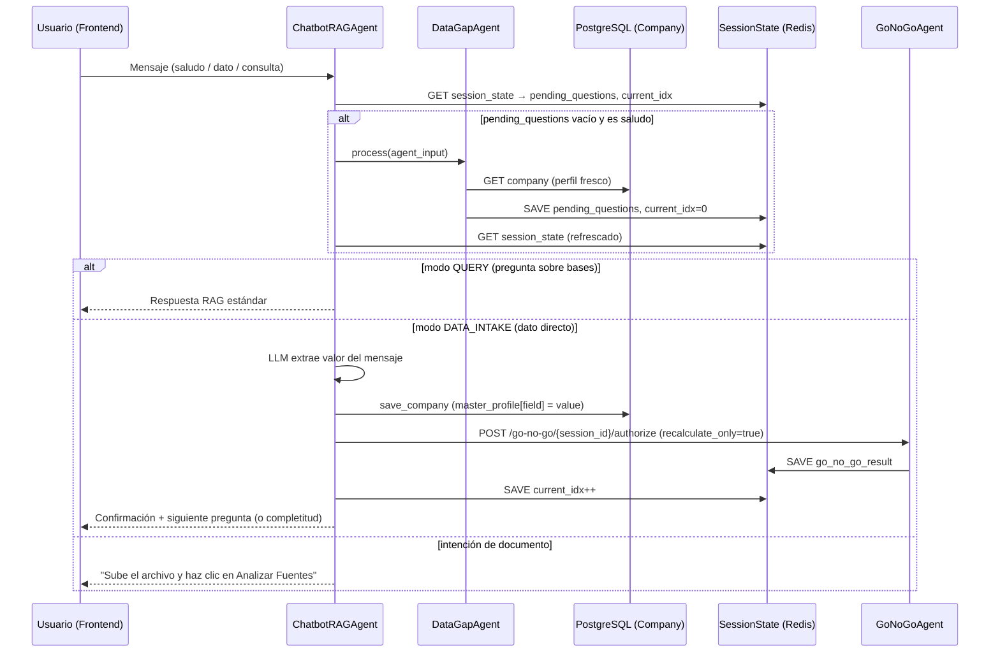

# Diseño Técnico: Recolección Inteligente de Datos vía Chatbot

## Overview

Esta feature extiende el `ChatbotRAGAgent` existente para convertirlo en un recolector proactivo y estructurado de datos faltantes del `master_profile`. El flujo se activa cuando el `DataGapAgent` detecta brechas y las almacena como `pending_questions` en `session_state`. El chatbot formula cada pregunta de forma conversacional, acepta respuestas directas o indicaciones de documento, persiste cada dato capturado, y recalcula el semáforo Go/No-Go tras cada guardado — todo sin interrumpir el pipeline existente.

**Infraestructura reutilizada (sin modificar su contrato):**
- `ChatbotRAGAgent` — modos QUERY / DATA_INTAKE / META / PENDING ya existentes
- `DataGapAgent` — detección de brechas y auto-extracción desde RAG
- `GoNoGoAgent` + endpoint `POST /go-no-go/{session_id}/authorize` con `recalculate_only: true`
- `MCPContextManager.memory.save_company` — persistencia del perfil maestro
- `GoNoGoPanel` — panel frontend con recálculo inline ya implementado

---

## Architecture

El flujo de recolección sigue un ciclo de tres pasos que se repite por cada `pending_question`:



**Decisión de diseño clave:** El recálculo del semáforo se invoca directamente desde `_handle_data_intake` del `ChatbotRAGAgent`, inmediatamente después de `_save_field_to_company`. Esto mantiene la lógica de recálculo en un único lugar (el endpoint existente) y evita duplicar el scoring.

---

## Components and Interfaces

### ChatbotRAGAgent — cambios mínimos

**`_handle_data_intake`** (extensión):
```python
async def _handle_data_intake(self, session_id, user_input, company_id,
                               pending, current_idx, session_state, correlation_id) -> AgentOutput:
    # ... lógica existente de extracción y guardado ...
    
    # NUEVO: Recálculo del semáforo tras guardado exitoso
    if saved:
        prev_semaforo = session_state.get("go_no_go_result", {}).get("semaforo")
        new_gng = await self._recalculate_semaforo(session_id, company_id)
        new_semaforo = new_gng.get("semaforo") if new_gng else None
        semaforo_change_msg = self._build_semaforo_change_msg(prev_semaforo, new_semaforo)
    
    # NUEVO: Incluir notificación de cambio de semáforo en la respuesta
    resp = f"✅ **{field_label}** guardado como `{extracted_value}`.\n\n{semaforo_change_msg}\n\n{next_question_or_completion}"
```

**`_recalculate_semaforo`** (método nuevo):
```python
async def _recalculate_semaforo(self, session_id: str, company_id: str) -> Optional[dict]:
    """Invoca GoNoGoAgent con recalculate_only=True y persiste el resultado en session_state."""
    try:
        from app.agents.go_no_go import GoNoGoAgent
        from app.contracts.agent_contracts import AgentInput
        agent_input = AgentInput(session_id=session_id, company_id=company_id, company_data={})
        result = await GoNoGoAgent(self.context_manager).process(agent_input)
        gng_data = result.data if hasattr(result, "data") else {}
        session_state = await self.context_manager.memory.get_session(session_id) or {}
        session_state["go_no_go_result"] = gng_data
        await self.context_manager.memory.save_session(session_id, session_state)
        return gng_data
    except Exception as e:
        logger.error("chatbot_semaforo_recalc_error", session_id=session_id, error=str(e))
        return None
```

**`_build_semaforo_change_msg`** (método nuevo):
```python
@staticmethod
def _build_semaforo_change_msg(prev: Optional[str], new: Optional[str]) -> str:
    if not prev or not new or prev == new:
        return ""
    icons = {"RED": "🔴", "YELLOW": "🟡", "GREEN": "🟢"}
    return f"🎯 **Semáforo actualizado:** {icons.get(prev, prev)} → {icons.get(new, new)}"
```

### DataGapAgent — sin cambios de contrato

El `DataGapAgent` ya implementa:
- `_search_in_rag` — búsqueda en vectores corporativos y de sesión
- `_filename_looks_like_bases` — filtro de documentos de convocatoria
- `_persist_profile_updates` — persistencia de campos auto-extraídos
- `_save_pending_questions` — guardado de `pending_questions` en `session_state`

No se requieren cambios en su interfaz pública.

### GoNoGoPanel (Frontend) — sin cambios

El panel ya implementa el flujo completo de recálculo inline (`handleSaveField` → `recalculate_only: true` → `setLocalResult`). El chatbot actualiza `session_state.go_no_go_result` en Redis; el frontend lo refleja en el próximo render del panel (que lee `goNoGoResult` desde el estado de `App.jsx`).

**Sincronización frontend:** Cuando el chatbot guarda un dato y recalcula el semáforo, el nuevo `go_no_go_result` queda en `session_state`. El `GoNoGoPanel` se actualiza en tiempo real porque `App.jsx` pasa `goNoGoResult` como prop reactiva. Para que el panel refleje el cambio sin recargar, el endpoint del chatbot debe devolver el nuevo `go_no_go_result` en su respuesta:

```json
{
  "reply": "✅ RFC guardado...",
  "go_no_go_result": { "semaforo": "GREEN", "brechas": [] }
}
```

El frontend en `App.jsx` actualiza `setGoNoGoResult` al recibir este campo en la respuesta del chatbot.

### Endpoint `/chatbot/ask` — extensión de respuesta

```python
# En el handler del endpoint chatbot/ask
response_data = {
    "reply": agent_output.data.get("respuesta", ""),
    "citas": agent_output.data.get("citas", []),
    "tipo": agent_output.data.get("tipo", "info"),
}

# NUEVO: Incluir go_no_go_result si fue recalculado en este turno
session_state = await memory.get_session(session_id)
if session_state.get("go_no_go_result"):
    response_data["go_no_go_result"] = session_state["go_no_go_result"]

return response_data
```

---

## Data Models

### session_state (Redis) — campos relevantes

```python
{
    "pending_questions": [          # Lista de brechas pendientes (fuente de verdad)
        {
            "field": "rfc",
            "label": "RFC de la empresa",
            "question": "¿Cuál es el RFC oficial de Empresa SA?",
            "document_hint": "Cédula de Identificación Fiscal (CIF)",
            "type": "profile"       # "profile" | "economic_price"
        }
    ],
    "current_question_index": 0,    # Índice de la pregunta activa
    "go_no_go_result": {            # Último resultado del semáforo
        "semaforo": "YELLOW",
        "brechas": [...],
        "total_brechas": 3,
        "score_cumplimiento_tecnico": 65
    }
}
```

### Company.master_profile (PostgreSQL) — campos capturados por chatbot

```python
{
    "rfc": "ABC123456XYZ",
    "razon_social": "Empresa SA de CV",
    "representante_legal": "Juan Pérez",
    "domicilio_fiscal": "Calle 123, Col. Centro, CDMX",
    "telefono": "55 1234 5678",
    "email": "contacto@empresa.com",
    "web": "www.empresa.com",
    "anos_experiencia": "10",
    "numero_empleados": "50"
}
```

### Company.catalog (PostgreSQL) — precios capturados por chatbot

```python
[
    {
        "id": "precio_limpieza_hospital",
        "description": "Limpieza Hospital",
        "price_base": 150.50,
        "currency": "MXN",
        "source": "chatbot_intake"
    }
]
```

---

## Correctness Properties

*Una propiedad es una característica o comportamiento que debe mantenerse verdadero en todas las ejecuciones válidas del sistema — esencialmente, una declaración formal sobre lo que el sistema debe hacer. Las propiedades sirven como puente entre las especificaciones legibles por humanos y las garantías de corrección verificables por máquina.*

### Property 1: Inicio proactivo con preguntas pendientes

*Para cualquier* sesión con una lista no vacía de `pending_questions` y cualquier mensaje de saludo del usuario, la respuesta del `ChatbotRAGAgent` debe contener el texto de la primera pregunta pendiente (`pending_questions[0].question`).

**Validates: Requirements 1.1, 1.3**

---

### Property 2: Formulación completa de preguntas (pregunta + hint)

*Para cualquier* `pending_question` con cualquier `question` y `document_hint`, cuando el `ChatbotRAGAgent` formula esa pregunta, la respuesta debe contener tanto el texto de la pregunta como el `document_hint`.

**Validates: Requirements 2.1, 2.2**

---

### Property 3: Preservación del master_profile al actualizar un campo

*Para cualquier* `master_profile` con cualquier conjunto de campos existentes, cuando el `ChatbotRAGAgent` actualiza un campo individual mediante `_save_field_to_company`, todos los campos preexistentes deben permanecer intactos en el perfil guardado.

**Validates: Requirements 5.2**

---

### Property 4: Avance secuencial del índice tras guardado exitoso

*Para cualquier* lista de `pending_questions` de longitud N y cualquier `current_question_index` i < N, después de un guardado exitoso de un dato, `current_question_index` debe ser i+1 y la respuesta debe contener la pregunta en el índice i+1 (o el mensaje de completitud si i+1 == N).

**Validates: Requirements 7.1, 2.3**

---

### Property 5: Recálculo del semáforo tras cada guardado

*Para cualquier* dato guardado exitosamente en `master_profile`, el `ChatbotRAGAgent` debe invocar `GoNoGoAgent.process` con el `session_id` y `company_id` correspondientes, y el resultado debe persistirse en `session_state.go_no_go_result`.

**Validates: Requirements 6.1, 6.2**

---

### Property 6: Notificación de cambio de estado del semáforo

*Para cualquier* par de estados de semáforo (anterior, nuevo) donde anterior ≠ nuevo, la respuesta del `ChatbotRAGAgent` tras el guardado debe contener una mención explícita del cambio de estado.

**Validates: Requirements 6.3**

---

### Property 7: Filtrado de documentos de bases/convocatoria

*Para cualquier* lista de nombres de archivos que incluya al menos un nombre con palabras clave de bases/convocatoria (`bases`, `convocatoria`, `pliego`, `licitacion`), el método `_filename_looks_like_bases` debe retornar `True` para esos archivos y `False` para los demás.

**Validates: Requirements 4.4**

---

### Property 8: Listado completo de pendientes ante intención de aclaración

*Para cualquier* lista de `pending_questions` de longitud N ≥ 1, cuando el usuario envía un mensaje que activa `_evaluate_clarification_intent`, la respuesta debe contener el `label` de cada una de las N preguntas pendientes.

**Validates: Requirements 2.4**

---

### Property 9: Persistencia de precios en catálogo (no en master_profile)

*Para cualquier* `pending_question` de tipo `economic_price` y cualquier valor numérico válido proporcionado por el usuario, el valor debe guardarse en `company.catalog` y no debe modificar ningún campo de `company.master_profile`.

**Validates: Requirements 3.6**

---

### Property 10: Perfil fresco desde BD (no desde frontend)

*Para cualquier* `AgentInput` donde `company_data.master_profile` difiera del perfil almacenado en la BD para el mismo `company_id`, el `DataGapAgent` debe evaluar brechas usando el perfil de la BD, ignorando el `company_data` del input.

**Validates: Requirements 5.4**

---

## Error Handling

| Escenario | Comportamiento | Impacto en flujo |
|-----------|---------------|-----------------|
| `DataGapAgent` falla al conectar a BD en inicio proactivo | Respuesta de bienvenida genérica sin brechas | No bloquea conversación |
| LLM retorna `AMBIGUO` al extraer valor | Solicitar reformulación al usuario | `current_question_index` no avanza |
| `save_company` falla por error de BD | Notificar al usuario, no avanzar índice | Usuario puede reintentar |
| `GoNoGoAgent` falla durante recálculo | Log del error, continuar flujo conversacional | Semáforo no se actualiza en este turno |
| `company_id` ausente en contexto | Solicitar al usuario que seleccione empresa | No se intenta guardar ningún dato |
| Extracción RAG retorna `None` para un campo | Campo permanece en `pending_questions` | DataGapAgent lo vuelve a preguntar |

**Principio de resiliencia:** Ningún fallo en el recálculo del semáforo o en la extracción RAG debe interrumpir el flujo conversacional. Los errores se registran en el log estructurado (`logger.error`) pero no se propagan al usuario como excepciones.

---

## Testing Strategy

### Enfoque dual: tests unitarios + property-based tests

La feature involucra lógica de transformación de datos (extracción LLM, interpolación de preguntas, filtrado de fuentes) y gestión de estado (índice de preguntas, persistencia de perfil) que son ideales para property-based testing. Se usa **Hypothesis** (Python) como librería de PBT.

**Librería PBT:** `hypothesis` (Python) — mínimo 100 iteraciones por propiedad.

**Tag format:** `# Feature: chatbot-data-collection, Property {N}: {descripción}`

### Tests unitarios (ejemplos y edge cases)

- Clasificación de mensajes: QUERY vs DATA_INTAKE vs META
- Intención de aclaración (`_evaluate_clarification_intent`) con patrones conocidos
- Manejo de `AMBIGUO` en extracción de valor
- Flujo de finalización cuando `current_question_index` alcanza el total
- Respuesta cuando `company_id` está ausente
- Respuesta cuando `DataGapAgent` lanza excepción
- Respuesta cuando `save_company` lanza excepción
- Respuesta cuando el usuario indica que subirá un documento

### Tests de propiedades (Hypothesis)

Cada propiedad del diseño se implementa como un test de Hypothesis:

```python
# Feature: chatbot-data-collection, Property 1: Inicio proactivo con preguntas pendientes
@given(
    pending=st.lists(pending_question_strategy(), min_size=1, max_size=10),
    greeting=st.sampled_from(["hola", "buenos días", "hey", "qué tal"])
)
@settings(max_examples=100)
async def test_proactive_start_with_pending(pending, greeting):
    session_state = {"pending_questions": pending, "current_question_index": 0}
    response = await chatbot.process(build_input(query=greeting, session_state=session_state))
    assert pending[0]["question"] in response.data["respuesta"]
```

```python
# Feature: chatbot-data-collection, Property 3: Preservación del master_profile
@given(
    profile=st.dictionaries(st.text(min_size=1), st.text(min_size=1), min_size=1, max_size=10),
    new_field=st.text(min_size=1),
    new_value=st.text(min_size=1)
)
@settings(max_examples=100)
async def test_profile_preservation(profile, new_field, new_value):
    await save_field_to_company(company_id, new_field, new_value, existing_profile=profile)
    saved = await get_company(company_id)
    for key, val in profile.items():
        assert saved["master_profile"][key] == val
```

```python
# Feature: chatbot-data-collection, Property 7: Filtrado de documentos de bases
@given(
    filename=st.one_of(
        st.from_regex(r"(bases|convocatoria|pliego|licitacion).*\.pdf", fullmatch=True),
        st.from_regex(r"[a-z]{3,20}\.pdf", fullmatch=True)
    )
)
@settings(max_examples=200)
def test_bases_filename_filter(filename):
    keywords = ["bases", "convocatoria", "pliego", "licitacion"]
    expected = any(k in filename.lower() for k in keywords)
    assert DataGapAgent._filename_looks_like_bases(filename) == expected
```

### Tests de integración

- Flujo completo: saludo → DataGapAgent detecta brechas → chatbot formula pregunta → usuario responde → dato guardado → semáforo recalculado
- Verificar que `GoNoGoPanel` refleja el nuevo `go_no_go_result` tras la respuesta del chatbot
- Verificar que `pending_questions` se vacía correctamente al completar todas las preguntas
