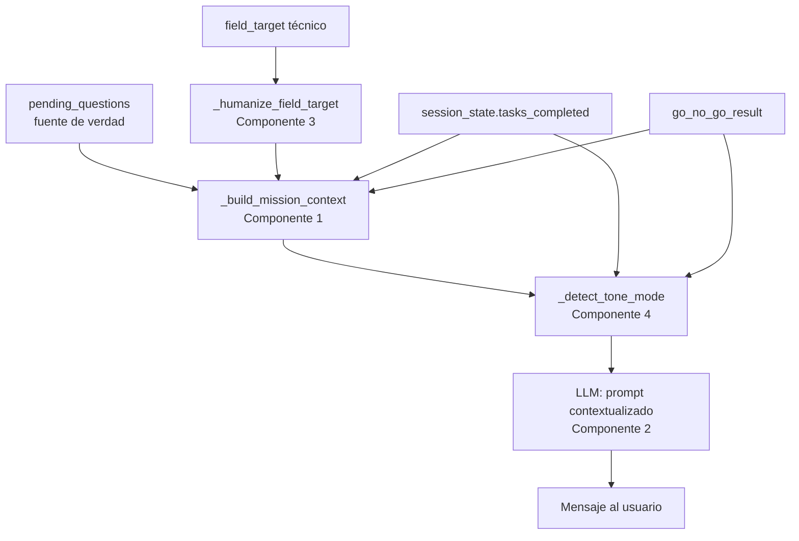
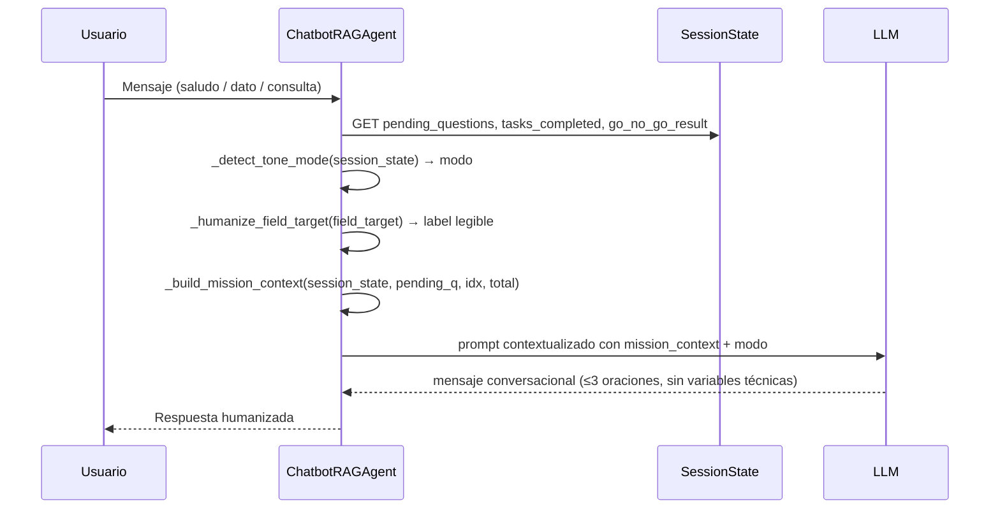

# Documento de Diseño: conversational-mission-engine

## Visión General

El `ChatbotRAGAgent` actual opera como un cuestionario secuencial disfrazado de chat: toma la lista `pending_questions`, formula cada pregunta en orden FIFO usando el campo `question` directamente, y espera respuestas. El resultado son tres síntomas concretos: (1) variables técnicas visibles en el chat (`condiciones_contractuales.penalizaciones`), (2) tono invariante que no reconoce logros como la generación de documentos, y (3) preguntas descontextualizadas que no conectan el dato solicitado con su impacto en la propuesta específica.

Este diseño introduce cinco componentes quirúrgicos en `chatbot_rag.py` que convierten el cuestionario en un motor conversacional con misión activa: cada pregunta se formula con contexto de misión, el tono se adapta al estado de la sesión, los `field_targets` técnicos se traducen a labels legibles, y el mensaje post-generación celebra el logro en lugar de generar ansiedad.

**Restricciones de diseño:**
- Todos los cambios son en `backend/app/agents/chatbot_rag.py` únicamente.
- El `IntakePlannerAgent` y el flujo de `pending_questions` como fuente de verdad no se modifican.
- Sin cambios en el frontend ni en la arquitectura de persistencia en `master_profile`.
- La generación de documentos sin datos completos se mantiene (decisión de producto).

---

## Arquitectura

El motor conversacional se inserta como una capa de presentación entre la cola `pending_questions` (fuente de verdad sin cambios) y el mensaje que ve el usuario. No modifica el estado de la sesión ni el flujo de persistencia.





---

## Componentes e Interfaces

### Componente 1: `_build_mission_context`

Método nuevo en `ChatbotRAGAgent`. Construye el diccionario de contexto de misión antes de formular cada pregunta. Es el único punto donde se agrega semántica de negocio a la pregunta técnica.

```python
def _build_mission_context(
    self,
    session_state: Dict[str, Any],
    pending_question: Dict[str, Any],
    current_idx: int,
    total: int,
) -> Dict[str, Any]:
    return {
        "dato_solicitado": pending_question.get("label", ""),
        "por_que_importa": pending_question.get("question", ""),
        "impacto": "BLOQUEANTE" if pending_question.get("is_blocking") else "complementario",
        "progreso": f"{current_idx + 1} de {total}",
        "documentos_generados": bool(session_state.get("tasks_completed")),
        "semaforo_actual": (session_state.get("go_no_go_result") or {}).get("semaforo", ""),
        "provenance_reason": (pending_question.get("provenance_ui") or {}).get("reason", ""),
    }
```

**Precondiciones:**
- `session_state` es un dict (puede estar vacío).
- `pending_question` es un dict con al menos `label` y `question`.
- `current_idx` es un entero ≥ 0.
- `total` es un entero ≥ 1.

**Postcondiciones:**
- Retorna un dict con exactamente las 7 claves definidas.
- `documentos_generados` es `True` si y solo si `session_state["tasks_completed"]` es una lista no vacía.
- `impacto` es `"BLOQUEANTE"` o `"complementario"` (nunca otro valor).
- Ningún valor del dict contiene el patrón `\w+\.\w+_\w+` (indicador de field_target técnico).

---

### Componente 2: Prompt contextualizado para formular preguntas

Reemplaza el uso directo de `conversation_normalizer.normalize_capture_message` en los puntos donde se formula la siguiente pregunta pendiente. El LLM recibe el `mission_context` y genera el mensaje conversacional.

**Puntos de integración en `chatbot_rag.py`:**
1. Bloque "Caso B: Otros pendientes" (línea ~820) — saludo/intención con pendientes activos.
2. Bloque de consulta vacía con pendientes (línea ~915) — bootstrap de sesión.
3. `_apply_saved_pending_value` → rama `if fresh_pending` (línea ~1453) — transición tras guardado.

**Prompt del sistema:**

```
Eres el asistente conversacional de LicitAI. Tu misión es ayudar a empresas a ganar licitaciones públicas en México.

Recibirás un contexto de misión con datos sobre la pregunta actual y el estado de la sesión.
Genera UN mensaje conversacional en español mexicano que:

1. Si documentos_generados=True: PRIMERO reconoce el logro con tono celebratorio (1 oración).
2. Explica brevemente por qué el dato importa para ESTA propuesta específica (usa provenance_reason si está disponible).
3. Si impacto=BLOQUEANTE: transmite urgencia sin generar ansiedad.
4. Formula la pregunta de forma directa y natural.

REGLAS ESTRICTAS:
- Máximo 3 oraciones en total.
- Tono conversacional, cálido, en español mexicano.
- NUNCA mostrar nombres de variables técnicas (field_target, question_type, solvencia_economica, condiciones_contractuales, etc.).
- NUNCA usar puntos seguidos de guiones bajos (patrón: palabra.palabra_palabra).
- El dato solicitado debe aparecer con su nombre legible, no su clave técnica.
```

**Prompt de usuario (template):**

```
Contexto de misión:
- Dato solicitado: {dato_solicitado}
- Por qué importa: {por_que_importa}
- Impacto: {impacto}
- Progreso: {progreso}
- Documentos generados: {documentos_generados}
- Semáforo actual: {semaforo_actual}
- Razón de provenance: {provenance_reason}

Genera el mensaje conversacional para solicitar este dato.
```

**Output esperado (ejemplo):**

> "Excelente, tus documentos ya están listos 🎉. Para blindar la propuesta, necesito confirmar tu capital contable — las bases exigen mínimo $2M para participar. ¿Cuánto tienes disponible actualmente?"

**Output actual (a reemplazar):**

> "Necesito condiciones_contractuales.penalizaciones. Penalizaciones contractuales: ¿La aceptas y tienes capacidad de cumplimiento?"

---

### Componente 3: `_humanize_field_target`

Método estático nuevo en `ChatbotRAGAgent`. Traduce `field_targets` técnicos a labels legibles para humanos. Se invoca antes de construir el `mission_context` para limpiar el `label` de la `pending_question`.

```python
@staticmethod
def _humanize_field_target(field_target: str) -> str:
    """
    Traduce field_targets técnicos a labels legibles para humanos.
    
    Estrategia:
    1. Buscar en el mapa de claves exactas.
    2. Si no hay match exacto, buscar por prefijo de namespace.
    3. Si no hay match de prefijo, limpiar el string técnico:
       - Eliminar prefijos de namespace (hasta el primer punto).
       - Reemplazar guiones bajos por espacios.
       - Capitalizar la primera letra.
    """
    _EXACT_MAP = {
        "condiciones_contractuales.penalizaciones": "Penalizaciones contractuales",
        "solvencia_economica.capital_contable": "Capital contable mínimo",
        "solvencia_economica.facturacion_anual": "Facturación anual",
        "solvencia_economica.patrimonio_neto": "Patrimonio neto",
        "solvencia_legal.rfc": "RFC de la empresa",
        "solvencia_legal.acta_constitutiva": "Acta constitutiva",
        "solvencia_legal.poder_notarial": "Poder notarial del representante",
        "solvencia_tecnica.anos_experiencia": "Años de experiencia",
        "solvencia_tecnica.contratos_similares": "Contratos similares previos",
        "quality.classification.review": "Revisión de clasificación documental",
        "quality.fill.review": "Validación de llenado documental",
    }
    
    _PREFIX_MAP = {
        "condiciones_contractuales.": "Condición contractual",
        "solvencia_economica.": "Solvencia económica",
        "solvencia_legal.": "Solvencia legal",
        "solvencia_tecnica.": "Solvencia técnica",
        "quality.": "Calidad documental",
        "inventory.": "Inventario documental",
    }
    
    ft = str(field_target or "").strip()
    if not ft:
        return "Dato requerido"
    
    # 1. Match exacto
    if ft in _EXACT_MAP:
        return _EXACT_MAP[ft]
    
    # 2. Match por prefijo
    for prefix, label in _PREFIX_MAP.items():
        if ft.startswith(prefix):
            suffix = ft[len(prefix):]
            readable_suffix = suffix.replace("_", " ").capitalize()
            return f"{label}: {readable_suffix}"
    
    # 3. Limpieza genérica: eliminar namespace y limpiar
    if "." in ft:
        ft = ft.split(".", 1)[1]  # Eliminar prefijo de namespace
    return ft.replace("_", " ").capitalize()
```

**Precondiciones:**
- `field_target` es un string (puede ser vacío o None).

**Postcondiciones:**
- Retorna un string no vacío.
- El resultado NUNCA contiene el patrón `\w+\.\w+` (namespace técnico).
- El resultado NUNCA contiene guiones bajos seguidos de letras minúsculas (patrón de snake_case).

---

### Componente 4: `_detect_tone_mode`

Método nuevo en `ChatbotRAGAgent`. Detecta el modo de tono apropiado según el estado de la sesión. Retorna una de cuatro constantes de modo.

```python
_TONE_MODES = {
    "modo_recoleccion_inicial",    # Primer contacto, sin documentos generados → orientador
    "modo_recoleccion_urgente",    # Datos bloqueantes pendientes → urgente pero amigable
    "modo_post_generacion",        # Documentos ya generados → celebratorio + pendientes como mejoras
    "modo_completado",             # Todos los datos capturados → felicitación + call to action
}

@staticmethod
def _detect_tone_mode(
    session_state: Dict[str, Any],
    pending_questions: List[Dict[str, Any]],
    current_idx: int,
) -> str:
    tasks_completed = list(session_state.get("tasks_completed") or [])
    has_generated_docs = any(
        str(t.get("task") or "").startswith("stage_completed:")
        for t in tasks_completed
    )
    
    if not pending_questions:
        return "modo_completado"
    
    current_q = pending_questions[current_idx] if current_idx < len(pending_questions) else {}
    is_blocking = bool(current_q.get("is_blocking"))
    
    if has_generated_docs:
        return "modo_post_generacion"
    
    if is_blocking:
        return "modo_recoleccion_urgente"
    
    return "modo_recoleccion_inicial"
```

**Tabla de modos:**

| Modo | Condición | Tono | Ejemplo de apertura |
|------|-----------|------|---------------------|
| `modo_recoleccion_inicial` | Sin docs generados, dato no bloqueante | Orientador, tranquilo | "Para armar tu propuesta, necesito..." |
| `modo_recoleccion_urgente` | Sin docs generados, dato BLOQUEANTE | Urgente pero amigable | "Este dato es clave para poder participar..." |
| `modo_post_generacion` | Docs ya generados | Celebratorio + mejora opcional | "Tus documentos están listos 🎉. Para blindar aún más..." |
| `modo_completado` | Sin pendientes | Felicitación + CTA | "¡Todo listo! Ya puedes generar tu propuesta." |

---

### Componente 5: Mensaje post-generación mejorado

Reemplaza el mensaje frío del frontend (`App.jsx`, línea ~1339) por un mensaje contextualizado. El cambio es en `chatbot_rag.py`: cuando el agente detecta `modo_post_generacion` y formula la siguiente pregunta, el mensaje incluye el reconocimiento del logro.

**Mensaje actual (frío):**
> "✅ Documentos generados. Aún quedan datos pendientes del expediente — el asistente continuará solicitándolos para completar el perfil."

**Mensaje nuevo (contextualizado, generado por el LLM con `modo_post_generacion`):**
> "Tus documentos ya están generados y listos para descargar 🎉. Para blindar aún más tu propuesta, me ayudaría confirmar [dato] — esto fortalece [razón]. ¿Lo tienes a la mano?"

El mensaje post-generación se genera vía el prompt contextualizado (Componente 2) cuando `_detect_tone_mode` retorna `"modo_post_generacion"`. El modo se pasa como parte del contexto al LLM para que ajuste el tono.

---

## Modelos de Datos

### `mission_context` (dict interno, no persistido)

```python
{
    "dato_solicitado": str,       # Label legible del dato (ya humanizado)
    "por_que_importa": str,       # Texto de la pregunta original (contexto de negocio)
    "impacto": str,               # "BLOQUEANTE" | "complementario"
    "progreso": str,              # "N de M" (ej: "3 de 7")
    "documentos_generados": bool, # True si tasks_completed tiene stage_completed
    "semaforo_actual": str,       # "RED" | "YELLOW" | "GREEN" | ""
    "provenance_reason": str,     # Razón de provenance del IntakePlannerAgent
}
```

### `tone_mode` (string, no persistido)

```python
# Una de las cuatro constantes:
"modo_recoleccion_inicial" | "modo_recoleccion_urgente" | "modo_post_generacion" | "modo_completado"
```

---

## Algoritmo Principal: Formulación de Pregunta con Misión

```pascal
PROCEDURE formular_pregunta_con_mision(session_state, pending_questions, current_idx)
  INPUT: session_state, pending_questions, current_idx
  OUTPUT: mensaje_conversacional (string)

  SEQUENCE
    pending_q ← pending_questions[current_idx]
    total ← len(pending_questions)

    // Paso 1: Humanizar el label técnico
    raw_label ← pending_q.get("label") OR pending_q.get("field_target") OR ""
    label_legible ← _humanize_field_target(raw_label)
    pending_q_humanizada ← {**pending_q, "label": label_legible}

    // Paso 2: Detectar modo de tono
    modo ← _detect_tone_mode(session_state, pending_questions, current_idx)

    // Paso 3: Construir contexto de misión
    mission_ctx ← _build_mission_context(session_state, pending_q_humanizada, current_idx, total)

    // Paso 4: Generar mensaje con LLM
    IF modo = "modo_completado" THEN
      RETURN mensaje_completado_estatico()
    END IF

    prompt ← build_mission_prompt(mission_ctx, modo)
    respuesta ← LLM.generate(prompt)

    // Paso 5: Validar que no hay variables técnicas en la respuesta
    IF contiene_variable_tecnica(respuesta) THEN
      respuesta ← fallback_humanizado(label_legible, pending_q.get("question"))
    END IF

    RETURN respuesta
  END SEQUENCE
END PROCEDURE
```

**Precondiciones:**
- `pending_questions` es una lista no vacía.
- `current_idx` es un entero en el rango `[0, len(pending_questions) - 1]`.
- `session_state` es un dict (puede estar vacío).

**Postcondiciones:**
- El mensaje retornado no contiene el patrón `\w+\.\w+_\w+` (variable técnica).
- Si `documentos_generados=True`, el mensaje contiene alguna señal de reconocimiento del logro.
- Si `impacto=BLOQUEANTE`, el mensaje contiene alguna señal de urgencia.
- El mensaje tiene máximo 3 oraciones.

**Invariante de bucle (para la cola de pending_questions):**
- En cada iteración, el label mostrado al usuario es el resultado de `_humanize_field_target`, nunca el `field_target` crudo.

---

## Propiedades de Corrección

*Una propiedad es una característica o comportamiento que debe mantenerse verdadero en todas las ejecuciones válidas del sistema. Las propiedades sirven como puente entre las especificaciones legibles por humanos y las garantías de corrección verificables por máquina.*

### Propiedad 1: El chat nunca muestra variables técnicas

*Para cualquier* `pending_question` con cualquier `field_target` (incluyendo los que contienen `.` seguido de `_`), el mensaje generado por el motor conversacional SHALL NOT contener strings que coincidan con el patrón `\w+\.\w+` (indicador de namespace técnico).

**Valida: Requisitos 1.1, 1.2, 2.1**

```python
# Feature: conversational-mission-engine, Propiedad 1
@given(
    field_target=st.from_regex(r"[a-z_]+\.[a-z_]+", fullmatch=True),
    question=st.text(min_size=1, max_size=200),
)
@settings(max_examples=200)
def test_no_technical_variables_in_output(field_target, question):
    pending_q = {"field_target": field_target, "label": field_target, "question": question}
    label = ChatbotRAGAgent._humanize_field_target(field_target)
    assert not re.search(r"\w+\.\w+", label), f"Label técnico visible: {label}"
```

---

### Propiedad 2: Reconocimiento del logro cuando hay documentos generados

*Para cualquier* `session_state` donde `tasks_completed` contiene al menos un elemento con `task` que comienza con `"stage_completed:"`, el modo detectado por `_detect_tone_mode` SHALL ser `"modo_post_generacion"`, y el mensaje generado SHALL contener al menos una de las señales de reconocimiento: `["🎉", "listos", "generados", "completados", "exitosamente"]`.

**Valida: Requisito 2.2**

```python
# Feature: conversational-mission-engine, Propiedad 2
@given(
    task_name=st.from_regex(r"stage_completed:[a-z_]+", fullmatch=True),
    pending_q=pending_question_strategy(),
)
@settings(max_examples=100)
def test_recognition_when_docs_generated(task_name, pending_q):
    session_state = {"tasks_completed": [{"task": task_name}]}
    mode = ChatbotRAGAgent._detect_tone_mode(session_state, [pending_q], 0)
    assert mode == "modo_post_generacion"
```

---

### Propiedad 3: Señal de urgencia cuando el impacto es BLOQUEANTE

*Para cualquier* `pending_question` donde `is_blocking=True` y `session_state` sin documentos generados, el modo detectado SHALL ser `"modo_recoleccion_urgente"`.

**Valida: Requisito 2.3**

```python
# Feature: conversational-mission-engine, Propiedad 3
@given(
    pending_q=pending_question_strategy().filter(lambda q: q.get("is_blocking") is True),
)
@settings(max_examples=100)
def test_urgency_mode_for_blocking(pending_q):
    session_state = {}  # Sin documentos generados
    mode = ChatbotRAGAgent._detect_tone_mode(session_state, [pending_q], 0)
    assert mode == "modo_recoleccion_urgente"
```

---

### Propiedad 4: `_humanize_field_target` nunca retorna namespace técnico

*Para cualquier* string `field_target` (incluyendo strings vacíos, con múltiples puntos, con guiones bajos), `_humanize_field_target` SHALL retornar un string que NO contenga el patrón `\w+\.\w+` (prefijo de namespace técnico).

**Valida: Requisito 1.1, 1.2**

```python
# Feature: conversational-mission-engine, Propiedad 4
@given(
    field_target=st.one_of(
        st.from_regex(r"[a-z_]+\.[a-z_]+(\.[a-z_]+)?", fullmatch=True),
        st.text(min_size=0, max_size=100),
    )
)
@settings(max_examples=300)
def test_humanize_never_returns_namespace(field_target):
    result = ChatbotRAGAgent._humanize_field_target(field_target)
    assert isinstance(result, str)
    assert len(result) > 0
    assert not re.search(r"\w+\.\w+", result), f"Namespace técnico en resultado: {result}"
```

---

## Manejo de Errores

| Escenario | Comportamiento | Impacto |
|-----------|---------------|---------|
| LLM falla al generar mensaje contextualizado | Fallback a `conversation_normalizer.normalize_capture_message` con label humanizado | Sin interrupción al usuario |
| `field_target` no reconocido en `_humanize_field_target` | Limpieza genérica: eliminar namespace + reemplazar `_` por espacios | Label legible aunque no perfecto |
| `session_state` vacío en `_build_mission_context` | Valores por defecto: `documentos_generados=False`, `semaforo_actual=""` | Modo `modo_recoleccion_inicial` |
| `_detect_tone_mode` recibe `pending_questions` vacío | Retorna `"modo_completado"` | Mensaje de felicitación + CTA |
| Respuesta del LLM contiene variable técnica (validación post-generación) | Fallback a label humanizado + pregunta original | Sin variables técnicas visibles |

**Principio de resiliencia:** El motor conversacional es una capa de presentación. Cualquier fallo en la generación del mensaje contextualizado debe degradar graciosamente al comportamiento anterior (normalize_capture_message), nunca bloquear el flujo conversacional.

---

## Estrategia de Testing

### Librería PBT: `hypothesis` (Python)

El proyecto ya usa Hypothesis (ver `.hypothesis/` en la raíz y `backend/.hypothesis/`). Todos los tests de propiedades usan `@settings(max_examples=100)` como mínimo.

### Tests unitarios

- `test_humanize_field_target_exact_match`: verificar mapeo exacto para claves conocidas.
- `test_humanize_field_target_prefix_match`: verificar mapeo por prefijo para namespaces conocidos.
- `test_humanize_field_target_generic_cleanup`: verificar limpieza genérica para claves desconocidas.
- `test_build_mission_context_with_blocking`: verificar que `impacto="BLOQUEANTE"` cuando `is_blocking=True`.
- `test_build_mission_context_docs_generated`: verificar que `documentos_generados=True` cuando `tasks_completed` tiene `stage_completed`.
- `test_detect_tone_mode_post_generacion`: verificar modo cuando hay docs generados.
- `test_detect_tone_mode_urgente`: verificar modo cuando hay dato bloqueante sin docs.
- `test_detect_tone_mode_completado`: verificar modo cuando `pending_questions` está vacío.
- `test_post_generation_message_not_cold`: verificar que el mensaje post-generación no es el texto frío original.

### Tests de propiedades (Hypothesis)

Los cuatro tests de propiedades definidos en la sección de Propiedades de Corrección, más:

- **Propiedad 5**: Para cualquier `mission_context` con `documentos_generados=False` e `impacto="complementario"`, el modo es `"modo_recoleccion_inicial"`.
- **Propiedad 6**: `_build_mission_context` siempre retorna exactamente 7 claves, independientemente del contenido de `session_state` y `pending_question`.

### Edge cases

- `field_target` vacío → `_humanize_field_target` retorna `"Dato requerido"`.
- `field_target` sin punto → se retorna limpio (sin namespace que eliminar).
- `field_target` con múltiples puntos (`a.b.c`) → se elimina solo el primer namespace.
- `session_state` con `tasks_completed=[]` (lista vacía) → `documentos_generados=False`.
- `pending_questions` con `current_idx` fuera de rango → `_detect_tone_mode` usa `{}` como `current_q`.

---

## Dependencias

- `backend/app/agents/chatbot_rag.py` — único archivo modificado.
- `backend/app/services/resilient_llm.py` — cliente LLM existente (sin cambios).
- `backend/app/services/conversation_normalizer.py` — fallback de presentación (sin cambios).
- `hypothesis` — librería PBT ya instalada en el proyecto.
