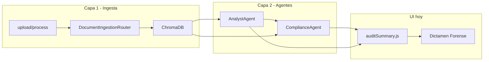
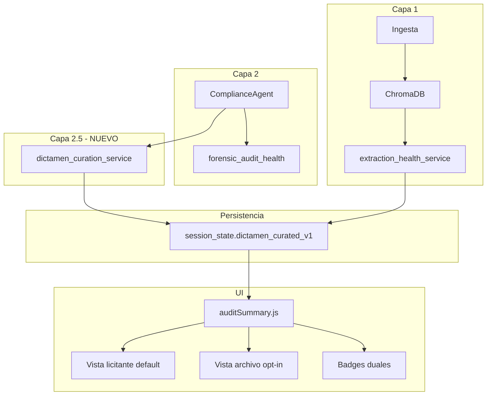
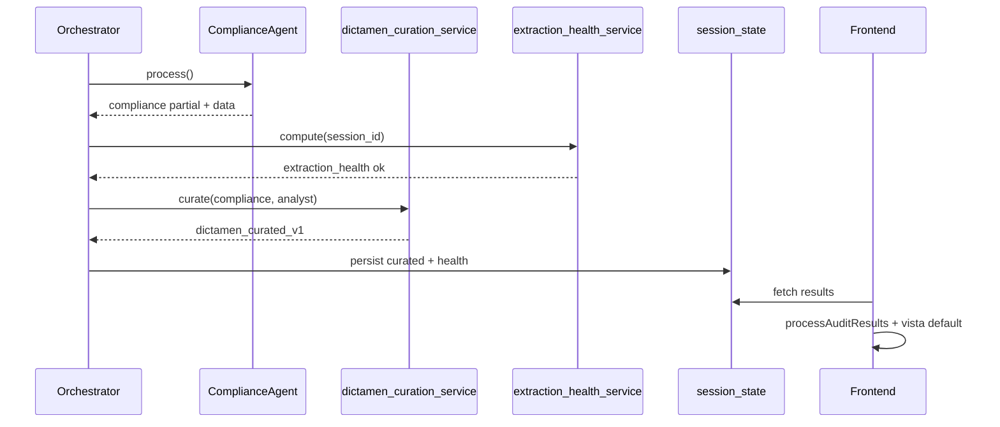

# Diseño — Curación del Dictamen Forense y salud dual

## 1. Contexto arquitectónico

### Estado actual (AS-IS)



**Problema:** `auditSummary.js` fusiona todo en `causales[]` y cuenta `totalRequisitos` sin curación. Filtros en `document_deliverable_filter.py` solo alimentan paneles downstream (Documentos detectados, writers), no el dictamen.

### Estado objetivo (TO-BE)



## 2. Componentes nuevos

### 2.1 `dictamen_curation_service.py`

**Ubicación:** `backend/app/services/dictamen_curation_service.py`

**Responsabilidad:** Transformar `compliance_master_list` + hallazgos analyst/riesgos en vista curada determinista.

**API propuesta:**

```python
def curate_dictamen_for_licitante_view(
    *,
    compliance_master_list: dict[str, Any],
    analyst_hallazgos: list[dict[str, Any]] | None = None,
    go_no_go_brechas: list[dict[str, Any]] | None = None,
) -> dict[str, Any]:
    """Retorna dictamen_curated_v1."""
```

**Pipeline interno (orden fijo):**

1. Normalizar ítems compliance a forma unificada (`ComplianceItemNormalized`).
2. Aplicar `classify_audience(item)` → `licitante|convocante|neutral`.
3. Aplicar `resolve_curation_reason(item)` → `None` (accionable) o enum.
4. Particionar en `actionable_items` / `archival_items`.
5. Fusionar hallazgos analyst/riesgos con mismas reglas.
6. Calcular `stats` y `filter_pipeline_version`.

**Enum `CurationReason` (estable para UX y logs):**

| Código | Descripción |
|--------|-------------|
| `informativo` | `tipo_accion === informativo` |
| `convocante_narrative` | Narrativa facultades/identidad del convocante |
| `procedural_noise` | `_PROCEDURAL_NOISE_RE` / no entregable |
| `not_actionable_tipo` | Tipo no incluido en accionables |
| `duplicate_archival` | Dedup contra ítem accionable ganador |
| `neutral_context` | Contexto sin obligación licitante (opcional fase 3) |

### 2.2 `classify_item_audience()` (implementado — HRU)

**Ubicación:** [`dictamen_curation_service.py`](../../../backend/app/services/dictamen_curation_service.py) + política versionada [`dictamen_curation_policy.json`](../../../backend/app/contracts/dictamen_curation_policy.json).

**Sin hardcode por licitación/municipio.** Cascada determinista:

1. Campo `audience` del ítem (Compliance reduce).
2. Patrones universales de sujeto licitante/convocante en JSON versionado (`el licitante`, `el comité`, `la contratante`, etc.).
3. Tokens del convocante **de la sesión** (`session_convocante_from_state`: `convocante`, `dependencia`, `entidad`… persistidos en intake/análisis).
4. Override mixto: si el texto también obliga al licitante (`deberá presentar`, `el licitante`), permanece accionable.

**Prohibido en producción:** regex con cargos fijos (`director[a]? general`), municipios, tesorerías ni nombres de convocante hardcodeados.

### 2.3 `extraction_health_service.py`

**Ubicación:** `backend/app/services/extraction_health_service.py`

**Entrada:** `session_id`, `memory` repository.

**Lógica:**

| Condición | Estado |
|-----------|--------|
| Todos los docs bases `ANALYZED`, Chroma `get_sources` > 0, texto ≥ umbral | `ok` |
| Algún doc pendiente o texto bajo umbral | `degraded` |
| Sin docs o ingesta fallida | `failed` |

**Salida:**

```json
{
  "status": "ok",
  "documents_analyzed": 3,
  "documents_pending": 0,
  "total_extracted_chars": 842000,
  "chroma_sources_count": 3,
  "message_ux": "Bases leídas e indexadas correctamente."
}
```

### 2.4 `forensic_audit_health` (derivado, sin servicio pesado)

Construido desde `compliance.status`, `compliance.error`, `audit_summary.zones`:

```json
{
  "status": "partial",
  "zones_failed": ["GARANTÍAS/SEGUROS"],
  "zones_partial": ["ADMINISTRATIVO/LEGAL", "TÉCNICO/OPERATIVO"],
  "global_match_pct": 58.2,
  "empty_llm_blocks_total": 10,
  "message_ux": "Auditoría forense incompleta en garantías y técnico. Revisar manualmente o re-analizar."
}
```

## 3. Contrato de datos `dictamen_curated_v1`

```json
{
  "schema_version": "dictamen_curated_v1",
  "filter_pipeline_version": "1.0.0",
  "provenance": {
    "source_compliance_total": 329,
    "source_analyst_hallazgos": 40,
    "curated_at": "2026-06-23T12:00:00Z"
  },
  "stats": {
    "actionable_count": 98,
    "archival_count": 271,
    "by_curation_reason": {
      "informativo": 120,
      "convocante_narrative": 85,
      "procedural_noise": 45,
      "not_actionable_tipo": 21
    },
    "by_tipo_accion_actionable": {
      "generar": 42,
      "presentar_fisico": 38,
      "requiere_datos_licitante": 12
    }
  },
  "actionable_items": [
    {
      "id": "AD-14",
      "category": "compliance",
      "tipo": "📁 ADMINISTRATIVO",
      "texto": "El licitante debe declarar que no se encuentra en impedimento...",
      "page": 1,
      "tipo_accion": "generar",
      "audience": "licitante",
      "zona_origen": "ADMINISTRATIVO/LEGAL",
      "agent_id": "compliance_001",
      "provenance_ui": {
        "source": "compliance_master_list",
        "curation": "included_actionable"
      }
    }
  ],
  "archival_items": [
    {
      "id": "AD-02",
      "texto": "La Directora General de Obra Pública cuenta con la facultad...",
      "page": 8,
      "curation_reason": "convocante_narrative",
      "audience": "convocante",
      "provenance_ui": {
        "source": "compliance_master_list",
        "curation": "excluded_default_view"
      }
    }
  ],
  "extraction_health": { "status": "ok", "message_ux": "..." },
  "forensic_audit_health": { "status": "partial", "message_ux": "..." },
  "ux_guia_usuario": "Las bases se leyeron correctamente. La auditoría automática detectó lagunas en garantías; usa la lista de obligaciones como checklist principal."
}
```

### Persistencia en sesión

```python
session_state["dictamen_curated_v1"] = curated  # post compliance
session_state["extraction_health"] = ext_health  # post análisis o al abrir dictamen
```

Hook recomendado: tras `stage_completed:compliance` en [`orchestrator.py`](../../../backend/app/agents/orchestrator.py), invocar curación y persistir.

## 4. Cambios en frontend

### 4.1 `auditSummary.js`

- Nueva función `applyDictamenCuration(base, dictamenCurated)`:
  - Si existe `dictamen_curated_v1` del backend → usar `actionable_items` para tarjetas default.
  - `totalRequisitos` → `stats.actionable_count` (renombrar campo exportado a `obligacionesDetectadas`).
  - Conservar `causalesRaw` / `causalesArchival` para toggle.
- Integrar `extraction_health` y `forensic_audit_health` en objeto retornado por `processAuditResults`.

### 4.2 `App.jsx` — `AnalysisResults`

- Dos badges en cabecera del dictamen.
- Toggle `verArchivoCompleto` state.
- Copy `ux_guia_usuario` desde backend.
- Métrica widget: **OBLIGACIONES DETECTADAS** + subtítulo opcional `(+N en archivo forense)`.

### 4.3 `ExportPDF.jsx`

- Sección 1: salud dual + obligaciones.
- Sección 2 (condicional): archivo completo.

### 4.4 `ForensicCard.jsx` (opcional fase 1.1)

- Badge pequeño `tipo_accion` y `audience` cuando vista archivo activa.
- En default, ocultar tarjetas archivadas.

## 5. Cambios en ComplianceAgent (fase 3)

**Archivo:** [`compliance.py`](../../../backend/app/agents/compliance.py)

**Prompt `_extract_zone_chunk`:** añadir bloque:

```
PERSPECTIVA LICITANTE (OBLIGATORIO):
- NO extraigas como requisito del licitante las facultades, personalidad o identidad de la CONTRATANTE/CONVOCANTE.
- Ejemplo EXCLUIR: "La Directora General cuenta con facultad de suscribir actos jurídicos".
- Ejemplo INCLUIR: "El licitante deberá presentar..." / "El contratista entregará...".
- Si solo describe a la contratante: tipo_accion=informativo, audience=convocante.
```

**`_reduce_zone_items`:** después de `enforce_deterministic_tipo_accion`, llamar `stamp_audience_metadata(item)`.

## 6. Resiliencia LLM (fase 4) — diseño ligero

**Sin nuevo agente.** Extender `block_events` ya persistidos en `zone_reports`:

- Endpoint o job `POST /sessions/{id}/compliance/retry-blocks` con `{ zone, block_indexes[] }`.
- Reutiliza `_extract_zone_chunk` con mismo chunk text desde cache de `block_events` si se guarda hash del chunk (opcional v1.1).

**Mensaje UX centralizado** en `dictamen_ux_messages.py`:

```python
def format_forensic_partial_message(zones: list) -> str: ...
```

## 7. Integración con módulos existentes

| Módulo | Relación |
|--------|----------|
| `document_candidate_list_service` | Sigue omitiendo `informativo`; curated no duplica lógica, comparte `is_convocante_narrative` |
| `filter_compliance_for_generation` | Sin cambio; consume master list cruda |
| `intake_planner` | Sin cambio en fase 1 |
| `audit_processor.py` | Debe emitir mismos campos que `auditSummary.js` |
| `generate_audit_report.py` | Ampliar CSV con `curation_reason` counts (fase 5) |
| Oracle | Nuevo caso opcional `DICTAMEN01` — 0 convocante en actionable export |

## 8. Variables de entorno

| Variable | Default | Descripción |
|----------|---------|-------------|
| `DICTAMEN_VIEW_MODE` | `licitante` | `licitante` \| `forense_completo` |
| `DICTAMEN_CURATION_ENABLED` | `true` | Kill switch curación |
| `DICTAMEN_FILTER_PIPELINE_VERSION` | `1.0.0` | Trazabilidad de reglas |

## 9. Diagrama de secuencia — post análisis



## 10. Riesgos y mitigaciones

| Riesgo | Mitigación |
|--------|------------|
| Filtrar obligación real del licitante | Tests TC03; regla "el licitante" gana sobre convocante |
| Usuario legal quiere volcado completo | Toggle + `DICTAMEN_VIEW_MODE=forense_completo` |
| Desincronía backend/frontend | `audit_processor.py` paridad; test contract |
| Contador baja "demasiado" y confunde | Subtítulo `(271 registros en archivo forense)` |

## 11. Archivos a tocar (mapa)

| Archivo | Cambio |
|---------|--------|
| `backend/app/services/dictamen_curation_service.py` | **Nuevo** |
| `backend/app/services/extraction_health_service.py` | **Nuevo** |
| `backend/app/services/dictamen_ux_messages.py` | **Nuevo** |
| `backend/app/services/document_deliverable_filter.py` | `is_convocante_narrative()` |
| `backend/app/agents/orchestrator.py` | Hook post-compliance |
| `backend/app/agents/compliance.py` | Prompt + audience (fase 3) |
| `backend/app/utils/audit_processor.py` | Campos curated + health |
| `backend/app/config/settings.py` | Flags DICTAMEN_* |
| `frontend/src/utils/auditSummary.js` | Curación + métricas |
| `frontend/src/App.jsx` | UI badges + toggle |
| `frontend/src/components/ExportPDF.jsx` | Export curado |
| `backend/tests/test_dictamen_curation_service.py` | **Nuevo** |
| `docs/SPEC_DICTAMEN_CURACION_LICITANTE.md` | Índice (este paquete) |
| `DEPLOY_HARDENING_PLAYBOOK.md` | Sección salud dual (fase 5) |
