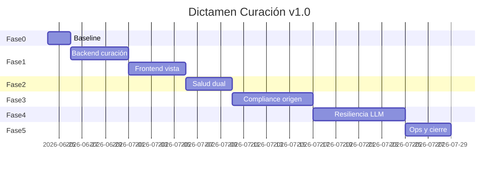

# Plan de implementación — Curación Dictamen Forense

**Spec:** `dictamen-curacion-licitante` v1.0.0  
**Duración estimada:** 3–4 semanas (1 dev + revisión)  
**Dependencias:** Ninguna migración DB; solo `session_state` JSON.

## Principios de entrega

1. **PRs pequeños** por fase — cada fase deja valor usable y tests verdes.
2. **No romper legacy** — `compliance.data` crudo intacto; curación es capa derivada.
3. **Trazabilidad** — cada PR referencia IDs de tarea (`DC-xxx`) de [`tasks.md`](tasks.md).

---

## Fase 0 — Baseline y criterios (2 días)

**Objetivo:** Medir antes de codificar; congelar aceptación.

| ID | Entregable | Responsable |
|----|------------|-------------|
| DC-000 | Export `compliance.json` sesión problema (`export_oracle_inputs.py`) | Ops |
| DC-001 | Muestra manual 50 ítems etiquetados actionable/archival | Producto |
| DC-002 | Documento criterios aceptación firmado (tabla en requirements R-UAT) | Producto + Tech |

**Criterio de salida:** baseline `actionable_manual_count` / `total_count` documentado.

---

## Fase 1 — Curación backend + UI default (5–7 días)

**Objetivo:** Bajar drásticamente el 369 visible; eliminar ruido convocante en default.

### Semana 1 — Backend

| Día | Tarea | Archivos |
|-----|-------|----------|
| 1 | `is_convocante_narrative()` + tests | `document_deliverable_filter.py`, `test_document_deliverable_filter.py` |
| 2 | `dictamen_curation_service.py` scaffold + enum reasons | nuevo + `test_dictamen_curation_service.py` |
| 3 | Integrar filtros existentes; stats; dedup | `dictamen_curation_service.py` |
| 4 | Hook orquestador post-compliance; persist `dictamen_curated_v1` | `orchestrator.py` |
| 5 | `audit_processor.py` paridad campos | `audit_processor.py`, tests |

### Semana 2 — Frontend

| Día | Tarea | Archivos |
|-----|-------|----------|
| 1 | `auditSummary.js` consumir curated; `obligacionesDetectadas` | `auditSummary.js` |
| 2 | `AnalysisResults` toggle archivo completo | `App.jsx` |
| 3 | Renombrar widget métricas; subtítulo archivo | `App.jsx` |
| 4 | `ExportPDF.jsx` export curado | `ExportPDF.jsx` |
| 5 | UAT interno sesión obra municipal | — |

**Criterio de salida Fase 1:**

- TC01–TC03 verdes
- Contador default < 50% baseline
- Cero "Directora General…" en default

**PR sugeridos:**

1. `feat(dictamen): convocante narrative filter + curation service`
2. `feat(dictamen): orchestrator persist dictamen_curated_v1`
3. `feat(ui): dictamen vista licitante + toggle archivo`

---

## Fase 2 — Salud dual y mensajes UX (3–4 días)

**Objetivo:** Separar "bases leídas" de "auditoría con incidencias".

| ID | Tarea | Archivos |
|----|-------|----------|
| DC-101 | `extraction_health_service.py` | nuevo + tests |
| DC-102 | `forensic_audit_health` builder desde compliance | `dictamen_curation_service.py` o helper |
| DC-103 | `dictamen_ux_messages.py` copy centralizado | nuevo |
| DC-104 | Badges duales en UI | `App.jsx` |
| DC-105 | Eliminar implicación "no se leyó PDF" en partial | `auditSummary.js`, `audit_processor.py` |
| DC-106 | Test contrato: extraction ok + compliance partial | `test_dictamen_curation_service.py` |

**Criterio de salida Fase 2:**

- Usuario ve verde en lectura + amarillo en auditoría en corrida problema
- `ux_guia_usuario` auto-generado

**PR:** `feat(dictamen): dual health extraction vs forensic audit`

---

## Fase 3 — Mejora en origen ComplianceAgent (5–7 días)

**Objetivo:** Menos ruido antes del filtro; metadata `audience`.

| ID | Tarea | Archivos |
|----|-------|----------|
| DC-201 | Prompt perspectiva licitante + few-shot negativos | `compliance.py` |
| DC-202 | `stamp_audience_metadata()` en reduce | `compliance.py` |
| DC-203 | Guard must-have: no promover convocante | `compliance.py` L757-782 |
| DC-204 | Regresión corpus obra + ISSSTE limpieza | tests fixtures |
| DC-205 | Verificar reducción `archival_count` vs solo filtro UI | métricas sesión |

**Criterio de salida Fase 3:**

- `audience` presente en ≥95% ítems compliance nuevos
- Reducción adicional archival en origen (opcional medir)

**PR:** `feat(compliance): licitante perspective + audience metadata`

---

## Fase 4 — Resiliencia bloques LLM y zona GARANTÍAS (5–8 días)

**Objetivo:** Reducir PARTIAL por bloques vacíos y FAIL garantías opaco.

| ID | Tarea | Archivos |
|----|-------|----------|
| DC-301 | Diagnóstico logs `compliance_block_empty` sesión problema | ops |
| DC-302 | Mensaje UX con bloques numerados por zona | `dictamen_ux_messages.py` |
| DC-303 | Afinar query RAG zona GARANTÍAS | `compliance.py` search_zones |
| DC-304 | Separar FAIL técnico (RAG vacío) vs FAIL calidad (match bajo) | `compliance.py` `_apply_zone_gate` |
| DC-305 | (Opcional v1.1) Job retry bloques fallidos | nuevo route o `session_maintenance_job_service` |
| DC-306 | Smoke 2× mismo PDF documentar varianza | `docs/corridas_*.json` |

**Criterio de salida Fase 4:**

- 0 bloques vacíos en condiciones Ollama estables (objetivo operativo)
- Mensaje garantías incluye páginas sugeridas si match bajo

**PR:** `fix(compliance): zone gates UX + garantias RAG tuning`

---

## Fase 5 — Gobernanza, ops y cierre (3–4 días)

| ID | Tarea | Archivos |
|----|-------|----------|
| DC-401 | `DICTAMEN_VIEW_MODE` en settings + `.env.example` | `settings.py`, `.env.example` |
| DC-402 | Playbook deploy: badges y cuándo re-analizar | `DEPLOY_HARDENING_PLAYBOOK.md` |
| DC-403 | Actualizar acta V.5 riesgo residual partial | `docs/acta_decision_tecnica_v5.md` addendum |
| DC-404 | Oracle caso DICTAMEN01 (opcional) | `tests/oracle_*.json`, `run_oracle.py` |
| DC-405 | `generate_audit_report.py` stats curación | script audit |
| DC-406 | UAT usuario no técnico | checklist |

**Criterio de salida Fase 5:** GO producción interna con playbook actualizado.

---

## Cronograma consolidado

*Fase 3 y 4 pueden solaparse parcialmente si hay 2 desarrolladores.*

---

## Matriz de trazabilidad requisito → tarea

| Requisito | Tareas |
|-----------|--------|
| R1 | DC-102–104, orquestador hook |
| R2 | DC-001 filter, curation service |
| R3 | DC-104, App.jsx toggle |
| R4 | DC-101–106 |
| R5 | ExportPDF |
| R6 | Orquestador persist |
| R7 | DC-201–203 |
| R8 | DC-301–306 |
| R9 | DC-401 |

---

## Rollback

1. `DICTAMEN_CURATION_ENABLED=false` → UI vuelve a `processAuditResults` legacy.
2. Sin borrar `dictamen_curated_v1` en sesión (compatibilidad forward).
3. Revert PR frontend independiente del backend si necesario.

---

## Definición de Done (global)

- [ ] Tests nuevos verdes en CI
- [ ] `pytest` subset dictamen + deliverable_filter
- [ ] Paridad `audit_processor.py` / `auditSummary.js`
- [ ] UAT TC01–TC05 + sesión obra municipal
- [ ] Documentación SPEC enlazada desde `docs/SPEC_DICTAMEN_CURACION_LICITANTE.md`
- [ ] Sin regresión en `document_candidate_list_service` y generación
