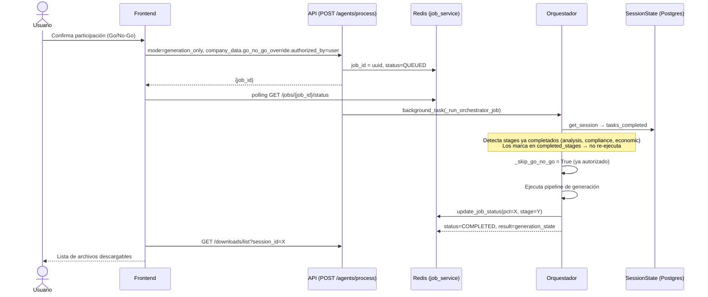

# Diseño Técnico: Generación de Documentos de Licitación

## Overview

El pipeline de generación de documentos de LicitAI produce automáticamente el paquete completo de propuesta para una licitación pública mexicana. Una vez que el usuario autoriza la participación en el Semáforo Go/No-Go, el orquestador activa el modo `generation_only`, que reutiliza los resultados de análisis y compliance ya persistidos en `tasks_completed` y ejecuta en secuencia los seis agentes de generación: TechnicalWriterAgent, FormatsAgent, EconomicWriterAgent, DocumentPackagerAgent, CompraNetPackager y DeliveryAgent.

Los agentes ya tienen implementación real y funcional. Este diseño especifica el flujo de datos entre ellos, los gaps que deben corregirse, los contratos de entrada/salida y las propiedades de corrección verificables.


## Architecture

### Flujo de Activación



### Pipeline de Generación (modo generation_only)

```mermaid
flowchart TD
    A[Orquestador: generation_only] --> B{go_no_go_override.authorized_by == user?}
    B -- No --> STOP[Retorna go_no_go_pending]
    B -- Sí --> C{Master_Profile completo?}
    C -- No --> WFD[Retorna WAITING_FOR_DATA\ncon lista de campos faltantes]
    C -- Sí --> D[TechnicalWriterAgent\n/data/outputs/{sid}/1.propuesta tecnica/]
    D --> E[FormatsAgent\n/data/outputs/{sid}/3.documentos administrativos/]
    E --> F[EconomicWriterAgent\n/data/outputs/{sid}/2.propuesta_economica/]
    F --> G[DocumentPackagerAgent\nOrganiza sobres + carátulas]
    G --> H[CompraNetPackager\nValida ext + SHA-256 + ZIP]
    H --> I[DeliveryAgent\nChecklist PDF + guía de entrega]
    I --> J[generation_state.status = completed]
```

### Estructura de Directorios de Salida

```
/data/outputs/{session_id}/
├── 1.propuesta tecnica/
│   ├── 01_CARTA_PRESENTACION_PROPUESTA_TECNICA.docx
│   ├── 02_2_1_Capacidad_Tecnica.docx
│   └── ...
├── 2.propuesta_economica/
│   ├── TABLA_PRECIOS_UNITARIOS.xlsx
│   ├── ANEXO_AE_PROPUESTA_ECONOMICA.docx
│   └── CARTA_COMPROMISO_PRECIOS.docx
├── 3.documentos administrativos/
│   ├── 1_1_Acta_Constitutiva.docx
│   ├── 1_2_Poder_Notarial.docx
│   └── ...
├── SOBRE_1_ADMINISTRATIVO/
│   ├── 00_CARATULA_SOBRE.docx
│   └── 01_1_1_Acta_Constitutiva.docx
├── SOBRE_2_TECNICO/
│   ├── 00_CARATULA_SOBRE.docx
│   └── 01_CARTA_PRESENTACION_PROPUESTA_TECNICA.docx
├── SOBRE_3_ECONOMICO/
│   ├── 00_CARATULA_SOBRE.docx
│   └── 01_TABLA_PRECIOS_UNITARIOS.xlsx
├── _compranet_validated/
│   ├── SobreComplementaria/
│   ├── SobreTecnica/
│   ├── SobreEconomica/
│   └── MANIFIESTO_SHA256.json
├── LOGISTICA_Y_GUIA_DE_ENTREGA.pdf
└── descriptions.json
```


## Components and Interfaces

### 1. Orquestador (OrchestratorAgent)

**Responsabilidad en generación:** Verificar autorización Go/No-Go, reconstruir datos de fases anteriores desde `tasks_completed`, y encadenar los agentes de generación pasando `company_data` enriquecido a cada uno.

**Lógica de activación (código existente en `orchestrator.py`):**
```python
# Línea clave: _skip_go_no_go
go_no_go_override = session_state.get("go_no_go_override") or {}
_already_authorized = go_no_go_override.get("authorized_by") == "user"
_skip_go_no_go = mode in ("generation_only", "generation") and _already_authorized
```

**Gap identificado:** El orquestador en `generation_only` incluye `"analysis"` y `"compliance"` en `default_stages` del `PipelineConfigurator`, pero los salta via `completed_stages`. Sin embargo, si la sesión es nueva (sin `tasks_completed`), intentará ejecutar esos stages. Se debe agregar una validación explícita que retorne error si no hay datos de compliance persistidos en modo `generation_only`.

**Reconstrucción de datos para agentes de generación:**
```python
# El orquestador debe inyectar en company_data antes de llamar a cada agente:
generation_company_data = {
    **agent_input.company_data,
    "master_profile": master_profile,           # Del session_state
    "compliance_master_list": compliance_data,  # De tasks_completed:stage_completed:compliance
    "economic_data": economic_data,             # De tasks_completed:economic_proposal
    "documentos_generados": {                   # Acumulado tras cada agente
        "tecnica": [...],      # Output de TechnicalWriterAgent
        "administrativa": [...], # Output de FormatsAgent
        "economica": [...]     # Output de EconomicWriterAgent
    }
}
```

**Estado de generación (`generation_state`):** El orquestador mantiene en `session_state.generation_state` la cola de jobs con su estado individual:
```json
{
  "status": "running",
  "jobs": [
    {"id": "technical", "type": "agent", "status": "completed"},
    {"id": "formats", "type": "agent", "status": "running"},
    {"id": "economic_writer", "type": "agent", "status": "pending"},
    {"id": "packager", "type": "agent", "status": "pending"},
    {"id": "delivery", "type": "agent", "status": "pending"}
  ]
}
```

---

### 2. TechnicalWriterAgent

**Archivo:** `backend/app/agents/technical_writer.py`  
**Estado:** Funcional. Genera DOCX con logo, firma, fecha y encabezado.

**Datos requeridos del `company_data`:**
| Campo | Fuente | Uso |
|-------|--------|-----|
| `master_profile.razon_social` | Master Profile | Encabezado, firma, footer |
| `master_profile.rfc` | Master Profile | Footer, destinatario |
| `master_profile.representante_legal` | Master Profile | Bloque de firma |
| `master_profile.domicilio_fiscal` | Master Profile | Footer |
| `master_profile.tipo` | Master Profile | Pronombres (yo/nosotros) |
| `master_profile.logo` | Master Profile | Logo en encabezado |
| `compliance_master_list.tecnico` | tasks_completed | Lista de requisitos técnicos |

**Output (`AgentOutput.data`):**
```json
{
  "titulo": "Propuesta Técnica Completa",
  "folder": "/data/outputs/{session_id}/1.propuesta tecnica/",
  "documentos": [
    {"nombre": "Carta de Presentación", "ruta": "...docx", "status": "OK"}
  ],
  "descriptions": {"filename.docx": "descripción del requisito"}
}
```

**Gap:** Ninguno crítico. El agente ya maneja logo faltante con `try/except` y continúa.

---

### 3. FormatsAgent

**Archivo:** `backend/app/agents/formats.py`  
**Estado:** Funcional. Tiene validación `WAITING_FOR_DATA` via `build_formats_pilot_missing_entries`.

**Datos requeridos del `company_data`:**
| Campo | Fuente | Uso |
|-------|--------|-----|
| `master_profile.razon_social` | Master Profile | Documentos, templates |
| `master_profile.rfc` | Master Profile | Templates legales, firma |
| `master_profile.representante_legal` | Master Profile | Firma |
| `master_profile.ciudad` | Master Profile | Lugar en documentos |
| `master_profile.giro` | Master Profile | Campo `servicio` en templates |
| `compliance_master_list.administrativo` | tasks_completed | Lista de requisitos admin |
| `compliance_master_list.formatos` | tasks_completed | Lista de formatos obligatorios |

**Templates legales bloqueados (Jinja2):**
- `anexo_7.j2` → Acreditación de personalidad jurídica
- `anexo_11.j2` → Declaración de conformidad
- `anexo_15.j2` → Declaración artículos 50/60

**Output (`AgentOutput.data`):**
```json
{
  "documentos": [
    {"nombre": "...", "ruta": "...docx", "status": "FINAL", "template_id": "anexo_7"}
  ],
  "count": 5,
  "folder": "/data/outputs/{session_id}/3.documentos administrativos/"
}
```

**Gap:** El campo `master_profile.ciudad` puede estar ausente. `_template_data` usa `master_profile.get("ciudad", "Mexico")` como fallback, lo cual es correcto pero debe documentarse como campo opcional.

---

### 4. EconomicWriterAgent

**Archivo:** `backend/app/agents/economic_writer.py`  
**Estado:** Funcional. Genera XLSX y dos DOCX.

**Datos requeridos del `company_data`:**
| Campo | Fuente | Uso |
|-------|--------|-----|
| `master_profile.razon_social` | Master Profile | Encabezado XLSX, DOCX |
| `master_profile.rfc` | Master Profile | Carta compromiso |
| `master_profile.representante_legal` | Master Profile | Firma |
| `economic_data.items` | tasks_completed:economic_proposal | Partidas de precio |
| `economic_data.currency` | tasks_completed:economic_proposal | Moneda (default MXN) |

**Lógica de búsqueda de `economic_data` (tres rutas, en orden):**
1. `agent_input.company_data["economic_data"]` (inyección directa del orquestador)
2. `agent_input.company_data["results"]["economic"]["data"]`
3. `tasks_completed` buscando `task == "economic_proposal"`

**Cálculo de totales:**
```
subtotal = sum(item.cantidad * item.precio_unitario for item in items)
iva      = round(subtotal * 0.16, 2)
total    = round(subtotal + iva, 2)
```

**Output (`AgentOutput.data`):**
```json
{
  "folder": "/data/outputs/{session_id}/2.propuesta_economica/",
  "documentos": [
    {"nombre": "Tabla de Precios Unitarios", "ruta": "...xlsx", "tipo": "tabla_precios"},
    {"nombre": "Anexo AE - Propuesta Económica", "ruta": "...docx", "tipo": "anexo_economico"},
    {"nombre": "Carta Compromiso de Precios", "ruta": "...docx", "tipo": "carta_compromiso"}
  ],
  "resumen_economico": {"subtotal": 0.0, "iva": 0.0, "total": 0.0, "moneda": "MXN"}
}
```

**Gap:** Ninguno crítico.

---

### 5. DocumentPackagerAgent

**Archivo:** `backend/app/agents/document_packager.py`  
**Estado:** Funcional. Tiene fallback determinístico cuando el LLM falla.

**Datos requeridos del `company_data`:**
| Campo | Fuente | Uso |
|-------|--------|-----|
| `master_profile` | Master Profile | Carátulas |
| `documentos_generados.tecnica` | Output TechnicalWriterAgent | Sobre técnico |
| `documentos_generados.administrativa` | Output FormatsAgent | Sobre administrativo |
| `documentos_generados.economica` | Output EconomicWriterAgent | Sobre económico |

**Gap identificado:** El orquestador debe construir `documentos_generados` acumulando los outputs de los tres agentes anteriores antes de invocar al DocumentPackagerAgent. Actualmente no hay código explícito que haga esta acumulación. Se debe agregar en el orquestador:

```python
documentos_generados = {
    "tecnica": tech_result.data.get("documentos", []),
    "administrativa": formats_result.data.get("documentos", []),
    "economica": econ_result.data.get("documentos", [])
}
agent_input_packager = agent_input.model_copy(update={
    "company_data": {
        **agent_input.company_data,
        "documentos_generados": documentos_generados
    }
})
```

**Output (`AgentOutput.data`):**
```json
{
  "estructura_sobres": {
    "sobre_1": {"nombre": "...", "carpeta": "...", "documentos": [...], "total_documentos": 3},
    "sobre_2": {"nombre": "...", "carpeta": "...", "documentos": [...], "total_documentos": 5},
    "sobre_3": {"nombre": "...", "carpeta": "...", "documentos": [...], "total_documentos": 3}
  },
  "caratulas_generadas": ["...path..."],
  "folder_raiz": "/data/outputs/{session_id}/"
}
```

---

### 6. CompraNetPackager

**Archivo:** `backend/app/agents/packager.py`  
**Estado:** Funcional. Validación de extensiones, nomenclatura canónica, SHA-256, ZIP opcional.

**Datos requeridos (`session_data`):**
| Campo | Fuente |
|-------|--------|
| `output_root` / `folder_raiz` | Output DocumentPackagerAgent |
| `rfc` | master_profile.rfc |
| `licitacion_id` | session_id o company_data.numero_licitacion |
| `estructura_sobres` | Output DocumentPackagerAgent |

**Función auxiliar existente:** `build_pack_session_data_from_outputs()` construye el `session_data` correcto a partir del output del DocumentPackagerAgent y el `company_data`.

**Extensiones permitidas (configurables via env):**
`.doc`, `.docx`, `.pdf`, `.jpg`, `.jpeg`, `.png`, `.xlsx`

**Nomenclatura canónica:**
```
{RFC_sanitizado}_{licitacion_sanitizado}_{SobreLabel}_{orden:02d}{ext}
```

**Output (`PackResult.to_dict()`):**
```json
{
  "success": true,
  "validation_passed": true,
  "manifest_path": "/data/outputs/{sid}/_compranet_validated/MANIFIESTO_SHA256.json",
  "zip_path": null,
  "staged_root": "/data/outputs/{sid}/_compranet_validated/",
  "files": [{"path": "...", "sha256": "...", "bytes": 1234}],
  "total_bytes": 5678
}
```

---

### 7. DeliveryAgent

**Archivo:** `backend/app/agents/delivery.py`  
**Estado:** Funcional. Genera PDF con ReportLab. Tiene fallback determinístico.

**Datos requeridos:** Solo `session_id` (usa RAG sobre las bases para detectar modalidad de entrega).

**Output (`AgentOutput.data`):**
```json
{
  "tipo_licitacion": "ELECTRONICA",
  "guia_pdf": "/data/outputs/{session_id}/LOGISTICA_Y_GUIA_DE_ENTREGA.pdf",
  "checklist": [{"check": "...", "status": "pendiente"}],
  "alertas": ["..."]
}
```

**Gap:** El checklist generado por DeliveryAgent lista los documentos con estado "Pendiente" pero no recibe la lista real de documentos generados. Se debe pasar `documentos_generados` al DeliveryAgent para que el checklist refleje los archivos reales del expediente.

---

### 8. API de Descarga (downloads.py)

**Endpoints existentes:**
- `GET /downloads/list?session_id={id}` → Lista todos los archivos en `/data/outputs/{session_id}/`
- `GET /downloads/file?path={rel_path}&session_id={id}` → Descarga un archivo individual
- `GET /downloads/zip?session_id={id}` → Descarga ZIP de todo el directorio

**Endpoint de estado de job:**
- `GET /agents/jobs/{job_id}/status` → Estado del job en Redis (stage, pct, message, generation_state)

**Habilitación del botón de descarga en el frontend:**
El frontend debe habilitar el botón de descarga cuando `job.status == "COMPLETED"` y `job.result.generation_state.status == "completed"`. Si `job.result.status == "waiting_for_data"`, mostrar `job.result.data.missing` al usuario.


## Data Models

### Master Profile (campos usados por agentes de generación)

```python
class MasterProfile(TypedDict, total=False):
    razon_social: str          # OBLIGATORIO - Razón social de la empresa
    rfc: str                   # OBLIGATORIO - RFC con homoclave
    representante_legal: str   # OBLIGATORIO - Nombre completo del representante
    domicilio_fiscal: str      # OBLIGATORIO - Dirección fiscal completa
    tipo: str                  # "moral" | "fisica" (default: "moral")
    logo: str                  # Ruta absoluta al archivo de imagen (opcional)
    ciudad: str                # Ciudad para documentos (default: "Mexico")
    giro: str                  # Giro o actividad económica (default: "servicio licitado")
```

### Economic Data (output de EconomicAgent, input de EconomicWriterAgent)

```python
class EconomicItem(TypedDict):
    partida: int               # Número de partida
    concepto: str              # Descripción del concepto
    unidad: str                # Unidad de medida
    cantidad: float            # Cantidad
    precio_unitario: float     # Precio unitario sin IVA
    subtotal: float            # cantidad * precio_unitario

class EconomicData(TypedDict):
    items: List[EconomicItem]
    currency: str              # "MXN" (default)
    validation_result: dict    # Resultado de validación de EconomicAgent
```

### Generation State (persistido en session_state y retornado en job result)

```python
class GenerationJob(TypedDict):
    id: str        # "technical" | "formats" | "economic_writer" | "packager" | "delivery"
    type: str      # "agent" | "checkpoint"
    status: str    # "pending" | "running" | "completed" | "failed" | "waiting_for_data"

class GenerationState(TypedDict):
    status: str                # "running" | "completed" | "failed" | "waiting_for_data"
    jobs: List[GenerationJob]
```

### Documentos Generados (acumulado por el orquestador entre agentes)

```python
class DocumentoGenerado(TypedDict):
    nombre: str    # Nombre legible del documento
    ruta: str      # Ruta absoluta en disco
    status: str    # "OK" | "FINAL"
    tipo: str      # "tabla_precios" | "anexo_economico" | "carta_compromiso" | etc.

class DocumentosGenerados(TypedDict):
    tecnica: List[DocumentoGenerado]
    administrativa: List[DocumentoGenerado]
    economica: List[DocumentoGenerado]
```

### Pack Result (output de CompraNetPackager)

```python
@dataclass
class PackResult:
    success: bool
    errors: List[str]
    validation_passed: bool
    manifest_path: Optional[str]   # Ruta al MANIFIESTO_SHA256.json
    zip_path: Optional[str]        # Ruta al ZIP (solo si total > 50 MiB)
    staged_root: Optional[str]     # Ruta a _compranet_validated/
    files: List[Dict]              # [{path, sha256, bytes}]
    total_bytes: int
```

### Missing Field Entry (para WAITING_FOR_DATA)

```python
class MissingFieldEntry(TypedDict):
    field: str     # Nombre del campo en master_profile (ej: "rfc")
    label: str     # Etiqueta legible para el usuario (ej: "RFC de la empresa")
    job_id: str    # ID del job bloqueante
```


## Correctness Properties

*A property is a characteristic or behavior that should hold true across all valid executions of a system — essentially, a formal statement about what the system should do. Properties serve as the bridge between human-readable specifications and machine-verifiable correctness guarantees.*

### Property 1: Campos obligatorios faltantes siempre bloquean la generación

*Para cualquier* `master_profile` al que le falte al menos uno de los campos `{razon_social, rfc, representante_legal}`, cualquier agente de generación (FormatsAgent, TechnicalWriterAgent, EconomicWriterAgent) que reciba ese perfil SHALL retornar `AgentStatus.WAITING_FOR_DATA` con un array `missing` que contenga exactamente los campos faltantes.

**Validates: Requirements 1.4, 3.7, 9.4**

---

### Property 2: Reanudación no re-ejecuta stages completados

*Para cualquier* sesión que tenga `stage_completed:compliance` en `tasks_completed`, al ejecutar el orquestador en modo `generation_only`, el `ComplianceAgent` NO SHALL ser invocado y los datos de compliance SHALL ser reconstruidos desde `tasks_completed`.

**Validates: Requirements 1.5**

---

### Property 3: Cardinalidad de documentos técnicos

*Para cualquier* lista de N requisitos técnicos (N ≥ 0) en la zona `tecnico` de la lista maestra de compliance, `TechnicalWriterAgent` SHALL generar exactamente N + 1 archivos DOCX (N documentos de requisitos más 1 carta de presentación).

**Validates: Requirements 2.1, 2.2**

---

### Property 4: Deduplicación de requisitos administrativos

*Para cualquier* lista de requisitos administrativos que contenga duplicados por ID, `FormatsAgent` SHALL generar exactamente un archivo DOCX por ID único, de modo que el número de archivos generados sea igual al número de IDs distintos en la lista de entrada.

**Validates: Requirements 3.8**

---

### Property 5: Invariante fiscal del cálculo económico

*Para cualquier* lista de ítems económicos con cantidades y precios unitarios positivos, `EconomicWriterAgent` SHALL calcular `iva = round(subtotal * 0.16, 2)` y `total = round(subtotal + iva, 2)`, donde `subtotal = sum(item.cantidad * item.precio_unitario for item in items)`.

**Validates: Requirements 4.4**

---

### Property 6: Validación de extensiones de archivo

*Para cualquier* archivo cuya extensión NO esté en el conjunto `{.doc, .docx, .pdf, .jpg, .jpeg, .png, .xlsx}`, `CompraNetPackager.pack()` SHALL retornar `PackResult(success=False)` con la extensión inválida listada en `errors`, sin copiar ningún archivo al directorio `_compranet_validated/`.

**Validates: Requirements 6.1, 6.2**

---

### Property 7: Nomenclatura canónica de archivos CompraNet

*Para cualquier* combinación de RFC, licitacion_id, sobre_label y número de orden, el nombre de archivo generado por `CompraNetPackager` SHALL seguir el patrón `{rfc_sanitizado}_{lic_sanitizado}_{sobre_label}_{orden:02d}{ext}`, donde la sanitización elimina caracteres no alfanuméricos y reemplaza espacios por guiones bajos.

**Validates: Requirements 6.3**

---

### Property 8: Integridad del manifiesto SHA-256

*Para cualquier* conjunto de archivos válidos empaquetados por `CompraNetPackager`, el `MANIFIESTO_SHA256.json` generado SHALL contener para cada archivo su hash SHA-256 correcto (verificable recalculando el hash del archivo en disco), su tamaño en bytes y su ruta relativa dentro de `_compranet_validated/`.

**Validates: Requirements 6.4**

---

### Property 9: Contenido de carátulas de sobre

*Para cualquier* `master_profile` válido y lista de documentos, la carátula DOCX generada por `DocumentPackagerAgent` SHALL contener la razón social, el RFC, el nombre del representante legal, el `session_id` como identificador de licitación, y los nombres de todos los documentos del sobre en el índice de contenido.

**Validates: Requirements 5.4**

---

### Property 10: Campos faltantes en WAITING_FOR_DATA son exactos

*Para cualquier* `master_profile` con un subconjunto S de campos obligatorios faltantes, la respuesta `WAITING_FOR_DATA` SHALL contener en `data.missing` exactamente los campos de S, sin incluir campos que sí están presentes ni omitir campos que faltan.

**Validates: Requirements 9.1, 1.4**

*Nota: Esta propiedad consolida y refina la Property 1 al nivel de exactitud del conjunto de campos reportados.*


## Error Handling

### Jerarquía de errores por agente

| Agente | Condición de error | Comportamiento |
|--------|-------------------|----------------|
| Orquestador | `go_no_go_override.authorized_by != "user"` en `generation_only` | Retorna `go_no_go_pending`, no ejecuta agentes |
| Orquestador | `tasks_completed` sin datos de compliance en `generation_only` | Retorna `error` con `stop_reason: MISSING_PRIOR_ANALYSIS` |
| TechnicalWriterAgent | `master_profile` sin campos obligatorios | Retorna `WAITING_FOR_DATA` |
| TechnicalWriterAgent | Logo no existe en disco | Log warning, continúa sin logo |
| TechnicalWriterAgent | Lista de requisitos técnicos vacía | Retorna `SUCCESS` con mensaje informativo |
| TechnicalWriterAgent | LLM falla en generación de un documento | Usa texto de fallback `"Contenido para {req_nombre}"` |
| FormatsAgent | Campos obligatorios faltantes | Retorna `WAITING_FOR_DATA` con `data.missing` |
| FormatsAgent | `TemplateIntegrityError` en template legal | Lanza excepción, detiene ese documento, continúa con los demás |
| FormatsAgent | LLM falla en generación de un documento | Log error, `continue` (omite ese documento) |
| EconomicWriterAgent | `economic_data` ausente o `items` vacío | Retorna `ERROR` con mensaje descriptivo |
| DocumentPackagerAgent | LLM falla o retorna JSON inválido | Aplica fallback determinístico por claves |
| DocumentPackagerAgent | Archivo fuente no existe en disco | Omite ese archivo, continúa con los demás |
| CompraNetPackager | `output_root`, `rfc` o `licitacion_id` faltantes | Retorna `PackResult(success=False)` con campo faltante |
| CompraNetPackager | Extensión no permitida | Retorna `PackResult(success=False)` con lista de archivos inválidos |
| CompraNetPackager | Directorio de salida no existe | Retorna `PackResult(success=False)` |
| DeliveryAgent | LLM falla al analizar modalidad de entrega | Genera PDF con `DETERMINACIÓN_MANUAL_REQUERIDA` |

### Propagación de WAITING_FOR_DATA

Cuando cualquier agente retorna `WAITING_FOR_DATA`:
1. El orquestador detecta el status y detiene el pipeline
2. Persiste `pending_questions` en `session_state` con los campos faltantes
3. Actualiza `generation_state.jobs[agente].status = "waiting_for_data"`
4. Retorna al frontend con `generation_state` actualizado
5. El frontend muestra los campos faltantes al usuario
6. Cuando el usuario proporciona los datos via chatbot, el frontend llama a `POST /agents/process` con `resume_generation: true`
7. El orquestador reanuda desde el agente bloqueado

### Resiliencia del pipeline

El pipeline de generación es **parcialmente tolerante a fallos**: si un agente falla con `ERROR` (no `WAITING_FOR_DATA`), el orquestador puede continuar con los agentes siguientes y marcar el job fallido como `"failed"` en `generation_state`. El usuario puede descargar los documentos que sí se generaron.


## Testing Strategy

### Enfoque dual: tests unitarios + property-based tests

La estrategia combina tests de ejemplo para comportamientos específicos y tests basados en propiedades para invariantes universales. La librería de PBT elegida es **Hypothesis** (Python), que se integra nativamente con pytest.

### Tests unitarios (pytest)

**TechnicalWriterAgent:**
- Ejemplo: Ejecutar con master_profile válido y 3 requisitos técnicos → verificar 4 archivos DOCX generados
- Edge case: Lista de requisitos vacía → status SUCCESS, solo carta de presentación
- Edge case: Logo path inexistente → proceso completa, log contiene "logo_insert_failed"

**FormatsAgent:**
- Ejemplo: Ejecutar con requisito que mapea a `anexo_7` → verificar que se usa el template Jinja2
- Edge case: `verify_integrity` retorna False → `TemplateIntegrityError` lanzado
- Edge case: LLM retorna string vacío → documento omitido, no falla el agente

**EconomicWriterAgent:**
- Ejemplo: Ejecutar con 3 ítems → verificar existencia de XLSX, ANEXO_AE.docx y CARTA_COMPROMISO.docx
- Edge case: `economic_data` sin `items` → status ERROR

**DocumentPackagerAgent:**
- Edge case: LLM retorna JSON inválido → fallback determinístico clasifica por claves estándar
- Edge case: Archivo fuente no existe → omitido del sobre, proceso continúa

**DeliveryAgent:**
- Ejemplo: Ejecutar con RAG que detecta "CompraNet" → PDF contiene "ELECTRONICA"
- Edge case: LLM falla → PDF generado con "DETERMINACIÓN_MANUAL_REQUERIDA"

**CompraNetPackager:**
- Ejemplo: Pack con estructura válida → `PackResult.success == True`, manifiesto generado
- Edge case: `rfc` faltante → `PackResult(success=False)` con mensaje descriptivo

### Property-based tests (Hypothesis)

Cada test de propiedad debe ejecutarse con mínimo **100 iteraciones** y estar etiquetado con el número de propiedad del diseño.

```python
# Tag format: Feature: document-generation, Property {N}: {descripción}

from hypothesis import given, settings
from hypothesis import strategies as st

# Property 1 & 10: Campos obligatorios faltantes
@given(
    missing_fields=st.frozensets(
        st.sampled_from(["razon_social", "rfc", "representante_legal"]),
        min_size=1
    )
)
@settings(max_examples=100)
# Feature: document-generation, Property 1: campos obligatorios faltantes bloquean generación
def test_missing_fields_returns_waiting_for_data(missing_fields):
    profile = build_complete_profile()
    for f in missing_fields:
        del profile[f]
    result = run_formats_agent(profile)
    assert result.status == AgentStatus.WAITING_FOR_DATA
    reported = {m["field"] for m in result.data["missing"]}
    assert reported == missing_fields  # exactamente los campos faltantes

# Property 3: Cardinalidad de documentos técnicos
@given(n_reqs=st.integers(min_value=0, max_value=20))
@settings(max_examples=100)
# Feature: document-generation, Property 3: cardinalidad de documentos técnicos
def test_technical_writer_generates_n_plus_one_docs(n_reqs, tmp_path):
    reqs = [build_tech_requirement(i) for i in range(n_reqs)]
    result = run_technical_writer(reqs, tmp_path)
    assert result.status == AgentStatus.SUCCESS
    assert len(result.data["documentos"]) == n_reqs + 1

# Property 4: Deduplicación de requisitos administrativos
@given(
    base_reqs=st.lists(build_admin_req_strategy(), min_size=1, max_size=10),
    n_duplicates=st.integers(min_value=0, max_value=5)
)
@settings(max_examples=100)
# Feature: document-generation, Property 4: deduplicación de requisitos administrativos
def test_formats_deduplicates_by_id(base_reqs, n_duplicates, tmp_path):
    reqs_with_dups = base_reqs + base_reqs[:n_duplicates]
    unique_ids = len({r["id"] for r in reqs_with_dups})
    result = run_formats_agent_with_reqs(reqs_with_dups, tmp_path)
    assert result.data["count"] == unique_ids

# Property 5: Invariante fiscal
@given(
    items=st.lists(
        st.fixed_dictionaries({
            "cantidad": st.floats(min_value=0.01, max_value=1000.0),
            "precio_unitario": st.floats(min_value=0.01, max_value=100000.0),
        }),
        min_size=1, max_size=20
    )
)
@settings(max_examples=200)
# Feature: document-generation, Property 5: invariante fiscal del cálculo económico
def test_economic_writer_iva_calculation(items):
    subtotal = sum(i["cantidad"] * i["precio_unitario"] for i in items)
    expected_iva = round(subtotal * 0.16, 2)
    expected_total = round(subtotal + expected_iva, 2)
    result = compute_economic_summary(items)
    assert result["iva"] == expected_iva
    assert result["total"] == expected_total

# Property 6: Validación de extensiones
@given(
    ext=st.text(alphabet=st.characters(whitelist_categories=("Ll", "Lu")), min_size=1, max_size=5)
)
@settings(max_examples=200)
# Feature: document-generation, Property 6: validación de extensiones de archivo
def test_compranet_packager_rejects_invalid_extensions(ext, tmp_path):
    allowed = {".doc", ".docx", ".pdf", ".jpg", ".jpeg", ".png", ".xlsx"}
    full_ext = f".{ext.lower()}"
    result = pack_single_file_with_ext(full_ext, tmp_path)
    if full_ext in allowed:
        assert result.success
    else:
        assert not result.success
        assert any(full_ext in e for e in result.errors)

# Property 7: Nomenclatura canónica
@given(
    rfc=st.text(min_size=1, max_size=13),
    lic_id=st.text(min_size=1, max_size=30),
    orden=st.integers(min_value=1, max_value=99)
)
@settings(max_examples=100)
# Feature: document-generation, Property 7: nomenclatura canónica CompraNet
def test_canonical_filename_format(rfc, lic_id, orden, tmp_path):
    result = pack_with_params(rfc, lic_id, orden, tmp_path)
    for f in result.files:
        parts = Path(f["path"]).name.split("_")
        assert len(parts) >= 4  # rfc_lic_label_orden.ext

# Property 8: Integridad SHA-256
@given(
    content=st.binary(min_size=1, max_size=10000)
)
@settings(max_examples=100)
# Feature: document-generation, Property 8: integridad del manifiesto SHA-256
def test_manifest_sha256_is_correct(content, tmp_path):
    result = pack_with_content(content, tmp_path)
    assert result.success
    manifest = json.loads(Path(result.manifest_path).read_text())
    for entry in manifest["files"]:
        actual_hash = hashlib.sha256((Path(result.staged_root) / entry["path"]).read_bytes()).hexdigest()
        assert entry["sha256"] == actual_hash
```

### Tests de integración

- Ejecutar el pipeline completo en modo `generation_only` con una sesión de prueba que tenga datos de compliance y economic persistidos
- Verificar que los tres sobres se crean con sus carátulas
- Verificar que el manifiesto SHA-256 es válido
- Verificar que el endpoint `GET /downloads/list` retorna los archivos generados

### Cobertura mínima esperada

| Componente | Unit | Property | Integration |
|------------|------|----------|-------------|
| TechnicalWriterAgent | ✓ | ✓ (P3) | ✓ |
| FormatsAgent | ✓ | ✓ (P1, P4, P10) | ✓ |
| EconomicWriterAgent | ✓ | ✓ (P5) | ✓ |
| DocumentPackagerAgent | ✓ | ✓ (P9) | ✓ |
| CompraNetPackager | ✓ | ✓ (P6, P7, P8) | ✓ |
| DeliveryAgent | ✓ | — | ✓ |
| Orquestador (generation_only) | ✓ | ✓ (P2) | ✓ |
