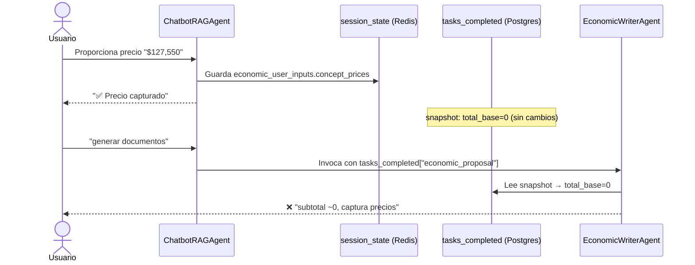
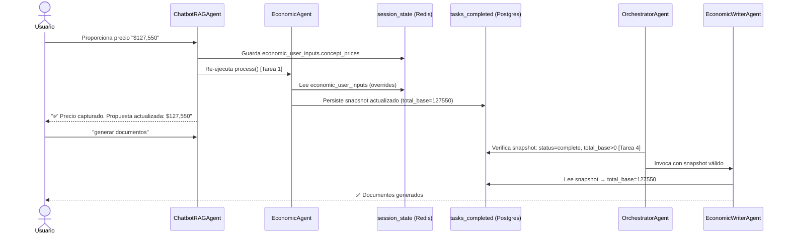
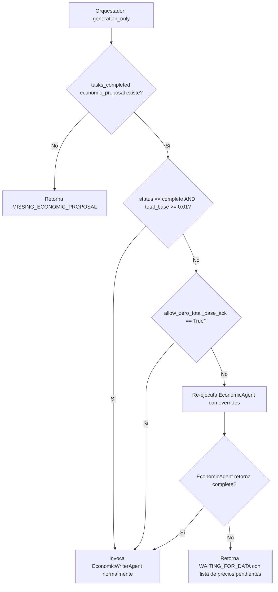

# Diseño Técnico: Sincronización de Precios Chat → Generación de Documentos

## Overview

El bug de sincronización ocurre porque existen **dos rutas de persistencia desconectadas**:

- **Ruta A (chatbot):** `session_state.economic_user_inputs.concept_prices` — donde el chatbot guarda los precios capturados por el usuario.
- **Ruta B (generador):** `tasks_completed["economic_proposal"]` — snapshot JSON que `EconomicWriterAgent` consume para generar documentos.

El `EconomicAgent` es el único componente que puede transformar la Ruta A en Ruta B (re-ejecutando el cálculo con los overrides del usuario), pero en el flujo actual **no se re-ejecuta** después de que el chatbot captura precios. El snapshot en `tasks_completed` queda con `total_base = 0` del ciclo anterior.

Este diseño especifica los cambios mínimos necesarios para cerrar esa brecha sin alterar los contratos existentes de los agentes.

---

## Architecture

### Flujo actual (con el bug)



### Flujo corregido



### Flujo de fallback en orquestador (Tarea 4)



---

## Components and Interfaces

### Cambio 1: ChatbotRAGAgent._handle_economic_transaction

**Archivo:** `backend/app/agents/chatbot_rag.py`

**Cambio:** Después de guardar en `economic_user_inputs` y antes de retornar la respuesta al usuario, invocar `EconomicAgent.process()` para actualizar el snapshot.

```python
# NUEVO: Re-ejecutar EconomicAgent para sincronizar snapshot
async def _trigger_economic_recalc(self, session_id: str, company_id: str, correlation_id: str) -> Optional[Dict]:
    """
    Re-ejecuta EconomicAgent para actualizar tasks_completed["economic_proposal"]
    con los precios recién capturados. Retorna el resultado o None si falla.
    """
    try:
        from app.agents.economic import EconomicAgent
        from app.contracts.agent_contracts import AgentInput
        agent_input = AgentInput(
            session_id=session_id,
            company_id=company_id,
            company_data={},
            correlation_id=correlation_id,
        )
        result = await EconomicAgent(self.context_manager).process(agent_input)
        return result.data if hasattr(result, "data") else None
    except Exception as e:
        logger.error("chatbot_economic_recalc_failed", session_id=session_id, error=str(e))
        return None
```

**Punto de inserción en `_handle_economic_transaction`:**
```python
# Después de: await self.context_manager.memory.save_session(session_id, state)
# Antes de: el bloque de revalidación existente

recalc_result = await self._trigger_economic_recalc(session_id, company_id, correlation_id)
if recalc_result and recalc_result.get("status") == "complete":
    total_base = recalc_result.get("total_base", 0.0)
    msg_recalc = f"\n\n💰 Propuesta actualizada: subtotal **${total_base:,.2f}** (sin IVA)."
else:
    msg_recalc = ""
```

**Contrato de entrada/salida:** Sin cambios en la firma del método. El nuevo comportamiento es aditivo.

---

### Cambio 2: EconomicRefresherService.apply_overrides + recalculate_totals

**Archivo:** `backend/app/services/economic_refresher.py`

**Cambio:** Extender `refresh_economic_validations_for_session` para que, además de revalidar, recalcule `total_base` y `grand_total` a partir de los ítems actualizados.

```python
async def refresh_economic_validations_for_session(
    memory,
    session_id: str,
) -> EconomicValidationResult:
    """
    Aplica overrides del usuario sobre el snapshot existente,
    recalcula totales y persiste el snapshot actualizado.
    """
    session_state = await memory.get_session(session_id) or {}
    
    # 1. Leer snapshot existente
    tasks = session_state.get("tasks_completed", [])
    snapshot = None
    for task in reversed(tasks):
        if task.get("task") == "economic_proposal":
            snapshot = dict(task.get("result", {}))
            break
    
    if not snapshot:
        return EconomicValidationResult()  # Sin snapshot, nada que hacer
    
    # 2. Aplicar overrides sobre ítems (NUEVO)
    user_inputs = session_state.get("economic_user_inputs") or {}
    refresher = EconomicRefresherService()
    items = list(snapshot.get("items") or [])
    items = refresher.apply_overrides(items, user_inputs, [], session_state)
    
    # 3. Recalcular totales (NUEVO)
    if items:
        calc_subtotal = sum(
            float(it.get("subtotal") or (float(it.get("cantidad", 1)) * float(it.get("precio_unitario", 0))))
            for it in items
        )
        snapshot["items"] = items
        snapshot["total_base"] = round(calc_subtotal, 2)
        snapshot["grand_total"] = round(calc_subtotal * 1.16, 2)
        if calc_subtotal >= 0.01:
            snapshot["status"] = "complete"
    
    # 4. Revalidar con los nuevos totales
    result = validate_economic_proposal(
        proposal_items=items,
        currency=snapshot.get("currency", "MXN"),
        total_base=snapshot["total_base"],
        grand_total=snapshot["grand_total"],
        reglas_economicas=snapshot.get("contexto_bases_analista", {}).get("reglas_economicas", {}),
        session_name=session_id,
        allow_zero_total_base=bool(user_inputs.get("allow_zero_total_base_ack")),
    )
    snapshot["validation_result"] = result.model_dump(mode="json")
    
    # 5. Persistir snapshot actualizado (NUEVO)
    # Actualizar en tasks_completed sin duplicar
    new_tasks = [t for t in tasks if t.get("task") != "economic_proposal"]
    new_tasks.append({"task": "economic_proposal", "result": snapshot})
    session_state["tasks_completed"] = new_tasks
    await memory.save_session(session_id, session_state)
    
    return result
```

---

### Cambio 3: OrchestratorAgent — validación de snapshot antes de generation_only

**Archivo:** `backend/app/agents/orchestrator.py`

**Cambio:** Agregar un checkpoint antes de invocar `EconomicWriterAgent` en modo `generation_only`.

```python
async def _ensure_economic_snapshot_ready(
    self,
    session_id: str,
    agent_input: AgentInput,
    session_state: Dict,
) -> Tuple[bool, Optional[Dict]]:
    """
    Verifica que el snapshot económico esté listo para generación.
    Si no lo está, re-ejecuta EconomicAgent.
    
    Retorna (ready: bool, error_payload: Optional[Dict])
    """
    tasks = session_state.get("tasks_completed", [])
    snapshot = None
    for task in reversed(tasks):
        if task.get("task") == "economic_proposal":
            snapshot = task.get("result", {})
            break
    
    if not snapshot:
        return False, {
            "status": "error",
            "stop_reason": "MISSING_ECONOMIC_PROPOSAL",
            "message": (
                "No se encontró una propuesta económica calculada. "
                "Regresa al chat y captura los precios antes de generar documentos."
            ),
        }
    
    allow_zero = bool(
        (session_state.get("economic_user_inputs") or {}).get("allow_zero_total_base_ack")
    )
    total_base = float(snapshot.get("total_base") or 0.0)
    status = str(snapshot.get("status") or "")
    
    if status == "complete" and (total_base >= 0.01 or allow_zero):
        return True, None  # Snapshot listo
    
    # Snapshot desactualizado: re-ejecutar EconomicAgent
    logger.info(
        "orchestrator_economic_snapshot_stale",
        session_id=session_id,
        total_base=total_base,
        status=status,
    )
    from app.agents.economic import EconomicAgent
    econ_input = AgentInput(
        session_id=session_id,
        company_id=agent_input.company_id,
        company_data=dict(agent_input.company_data),
        correlation_id=agent_input.correlation_id,
    )
    econ_result = await EconomicAgent(self.context_manager).process(econ_input)
    
    if econ_result.status == AgentStatus.SUCCESS:
        return True, None
    
    return False, {
        "status": "waiting_for_data",
        "stop_reason": "ECONOMIC_PRICES_INCOMPLETE",
        "message": econ_result.message or "Faltan precios por capturar antes de generar documentos.",
        "data": econ_result.data,
    }
```

**Punto de inserción:** Al inicio del bloque de generación en `OrchestratorAgent.process()`, antes de invocar `EconomicWriterAgent`:

```python
# En el bloque generation_only, antes de EconomicWriterAgent:
ready, error_payload = await self._ensure_economic_snapshot_ready(
    session_id, agent_input, session_state
)
if not ready:
    return {**error_payload, "session_id": session_id, "results": {}}
```

---

### Cambio 4: Limpieza de pending_questions económicas al cambiar de sesión

**Archivo:** `backend/app/agents/chatbot_rag.py` (método `_sanitize_economic_pending_questions`)

**Cambio:** Nuevo método que filtra `pending_questions` económicas contra los ítems del snapshot activo.

```python
async def _sanitize_economic_pending_questions(
    self,
    session_id: str,
    session_state: Dict,
) -> List[Dict]:
    """
    Filtra pending_questions de tipo economic_price verificando que el concepto
    exista en el snapshot tasks_completed["economic_proposal"] de la sesión activa.
    Descarta silenciosamente preguntas huérfanas (de sesiones anteriores).
    """
    pending = list(session_state.get("pending_questions") or [])
    
    # Obtener ítems del snapshot activo
    tasks = session_state.get("tasks_completed", [])
    snapshot_items = []
    for task in reversed(tasks):
        if task.get("task") == "economic_proposal":
            snapshot_items = list((task.get("result") or {}).get("items") or [])
            break
    
    if not snapshot_items:
        # Sin snapshot, no podemos validar → mantener todas las preguntas
        return pending
    
    snapshot_concepts = {
        self._normalize(str(it.get("concepto") or it.get("descripcion") or ""))
        for it in snapshot_items
        if it.get("concepto") or it.get("descripcion")
    }
    
    cleaned = []
    for q in pending:
        q_type = str(q.get("type") or "")
        if q_type == "economic_price":
            label = self._normalize(
                str(q.get("label") or "").replace("Precio (sin IVA): ", "")
            )
            # Mantener solo si el concepto existe en el snapshot activo
            if any(label in sc or sc in label for sc in snapshot_concepts):
                cleaned.append(q)
            else:
                logger.info(
                    "chatbot_orphan_economic_question_discarded",
                    session_id=session_id,
                    label=label[:120],
                )
        else:
            cleaned.append(q)
    
    return cleaned
```

**Punto de invocación:** Al inicio de `process()` en `ChatbotRAGAgent`, después de cargar `session_state`:

```python
# Sanitizar preguntas económicas huérfanas de sesiones anteriores
pending_cleaned = await self._sanitize_economic_pending_questions(session_id, session_state)
if len(pending_cleaned) != len(session_state.get("pending_questions") or []):
    session_state["pending_questions"] = pending_cleaned
    await self.context_manager.memory.save_session(session_id, session_state)
```

---

### Cambio 5: Acción HITL para allow_zero_total_base_ack en el chatbot

**Archivo:** `backend/app/agents/chatbot_rag.py`

**Cambio:** Detectar la intención de confirmación HITL en el mensaje del usuario y procesarla sin exponer el nombre técnico del flag.

```python
async def _handle_zero_base_ack(
    self,
    session_id: str,
    company_id: str,
    correlation_id: str,
) -> AgentOutput:
    """
    Procesa la confirmación del usuario de que la licitación no requiere importe base.
    Persiste allow_zero_total_base_ack y reintenta la generación.
    """
    session_state = await self.context_manager.memory.get_session(session_id) or {}
    user_inputs = dict(session_state.get("economic_user_inputs") or {})
    user_inputs["allow_zero_total_base_ack"] = True
    session_state["economic_user_inputs"] = user_inputs
    await self.context_manager.memory.save_session(session_id, session_state)
    
    logger.info("chatbot_zero_base_ack_confirmed", session_id=session_id)
    
    return self._format_response(
        session_id=session_id,
        correlation_id=correlation_id,
        respuesta=(
            "✅ Confirmado. He registrado que esta licitación no requiere importe base. "
            "Escribe `generar documentos` para continuar con la generación."
        ),
        confianza="Alta",
        tipo="zero_base_ack_confirmed",
    )
```

**Detección de intención:** En el clasificador de mensajes del chatbot, agregar patrón para detectar confirmación HITL:

```python
# En _classify_message_intent o equivalente:
ZERO_BASE_ACK_PATTERNS = [
    r"no requiere importe base",
    r"confirmar.*sin importe",
    r"licitaci[oó]n.*sin.*base",
    r"oferta.*sin.*importe",
    r"zero.?base.*ack",  # Solo para tests internos
]
```

---

## Data Flow: Persistencia del Snapshot

### Estructura del snapshot actualizado

```json
{
  "task": "economic_proposal",
  "result": {
    "status": "complete",
    "currency": "MXN",
    "items": [
      {
        "partida": 1,
        "concepto": "Limpieza en Unidades Médicas y Oficinas Administrativas",
        "cantidad": 1,
        "precio_unitario": 127550.00,
        "subtotal": 127550.00,
        "unidad": "Servicio"
      }
    ],
    "total_base": 127550.00,
    "grand_total": 148158.00,
    "allow_zero_total_base_ack": false,
    "validation_result": { "perfil_usado": "generic_v1", "blocking_issues": [] },
    "calculator_result": { "profile_name": "generic_v1", "formula_set": "generic_v1" }
  }
}
```

### Invariantes que deben mantenerse

| Invariante | Verificación |
|---|---|
| `total_base == sum(item.subtotal for item in items)` | Motor determinista en `EconomicCalculatorEngine` |
| `grand_total == round(total_base * 1.16, 2)` | Perfil `generic_v1` con IVA 16% |
| `item.subtotal == item.cantidad * item.precio_unitario` | `normalize_items()` en el motor |
| `status == "complete"` solo si `total_base >= 0.01 OR allow_zero_total_base_ack` | Validación en `EconomicWriterAgent` |

---

## Error Handling

### Tabla de escenarios de error y respuesta

| Escenario | Componente | Respuesta al usuario | Acción técnica |
|---|---|---|---|
| Re-ejecución de EconomicAgent falla (timeout) | ChatbotRAGAgent | "Precio guardado. La propuesta se actualizará en breve." | Ejecutar en background, actualizar `economic_proposal_ready` |
| Snapshot con `total_base=0` en generation_only | OrchestratorAgent | Lista de precios pendientes con instrucciones | Re-ejecutar EconomicAgent, retornar WAITING_FOR_DATA si falla |
| `tasks_completed["economic_proposal"]` ausente | OrchestratorAgent | "Regresa al chat y captura los precios primero." | Retornar `MISSING_ECONOMIC_PROPOSAL` |
| Pregunta económica huérfana (sesión anterior) | ChatbotRAGAgent | (silencioso, descartada) | Log + descarte en `_sanitize_economic_pending_questions` |
| Usuario confirma zero-base en licitación con precios | ChatbotRAGAgent | Confirmación + instrucción de generar | Persistir flag, no re-ejecutar EconomicAgent |

---

## Testing Strategy

### Tests unitarios

| Test | Archivo | Qué verifica |
|---|---|---|
| `test_economic_recalc_on_price_capture` | `test_economic_sync.py` | Que `_handle_economic_transaction` invoca `EconomicAgent` y actualiza el snapshot |
| `test_refresher_recalculates_totals` | `test_economic_sync.py` | Que `refresh_economic_validations_for_session` actualiza `total_base` con los overrides |
| `test_orchestrator_stale_snapshot_triggers_recalc` | `test_economic_sync.py` | Que el orquestador re-ejecuta EconomicAgent cuando `total_base=0` |
| `test_sanitize_orphan_economic_questions` | `test_economic_sync.py` | Que preguntas de sesiones anteriores son descartadas |
| `test_zero_base_ack_unblocks_generation` | `test_economic_sync.py` | Que `allow_zero_total_base_ack=True` permite generar con `total_base=0` |

### Test de integración (Requisito 7)

```python
@pytest.mark.asyncio
async def test_full_flow_chat_prices_to_document_generation(mock_context_manager):
    """
    Flujo completo: EconomicAgent con gaps → chatbot captura precios
    → generation_only → EconomicWriterAgent produce documentos con subtotal correcto.
    
    Verifica el bug de sincronización descrito en el análisis forense.
    """
    session_id = "test-limpieza-unidades-medicas"
    
    # 1. EconomicAgent detecta gaps → snapshot con total_base=0
    # 2. Chatbot captura precio $127,550
    # 3. Verificar snapshot actualizado: total_base=127550
    # 4. Orquestador en generation_only → EconomicWriterAgent → SUCCESS
    # 5. Verificar que EconomicWriterAgent NO retorna WAITING_FOR_DATA
```

### Property tests

```python
@given(
    prices=st.lists(
        st.floats(min_value=0.01, max_value=1_000_000.0),
        min_size=1, max_size=10
    )
)
@settings(max_examples=100)
def test_total_base_invariant_after_override(prices):
    """
    Property: total_base siempre es la suma de subtotales de los ítems
    después de aplicar overrides del usuario.
    """
    # total_base == sum(item.subtotal) para cualquier conjunto de precios
```
