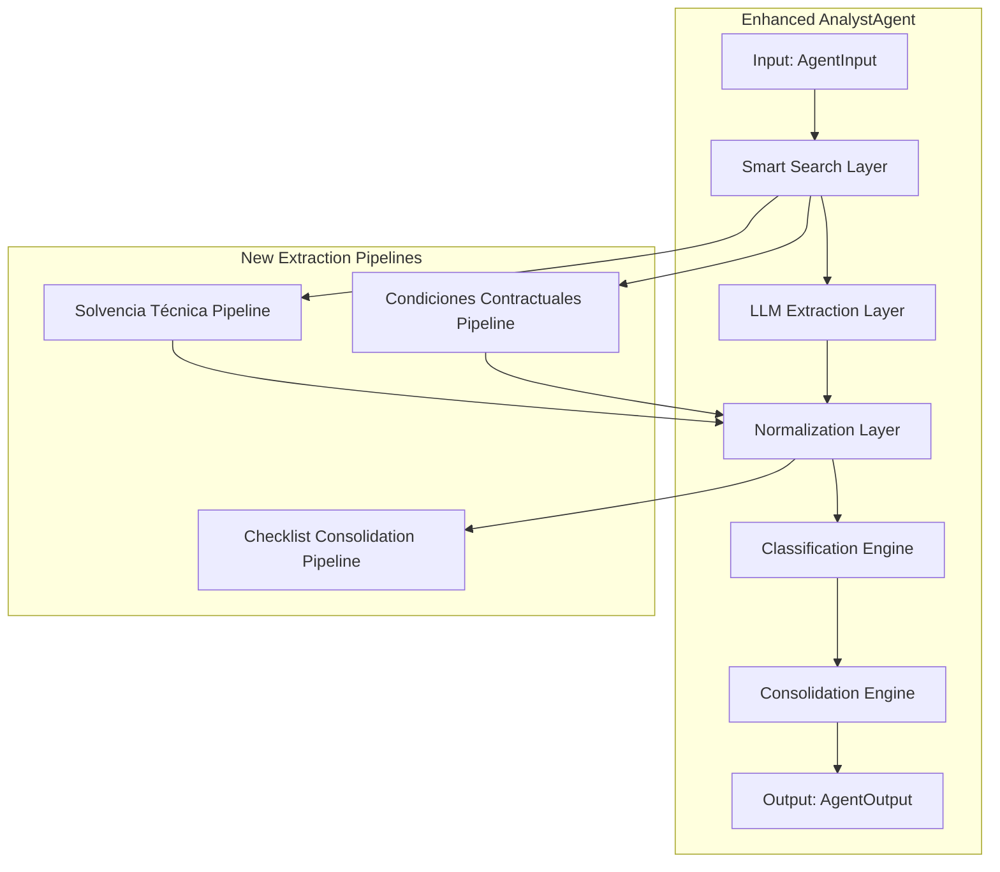
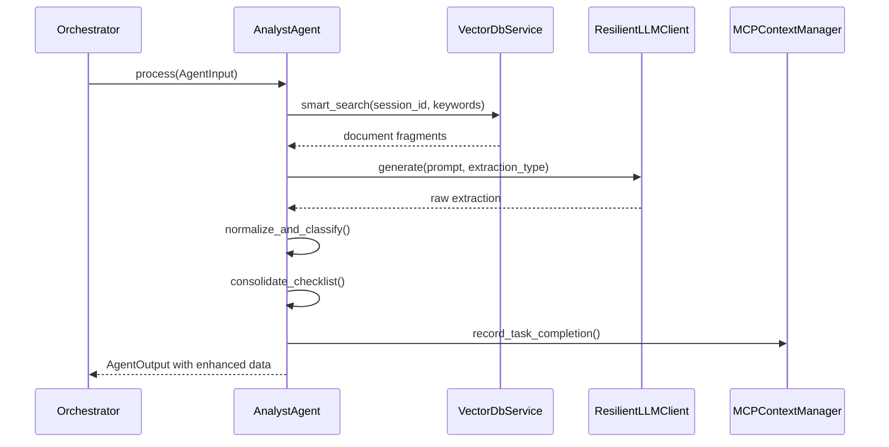
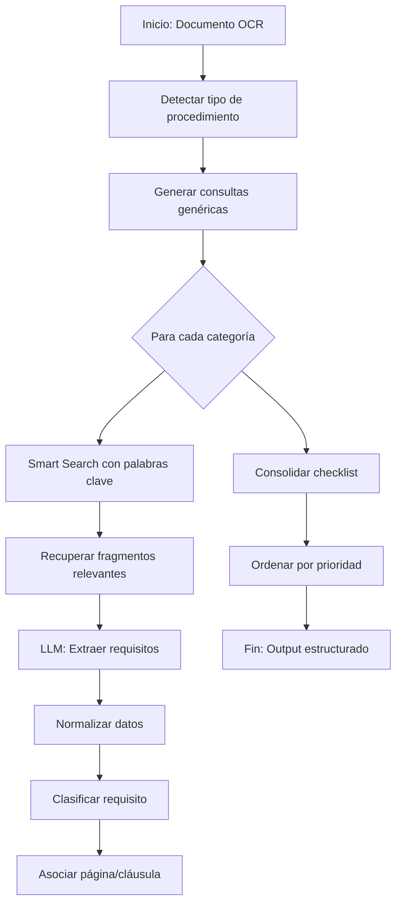

# Design Document: Enhanced Analyst Agent

## Overview

This document describes the design for enhancing the AnalystAgent to extract technical solvency (solvencia técnica) and contractual conditions (condiciones contractuales) from Mexican bidding documents (bases de licitación). The enhanced agent will be universal—working with any bidding document format without hardcoding specific structures.

The current AnalystAgent extracts:
- Cronograma (timeline)
- Requisitos de participación
- Requisitos filtro (exclusion criteria)
- Garantías
- Criterios de evaluación
- Reglas económicas
- Alcance operativo

The enhancement adds extraction of:
- Solvencia técnica (technical capability requirements)
- Condiciones contractuales (contractual terms)
- Consolidated checklist with classification and priority ordering

## Architecture

### High-Level Architecture



### Component Modifications

#### 1. Smart Search Layer (Existing + Extension)

The existing `smart_search` method in `BaseAgent` will be extended with new query patterns:

```python
# New search patterns for solvencia técnica
SOLVENCIA_KEYWORDS = [
    "experiencia mínima años contratos similares",
    "currículum empresarial personal clave",
    "plantilla personal técnico certificaciones",
    "equipamiento infraestructura requerida",
    "normas ISO NOM certificaciones",
    "cartas referencia contratos anteriores",
]

# New search patterns for condiciones contractuales
CONTRACTUAL_KEYWORDS = [
    "tipo contrato precio fijo alzado administración",
    "penalizaciones deducciones atraso",
    "anticipo pagos estimaciones finiquito",
    "garantía cumplimiento vicios ocultos",
]
```

#### 2. LLM Extraction Layer (Extension)

A new prompt template will be added for the enhanced extraction:

```python
ENHANCED_EXTRACTION_PROMPT = """
Extrae la información de SOLVENCIA TÉCNICA y CONDICIONES CONTRACTUALES de las bases de licitación.

EXTRACTOS:
{context}

Para cada requisito encontrado, incluye:
- Texto literal del requisito
- Clasificación (obligatorio/deseable/condicional)
- Página y cláusula de origen
- Nivel de confianza de la extracción

Estructura de salida:
{
  "solvencia_técnica": { ... },
  "condiciones_contractuales": { ... }
}
"""
```

#### 3. Normalization Layer (New)

New normalization functions will be added to handle the enhanced data structures:

```python
# In backend/app/services/analyst_output_normalize.py

def normalize_solvencia_tecnica(raw: Any) -> Dict[str, Any]:
    """Normaliza la estructura de solvencia técnica."""
    pass

def normalize_condiciones_contractuales(raw: Any) -> Dict[str, Any]:
    """Normaliza la estructura de condiciones contractuales."""
    pass

def classify_requirement(text: str) -> Tuple[str, bool]:
    """
    Clasifica un requisito como obligatorio, deseable o condicional.
    Returns: (classification, is_uncertain)
    """
    # Keywords for classification
    OBLIGATORY_KEYWORDS = ["deberá", "es obligatorio", "es requisito", "obligatorio", "requerido"]
    DESEABLE_KEYWORDS = ["deseable", "preferible", "se valorará", "preferente"]
    CONDITIONAL_KEYWORDS = ["cuando", "si ", "en caso de", "solo si", "únicamente"]
    
    # Implementation logic...
```

#### 4. Classification Engine (New)

The classification engine determines requirement priority:

```python
class RequirementClassifier:
    """Clasifica requisitos según su tipo y prioridad."""
    
    PRIORITY_ORDER = {
        "obligatorio": 1,
        "deseable": 2,
        "condicional": 3
    }
    
    CATEGORY_PRIORITY = {
        "garantías": 1,
        "documentación_legal": 2,
        "solvencia_técnica": 3,
        "propuesta_económica": 4,
    }
```

#### 5. Consolidation Engine (New)

Merges all extracted data into the final checklist:

```python
def consolidate_checklist(
    solvencia: Dict,
    condiciones: Dict
) -> List[Dict[str, Any]]:
    """
    Consolida solvencia técnica y condiciones contractuales
    en un checklist unificado ordenado por prioridad de entrega.
    """
```

### Integration with Existing System



## Components and Interfaces

### Input Interface

```python
# backend/app/contracts/agent_contracts.py (extension)

class AgentInput(BaseModel):
    session_id: str
    correlation_id: Optional[str] = None
    company_data: Optional[Dict[str, Any]] = None
    job_id: Optional[str] = None
```

### Output Interface

The enhanced AgentOutput will include:

```python
class AgentOutput(BaseModel):
    status: AgentStatus
    agent_id: str
    session_id: str
    data: Dict[str, Any]  # Now includes enhanced fields
    correlation_id: str
    processing_time_sec: float
```

### New Data Fields in Output

```python
{
    "cronograma": {...},                    # Existing
    "requisitos_participacion": [...],       # Existing
    "requisitos_filtro": [...],              # Existing
    "garantias": {...},                      # Existing
    "criterios_evaluacion": "...",           # Existing
    "reglas_economicas": {...},              # Existing
    "alcance_operativo": [...],              # Existing
    # NEW FIELDS
    "solvencia_tecnica": {
        "experiencia_minima": {...},
        "curriculum": {...},
        "plantilla_personal": [...],
        "equipamiento": [...],
        "infraestructura": [...],
        "normas_certificaciones": [...],
        "referencias": {...}
    },
    "condiciones_contractuales": {
        "tipo_contrato": {...},
        "penalizaciones": {...},
        "pagos": {...},
        "garantia_cumplimiento": {...},
        "garantia_vicios_ocultos": {...}
    },
    "checklist_consolidado": [
        {
            "id": "req_001",
            "categoria": "solvencia_técnica",
            "subcategoria": "experiencia",
            "descripcion": "...",
            "clasificación": "obligatorio",
            "página": "5",
            "cláusula": "8.3",
            "orden_entrega": 1
        },
        ...
    ]
}
```

## Data Models

### Solvencia Técnica

```python
from typing import List, Optional
from pydantic import BaseModel

class ExperienciaMinima(BaseModel):
    """Requisito de experiencia mínima en contratos similares."""
    años_experiencia: str = "No especificado"
    monto_minimo: str = "No especificado"
    numero_contratos: str = "No especificado"
    unidad_monetaria: str = "No especificado"
    confianza: float = 0.0
    fuente: str = ""

class PersonalClave(BaseModel):
    """Posición de personal clave requerida."""
    puesto: str
    experiencia_años: str = "No especificado"
    titulo_requerido: bool = False
    titulo_descripcion: str = ""

class CurriculumEmpresa(BaseModel):
    """Requisitos de currículum empresarial."""
    empresa_requerido: bool = False
    descripcion: str = ""
    personal_clave: List[PersonalClave] = []

class PlantillaPersonal(BaseModel):
    """Plantilla de personal técnico."""
    puesto: str
    cantidad: str = "No especificado"
    cedula_requerida: bool = False
    certificaciones: List[str] = []

class Equipamiento(BaseModel):
    """Equipo o herramienta requerida."""
    descripcion: str
    cantidad: str = "No especificado"
    caracteristicas: str = ""

class Infraestructura(BaseModel):
    """Infraestructura física requerida."""
    tipo: str  # oficina, almacén, planta
    ubicacion: str = "No especificado"
    caracteristicas: str = ""

class NormaCertificacion(BaseModel):
    """Norma o certificación requerida."""
    norma: str
    tipo: str  # ISO, NOM, NMX, etc.
    vigencia_requerida: bool = False

class Referencias(BaseModel):
    """Requisitos de contratos o cartas de referencia."""
    contratos_minimos: str = "No especificado"
    antigüedad_maxima_meses: str = "No especificado"
    cartas_referencia_aceptadas: bool = False
    requisitos_adicionales: str = ""

class SolvenciaTecnica(BaseModel):
    """Estructura unificada de solvencia técnica."""
    experiencia_mínima: ExperienciaMinima
    curriculum: CurriculumEmpresa
    plantilla_personal: List[PlantillaPersonal] = []
    equipamiento: List[Equipamiento] = []
    infraestructura: List[Infraestructura] = []
    normas_certificaciones: List[NormaCertificacion] = []
    referencias: Referencias
```

### Condiciones Contractuales

```python
class TipoContrato(BaseModel):
    """Tipo de contrato especificado."""
    tipo: str = "No especificado"
    modalidad: str = "No especificado"  # abierto/cerrado
    fuente: str = "explícito"  # explícito/inferido

class PenalizacionAtraso(BaseModel):
    """Penalización por atraso."""
    porcentaje: str = "No especificado"
    período: str = "No especificado"  # días naturales/hábiles

class Penalizaciones(BaseModel):
    """Condiciones de penalizaciones."""
    atraso: PenalizacionAtraso
    deducciones: List[str] = []
    limite_maximo: str = "No especificado"
    condiciones_aplicación: str = ""

class Anticipo(BaseModel):
    """Condiciones de anticipo."""
    porcentaje: str = "No especificado"
    garantia_porcentaje: str = "No especificado"

class Estimaciones(BaseModel):
    """Condiciones de pago por estimaciones."""
    periodicidad: str = "No especificado"
    proceso_aprobación: str = ""

class Pagos(BaseModel):
    """Condiciones de pago."""
    anticipo: Anticipo
    estimaciones: Estimaciones
    retenciones_finiquito: str = "No especificado"

class GarantiaCumplimiento(BaseModel):
    """Garantía de cumplimiento."""
    monto_porcentaje: str = "No especificado"
    tipo: str = "No especificado"  # fianza, garantía líquida, carta de crédito
    plazo_presentación: str = "No especificado"
    vigencia_meses: str = "No especificado"

class GarantiaViciosOcultos(BaseModel):
    """Garantía de vicios ocultos."""
    monto_porcentaje: str = "No especificado"
    tipo: str = "No especificado"
    periodo_meses: str = "No especificado"

class CondicionesContractuales(BaseModel):
    """Estructura unificada de condiciones contractuales."""
    tipo_contrato: TipoContrato
    penalizaciones: Penalizaciones
    pagos: Pagos
    garantía_cumplimiento: GarantiaCumplimiento
    garantía_vicios_ocultos: GarantiaViciosOcultos
```

### Checklist Consolidado

```python
from enum import Enum

class Categoria(str, Enum):
    SOLVENCIA_TÉCNICA = "solvencia_técnica"
    CONDICIONES_CONTRACTUALES = "condiciones_contractuales"

class Subcategoria(str, Enum):
    # Solvencia técnica
    EXPERIENCIA = "experiencia"
    PERSONAL = "personal"
    EQUIPAMIENTO = "equipamiento"
    NORMAS = "normas"
    REFERENCIAS = "referencias"
    # Condiciones contractuales
    TIPO_CONTRATO = "tipo_contrato"
    PENALIZACIONES = "penalizaciones"
    PAGOS = "garantías"
    GARANTÍAS = "garantías"

class Clasificacion(str, Enum):
    OBLIGATORIO = "obligatorio"
    DESEABLE = "deseable"
    CONDICIONAL = "condicional"

class RequisitoChecklist(BaseModel):
    """Un requisito en el checklist consolidado."""
    id: str
    categoría: Categoria
    subcategoria: Subcategoria
    descripción: str
    clasificación: Clasificacion
    página: str = "No especificado"
    cláusula: str = "No especificado"
    orden_entrega: int
    clasificación_incierta: bool = False
    confianza: float = 0.0
```

## Extraction Pattern

### Semantic Search Strategy

The agent uses keyword-based semantic search to identify requirements without hardcoding document formats:

```python
# Pattern: Generic keywords that work across different document formats
EXTRACTION_PATTERNS = {
    "experiencia": [
        "experiencia mínima",
        "años de experiencia",
        "contratos similares",
        "monto mínimo",
        "historial profesional",
    ],
    "personal": [
        "personal clave",
        "plantilla de personal",
        "personal técnico",
        "certificaciones",
        "cédula profesional",
    ],
    "equipamiento": [
        "equipamiento",
        "maquinaria",
        "herramientas",
        "infraestructura",
        "oficinas",
    ],
    "normas": [
        "norma",
        "certificación ISO",
        "NOM",
        "NMX",
        "cumplimiento",
    ],
    "contrato": [
        "tipo de contrato",
        "precio fijo",
        "precio alzado",
        "administración",
    ],
    "penalizaciones": [
        "penalización",
        "deducción",
        "atraso",
        "incumplimiento",
    ],
    "pagos": [
        "anticipo",
        "pago",
        "estimación",
        "finiquito",
        "retención",
    ],
    "garantías": [
        "garantía",
        "fianza",
        "cumplimiento",
        "vicios ocultos",
        "seriedad",
    ],
}
```

### Keyword-to-Query Mapping

```python
def build_extraction_query(category: str) -> str:
    """
    Construye una consulta de búsqueda semántica para una categoría.
    Usa palabras clave genéricas que funcionan con cualquier formato.
    """
    keywords = EXTRACTION_PATTERNS.get(category, [])
    return " ".join(keywords)
```

### Universal Extraction Flow



## Processing Flow

### Phase 1: Document Analysis

1. **Type Detection**: Identify if it's Licitación Pública, Invitación Restringida, or Adjudicación Directa
2. **Structure Discovery**: Determine document sections without assuming order

### Phase 2: Semantic Extraction

For each category (solvencia técnica, condiciones contractuales):

1. Build search query from generic keywords
2. Execute smart_search against vector database
3. Extract relevant text fragments
4. Send to LLM with category-specific prompt

### Phase 3: Normalization

1. Parse LLM JSON response
2. Apply normalization functions
3. Fill missing fields with "No especificado"
4. Calculate confidence scores

### Phase 4: Classification

1. Analyze requirement text for classification keywords
2. Apply classification rules:
   - "deberá", "obligatorio" → obligatorio
   - "deseable", "preferible" → deseable
   - "cuando", "si", "en caso de" → condicional
3. Default to "obligatorio" with uncertainty flag if unclear

### Phase 5: Consolidation

1. Merge solvencia_técnica and condiciones_contractuales
2. Add classification metadata
3. Add source location (page, clause)
4. Sort by delivery priority

### Phase 6: Output Generation

1. Generate final AgentOutput with all data
2. Persist to MCP context
3. Return to orchestrator

## Error Handling

### Error Categories

| Category | Handling | Recovery |
|----------|----------|----------|
| LLM Timeout | Retry with exponential backoff | Return partial data with error flag |
| Parse Error | Use fallback normalization | Mark field as "No especificado" |
| Low Confidence | Flag in metadata | Set classification_incierta=true |
| Missing Context | Log warning | Continue with available data |

### Confidence Scoring

```python
class ConfidenceScorer:
    """Calcula nivel de confianza para extracciones."""
    
    def calculate(self, extracted_text: str, source_context: str) -> float:
        # Factors:
        # - Length of extracted text vs source
        # - Presence of specific keywords
        # - Consistency with other extracted fields
        # - LLM confidence if provided
        pass
```

## Testing Strategy

### Unit Tests

**Test Classification Logic:**
```python
def test_classify_requirement():
    # Obligatorio
    assert classify_requirement("deberá presentar") == "obligatorio"
    assert classify_requirement("es obligatorio") == "obligatorio"
    
    # Deseable
    assert classify_requirement("es deseable") == "deseable"
    assert classify_requirement("se valorará") == "deseable"
    
    # Condicional
    assert classify_requirement("cuando se cumpla") == "condicional"
    assert classify_requirement("en caso de") == "condicional"
```

**Test Normalization Functions:**
```python
def test_normalize_solvencia_tecnica():
    raw = {"experiencia_mínima": {"años": "5"}}
    result = normalize_solvencia_tecnica(raw)
    assert result.experiencia_mínima.años_experiencia == "5"
```

### Integration Tests

**Test Full Extraction Pipeline:**
```python
@pytest.mark.asyncio
async def test_enhanced_extraction():
    agent = AnalystAgent(context_manager)
    result = await agent.process(test_input)
    
    assert "solvencia_tecnica" in result.data
    assert "condiciones_contractuales" in result.data
    assert "checklist_consolidado" in result.data
```

**Test with Different Document Types:**
- Licitación pública (complete format)
- Invitación restringida (simplified)
- Adjudicación directa (minimal)

### Test Data

Create test fixtures for:
- Sample OCR text with solvencia requirements
- Sample OCR text with contractual terms
- Edge cases: empty sections, ambiguous language

## Implementation Notes

### Backward Compatibility

The enhanced AgentAgent must maintain backward compatibility:
- Existing output fields remain unchanged
- New fields are added as optional
- Existing API contracts preserved

### Performance Considerations

- Smart search already uses page expansion (previous/next page)
- New searches add ~5-10 seconds to processing time
- Consider caching common extraction patterns

### Configuration

```python
# backend/app/config/settings.py
class Settings:
    # New settings for enhanced extraction
    ENHANCED_EXTRACTION_ENABLED: bool = True
    EXTRACTION_CONFIDENCE_THRESHOLD: float = 0.5
    DEFAULT_CLASSIFICATION: str = "obligatorio"
```

## Dependencies

- **Existing**: `ResilientLLMClient`, `VectorDbServiceClient`, `MCPContextManager`
- **New**: None required (reuses existing infrastructure)

## Migration Path

1. **Phase 1**: Add normalization functions (backward compatible)
2. **Phase 2**: Add new search queries to existing process method
3. **Phase 3**: Add classification and consolidation logic
4. **Phase 4**: Deploy with feature flag
5. **Phase 5**: Enable by default after validation
## Correctness Properties

*A property is a characteristic or behavior that should hold true across all valid executions of a system—essentially, a formal statement about what the system should do. Properties serve as the bridge between human-readable specifications and machine-verifiable correctness guarantees.*

### Property 1: Experiencia mínima extraction

*For any* bidding document containing experience requirements, the AnalystAgent SHALL extract the years of minimum experience, monetary amount, number of contracts, and currency unit into the structured format with keys `años_experiencia`, `monto_minimo`, `numero_contratos`, `unidad_monetaria`

**Validates: Requirements 1.1, 1.2, 1.3, 1.4**

### Property 2: Missing experience requirements fallback

*For any* bidding document that does NOT contain experience requirements, the AnalystAgent SHALL mark all experience fields as "No especificado" instead of generating fabricated values

**Validates: Requirements 1.5**

### Property 3: Curriculum empresarial extraction

*For any* bidding document requiring a company curriculum, the AnalystAgent SHALL extract whether curriculum is required, the description of what it should include, and the list of key personnel positions with their experience years and title requirements

**Validates: Requirements 2.1, 2.2, 2.3, 2.4, 2.5**

### Property 4: Plantilla de personal extraction

*For any* bidding document specifying technical personnel, the AnalystAgent SHALL extract each technical position with quantity, whether professional license (cédula) is required, and any required certifications

**Validates: Requirements 3.1, 3.2, 3.3, 3.4**

### Property 5: Empty plantilla fallback

*For any* bidding document that does NOT specify technical personnel, the AnalystAgent SHALL return an empty list with the key indicating no explicit requirements

**Validates: Requirements 3.5**

### Property 6: Equipamiento e infraestructura extraction

*For any* bidding document mentioning equipment or infrastructure, the AnalystAgent SHALL extract the list of equipment with descriptions, quantities, and characteristics, and infrastructure requirements with type, location, and characteristics

**Validates: Requirements 4.1, 4.2, 4.3, 4.4**

### Property 7: Normas y certificaciones extraction

*For any* bidding document requiring certifications or standards, the AnalystAgent SHALL extract the standard identifier, type (ISO/NOM/NMX/etc.), and whether current validity is required

**Validates: Requirements 5.1, 5.2, 5.3, 5.4, 5.5**

### Property 8: Referencias extraction

*For any* bidding document requiring reference contracts or letters, the AnalystAgent SHALL extract the minimum number of contracts, maximum age in months, whether reference letters are accepted, and any additional requirements

**Validates: Requirements 6.1, 6.2, 6.3, 6.4, 6.5**

### Property 9: Tipo de contrato extraction

*For any* bidding document specifying contract type, the AnalystAgent SHALL extract the exact contract type (fixed price, lump sum, cost-plus, etc.), modality (open/closed), and whether it was explicitly stated or inferred

**Validates: Requirements 7.1, 7.2, 7.3, 7.4**

### Property 10: Penalizaciones extraction

*For any* bidding document mentioning penalties, the AnalystAgent SHALL extract the penalty percentage, applicable period, specific deductions, maximum limit, and application conditions (calendar days vs business days)

**Validates: Requirements 8.1, 8.2, 8.3, 8.4, 8.5**

### Property 11: Condiciones de pago extraction

*For any* bidding document specifying payment terms, the AnalystAgent SHALL extract the advance payment percentage, advance guarantee percentage, payment periodicity, approval process, and final payment retainages

**Validates: Requirements 9.1, 9.2, 9.3, 9.4, 9.5**

### Property 12: Garantía de cumplimiento extraction

*For any* bidding document requiring a performance bond, the AnalystAgent SHALL extract the amount as percentage, guarantee type (bond, liquid guarantee, letter of credit), submission deadline, and validity period in months

**Validates: Requirements 10.1, 10.2, 10.3, 10.4, 10.5**

### Property 13: Garantía de vicios ocultos extraction

*For any* bidding document requiring hidden defects guarantee, the AnalystAgent SHALL extract the amount or percentage, guarantee type, and period in months

**Validates: Requirements 11.1, 11.2, 11.3, 11.4**

### Property 14: Requisito classification by keyword

*For any* extracted requirement text, the AnalystAgent SHALL classify it as:
- "obligatorio" when containing "deberá", "es obligatorio", or "es requisito"
- "deseable" when containing "deseable", "preferible", or "se valorará"
- "condicional" when containing "cuando", "si ", or "en caso de"

**Validates: Requirements 12.1, 12.2**

### Property 15: Ambiguous classification fallback

*For any* requirement text where classification cannot be clearly determined, the AnalystAgent SHALL default to "obligatorio" and mark it with `clasificación_incierta: true`

**Validates: Requirements 12.4**

### Property 16: Page and clause association

*For any* extracted requirement, the AnalystAgent SHALL associate it with the page number and clause/inciso where it appears, using "No especificado" and marking as "inferida" when location cannot be determined

**Validates: Requirements 13.1, 13.2, 13.3, 13.4, 13.5**

### Property 17: Checklist ordering by classification

*For any* consolidated checklist, the AnalystAgent SHALL order requirements first by classification (obligatorio first, then deseable, then condicional), and within each classification by category priority (garantías, documentación legal, solvencia técnica, propuesta económica)

**Validates: Requirements 14.1, 14.2**

### Property 18: Universal extraction independence

*For any* bidding document format (licitación pública, invitación restringida, adjudación directa), the AnalystAgent SHALL extract requirements using generic keyword-based search without hardcoding document-specific formats

**Validates: Requirements 15.1, 15.2, 15.3**

### Property 19: Solvencia técnica structure

*For any* extraction, the AnalystAgent SHALL generate a `solvencia_técnica` object containing all fields from requirements 1-6 with the exact specified structure including confidence metadata

**Validates: Requirements 16.1, 16.2, 16.3**

### Property 20: Condiciones contractuales structure

*For any* extraction, the AnalystAgent SHALL generate a `condiciones_contractuales` object containing all fields from requirements 7-11 with the exact specified structure including confidence metadata

**Validates: Requirements 17.1, 17.2, 17.3**

### Property 21: Consolidated checklist structure and ordering

*For any* extraction, the AnalystAgent SHALL generate a `checklist_consolidado` list where each item has the required fields (id, categoría, subcategoría, descripción, clasificación, página, cláusula, orden_entrega) and is sorted by `orden_entrega` in ascending order

**Validates: Requirements 18.1, 18.2, 18.3, 18.4**

### Property 22: Table parsing

*For any* bidding document containing tables, the AnalystAgent SHALL correctly parse tabular content identifying headers and rows without losing information

**Validates: Requirements 15.5**

### Property 23: Procedure type detection

*For any* bidding document, the AnalystAgent SHALL detect whether it is a licitación pública, invitación restringida, or adjudación directa based on content

**Validates: Requirements 15.2**
## Testing Strategy

### Dual Testing Approach

This feature requires both unit tests and property-based tests to ensure comprehensive coverage:

#### Unit Tests

Unit tests will focus on:
- Classification logic (keyword detection)
- Normalization functions (output structure)
- Data model validation
- Edge cases (empty inputs, missing fields)

#### Property-Based Tests

Property-based tests will verify universal properties across many generated inputs:
- Extraction accuracy for different document formats
- Classification consistency
- Output structure correctness
- Fallback behavior for missing data

### Property Test Configuration

Using Python's Hypothesis library:

```python
import hypothesis
from hypothesis import given, settings
from hypothesis import strategies as st

@given(text=st.text(min_size=1, max_size=1000))
@settings(max_examples=100)
def test_classification_keyword_detection(text):
    """Property: Classification keywords correctly classify requirements."""
    # Test that specific keywords trigger correct classification
    pass
```

### Test Categories

| Category | Test Type | Coverage |
|----------|-----------|----------|
| Classification logic | Unit + Property | 100% |
| Normalization functions | Unit | 100% |
| Extraction accuracy | Property | 100+ examples |
| Fallback behavior | Property | Edge cases |
| Output structure | Unit | 100% |
| Ordering logic | Unit + Property | 100% |

### Test Fixtures

Create test fixtures for:
- Sample OCR text with solvencia requirements (various formats)
- Sample OCR text with contractual terms (various formats)
- Edge cases: empty sections, ambiguous language
- Different procedure types (licitación, invitación, adjudación)

### Validation Approach

1. **Unit tests**: Run on every commit
2. **Property tests**: Run in CI with 100+ iterations
3. **Integration tests**: Run against real document samples
4. **Manual validation**: Spot-check edge cases

### Why Property-Based Testing Applies

This feature is ideal for PBT because:
- The extraction logic is a pure function (input: document text, output: structured data)
- There are universal properties that should hold across all document formats
- The input space is large (any bidding document in Mexico)
- We can generate random requirement texts and verify extraction correctness