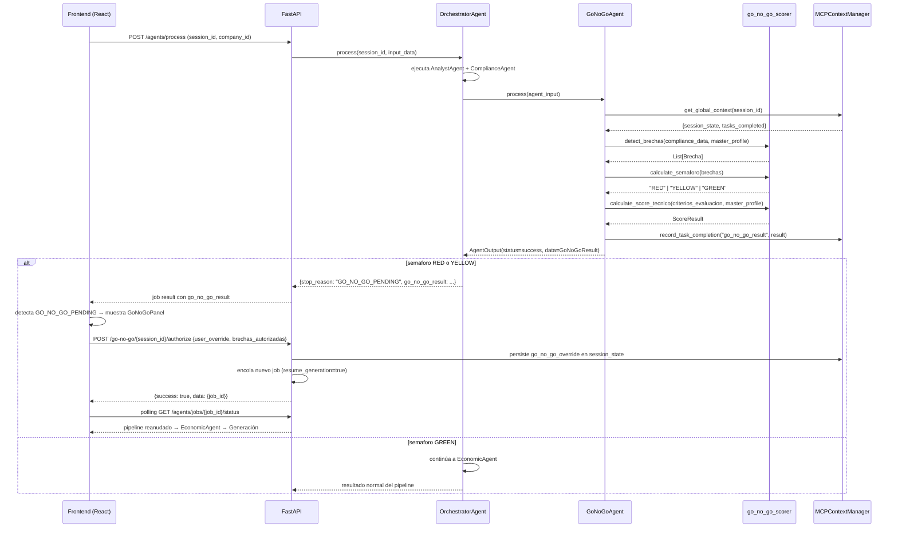

# Diseño Técnico — Semáforo Go/No-Go

## Resumen

El **Semáforo Go/No-Go** es una capa de decisión explícita que se inserta en el pipeline de LicitAI
entre el `ComplianceAgent` y el `EconomicAgent`. Evalúa de forma determinista (sin LLM) las brechas
entre el perfil maestro de la empresa y los requisitos de las bases, calcula un semáforo de riesgo
(RED / YELLOW / GREEN) y un score de cumplimiento técnico, y pausa el pipeline para que el usuario
autorice o detenga el proceso antes de invertir tiempo en la generación de documentos.

---

## Arquitectura

### Visión general del flujo modificado

```
Intake → Analyst → Compliance → [GoNoGoAgent] → EconomicAgent → Generación
                                      │
                              ┌───────┴────────┐
                              │  RED / YELLOW  │  → stop_reason: GO_NO_GO_PENDING
                              │  GREEN         │  → continúa pipeline
                              └────────────────┘
```

### Principios de diseño

- **Determinismo total**: `go_no_go_scorer.py` es un módulo stateless puro. Sin LLM, sin DB, sin efectos secundarios.
- **Fallback seguro**: si `GoNoGoAgent` falla, el orquestador continúa como GREEN para no bloquear el pipeline.
- **Contratos intactos**: `AgentInput` / `AgentOutput` no se modifican. El resultado se transporta en `AgentOutput.data`.
- **MCP exclusivo**: el agente solo lee/escribe estado vía `MCPContextManager`. Nunca acceso directo a PostgreSQL ni ChromaDB.
- **Archivos pequeños**: ningún módulo supera 200 líneas. La lógica de cálculo vive en `go_no_go_scorer.py`.

### Diagrama de secuencia — flujo completo



---

## Componentes e Interfaces

### Backend — nuevos archivos

#### `backend/app/agents/go_no_go_scorer.py`

Módulo stateless puro. Todas las funciones son deterministas y sin efectos secundarios.

```python
from dataclasses import dataclass, field
from typing import List, Literal, Optional, Any, Dict

@dataclass
class Brecha:
    id: str                          # UUID generado en detect_brechas
    categoria: str                   # certificacion_faltante | capital_insuficiente |
                                     # experiencia_insuficiente | documento_faltante |
                                     # requisito_no_acreditado
    descripcion: str                 # Descripción en lenguaje natural
    requisito_bases: str             # Texto literal del requisito en las bases
    valor_empresa: Optional[str]     # Dato del master_profile o None
    is_knockout: bool                # True si proviene de causas_desechamiento
    zona_origen: str                 # ADMINISTRATIVO/LEGAL | TÉCNICO/OPERATIVO |
                                     # FORMATOS/ANEXOS | GARANTÍAS/SEGUROS

@dataclass
class CriterioDetalle:
    criterio: str                    # Descripción del criterio de la rúbrica
    cumple: bool                     # True si hay evidencia en master_profile
    evidencia: Optional[str]         # Campo del master_profile que lo acredita
    peso: Optional[str]              # Porcentaje o puntos según las bases

@dataclass
class ScoreResult:
    score: Optional[int]             # 0-100 o None si no hay criterios
    detalle: List[CriterioDetalle]   # Un objeto por criterio de la rúbrica

# Firmas de funciones públicas:

def detect_brechas(
    compliance_data: Dict[str, Any],
    master_profile: Dict[str, Any],
) -> List[Brecha]:
    """Detecta brechas entre compliance_data y master_profile de forma determinista."""

def calculate_semaforo(
    brechas: List[Brecha],
) -> Literal["RED", "YELLOW", "GREEN"]:
    """Calcula el estado del semáforo según las reglas deterministas."""

def calculate_score_tecnico(
    criterios_evaluacion: Any,
    master_profile: Dict[str, Any],
) -> ScoreResult:
    """Calcula el score de cumplimiento técnico comparando criterios vs master_profile."""
```

#### `backend/app/agents/go_no_go.py`

Agente que orquesta la lógica del scorer y persiste el resultado vía MCP.

```python
class GoNoGoAgent(BaseAgent):
    agent_id = "go_no_go_001"

    async def process(self, agent_input: AgentInput) -> AgentOutput:
        """
        Ejecuta la evaluación Go/No-Go para la sesión.

        Args:
            agent_input: Contrato estándar de entrada con session_id y company_data.

        Returns:
            AgentOutput con data conteniendo GoNoGoResult serializado.

        Raises:
            No lanza excepciones al exterior; los errores se capturan y retornan
            como AgentOutput con status=ERROR.
        """
```

**Estructura de `GoNoGoResult` (en `AgentOutput.data`):**

```python
{
    "semaforo": "RED" | "YELLOW" | "GREEN",
    "brechas": [Brecha, ...],
    "total_knockouts": int,
    "total_brechas": int,
    "score_cumplimiento_tecnico": int | None,   # 0-100 o null
    "score_detalle": [CriterioDetalle, ...],
    "requires_user_decision": bool,
    "schema_version": 1
}
```

#### `backend/app/api/v1/routes/go_no_go.py`

Endpoint de autorización de brechas.

```python
router = APIRouter()

class AuthorizeRequest(BaseModel):
    user_override: bool
    brechas_autorizadas: List[str]   # IDs de brechas aceptadas por el usuario
    ip_address: Optional[str]        # IP del cliente (se hashea antes de persistir)

@router.post("/{session_id}/authorize")
async def authorize_go_no_go(
    session_id: str,
    body: AuthorizeRequest,
    background_tasks: BackgroundTasks,
) -> GenericResponse:
    """
    Autoriza o detiene el pipeline en estado GO_NO_GO_PENDING.

    Args:
        session_id: ID de la sesión en pausa.
        body: Decisión del usuario con lista de brechas autorizadas.

    Returns:
        GenericResponse con {success, data: {job_id?}, message}.
    """
```

### Backend — modificaciones mínimas a archivos existentes

#### `backend/app/contracts/orchestrator_contracts.py`

Agregar `"GO_NO_GO_PENDING"` a la descripción del campo `stop_reason` en `OrchestratorState`.
No se modifica la estructura del modelo; solo se actualiza el string de documentación del `Field`.

#### `backend/app/agents/orchestrator.py`

Insertar bloque de ejecución del `GoNoGoAgent` después del checkpoint `stage_completed:compliance`
y antes de la ejecución del `EconomicAgent`. Cambios mínimos:

1. Importar `GoNoGoAgent` dentro del bloque condicional (lazy import, igual que los demás agentes).
2. Ejecutar `GoNoGoAgent` si `stage_completed:compliance` está en `tasks_completed`.
3. Si `semaforo` es RED o YELLOW: retornar con `stop_reason="GO_NO_GO_PENDING"` e incluir `go_no_go_result` en la respuesta.
4. Si `semaforo` es GREEN: continuar al `EconomicAgent`.
5. Si `GoNoGoAgent` lanza excepción: loguear y continuar como GREEN (fallback).
6. En modo `generation_only` / `generation` con `go_no_go_override.authorized_by == "user"`: omitir `GoNoGoAgent`.

#### `backend/app/main.py`

Agregar una línea para registrar el router de go_no_go:

```python
from app.api.v1.routes import go_no_go as go_no_go_routes
app.include_router(go_no_go_routes.router, prefix="/api/v1/go-no-go", tags=["Semáforo Go/No-Go"])
```

### Frontend — nuevos archivos

#### `frontend/src/components/GoNoGoPanel.jsx`

Pantalla de decisión Go/No-Go. Recibe `goNoGoResult` y `sessionId` como props.

```jsx
// Props:
// goNoGoResult: objeto GoNoGoResult del backend
// sessionId: string
// onDecision: (jobId: string | null) => void  — callback tras decisión del usuario

const GoNoGoPanel = ({ goNoGoResult, sessionId, onDecision }) => { ... }
```

**Secciones del componente:**
- Semáforo visual (div con color CSS según `semaforo`)
- Sección de brechas knock-out (separada visualmente)
- Sección de brechas normales
- Score de cumplimiento técnico (barra de progreso CSS)
- Botones de acción: "Continuar asumiendo el riesgo" / "Detener y revisar"
- Aviso de override previo si `go_no_go.override_timestamp` existe en el dictamen

### Frontend — modificaciones mínimas

#### `frontend/src/App.jsx`

En la función que procesa el resultado del job polling, agregar detección de `GO_NO_GO_PENDING`:

```jsx
if (result?.agent_decision?.stop_reason === "GO_NO_GO_PENDING") {
    setGoNoGoResult(result.go_no_go_result);
    setShowGoNoGoPanel(true);
    return; // no procesar como dictamen normal
}
```

---

## Modelos de Datos

### `Brecha` (dataclass Python)

| Campo | Tipo | Descripción |
|---|---|---|
| `id` | `str` | UUID v4 generado en `detect_brechas` |
| `categoria` | `str` | Enum: `certificacion_faltante`, `capital_insuficiente`, `experiencia_insuficiente`, `documento_faltante`, `requisito_no_acreditado` |
| `descripcion` | `str` | Descripción en lenguaje natural de la brecha |
| `requisito_bases` | `str` | Texto literal del requisito en las bases |
| `valor_empresa` | `Optional[str]` | Valor del `master_profile` o `None` |
| `is_knockout` | `bool` | `True` si proviene de `causas_desechamiento` |
| `zona_origen` | `str` | Zona del `ComplianceAgent` de origen |

### `ScoreResult` (dataclass Python)

| Campo | Tipo | Descripción |
|---|---|---|
| `score` | `Optional[int]` | Porcentaje 0-100 o `None` si no hay criterios |
| `detalle` | `List[CriterioDetalle]` | Un objeto por criterio de la rúbrica |

### `CriterioDetalle` (dataclass Python)

| Campo | Tipo | Descripción |
|---|---|---|
| `criterio` | `str` | Descripción del criterio de la rúbrica |
| `cumple` | `bool` | `True` si hay evidencia en `master_profile` |
| `evidencia` | `Optional[str]` | Campo del `master_profile` que lo acredita |
| `peso` | `Optional[str]` | Porcentaje o puntos según las bases |

### `go_no_go_override` (en `session_state`)

```json
{
    "authorized_by": "user",
    "timestamp": "2026-04-01T12:00:00Z",
    "brechas_autorizadas": ["brecha-uuid-1", "brecha-uuid-2"],
    "ip_hash": "sha256-hash-de-la-ip"
}
```

### Lógica de clasificación de categorías en `detect_brechas`

La función mapea campos del requisito a categorías usando heurísticas sobre el texto del requisito:

| Patrón en `requisito_bases` | Categoría asignada |
|---|---|
| `certificaci`, `norma`, `iso`, `nom` | `certificacion_faltante` |
| `capital`, `patrimonio`, `financiero`, `balance` | `capital_insuficiente` |
| `experiencia`, `años`, `contratos similares` | `experiencia_insuficiente` |
| `documento`, `acta`, `constancia`, `carta` | `documento_faltante` |
| (cualquier otro) | `requisito_no_acreditado` |

Si `master_profile` está vacío o no tiene el campo relevante → `valor_empresa: None`.

---

## Propiedades de Corrección

*Una propiedad es una característica o comportamiento que debe ser verdadero en todas las ejecuciones válidas del sistema — esencialmente, una declaración formal sobre lo que el sistema debe hacer. Las propiedades sirven como puente entre especificaciones legibles por humanos y garantías de corrección verificables por máquina.*

### Propiedad 1: Invariante de categoría de brechas

*Para cualquier* entrada de `compliance_data` y `master_profile`, todas las brechas producidas por `detect_brechas` deben tener `categoria` dentro del conjunto `{"certificacion_faltante", "capital_insuficiente", "experiencia_insuficiente", "documento_faltante", "requisito_no_acreditado"}`.

**Valida: Requisitos 1.2**

### Propiedad 2: Invariante estructural de brecha

*Para cualquier* entrada válida, cada objeto `Brecha` producido por `detect_brechas` debe contener los campos `id`, `categoria`, `descripcion`, `requisito_bases`, `valor_empresa`, `is_knockout` y `zona_origen` con los tipos correctos.

**Valida: Requisitos 1.4**

### Propiedad 3: Knockout implica is_knockout=True

*Para cualquier* lista de `causas_desechamiento` no vacía, todas las brechas generadas a partir de esos elementos deben tener `is_knockout=True`.

**Valida: Requisitos 1.3**

### Propiedad 4: Perfil vacío genera requisito_no_acreditado

*Para cualquier* lista de requisitos no vacía con `master_profile={}`, todas las brechas producidas deben tener `categoria="requisito_no_acreditado"` y `valor_empresa=None`.

**Valida: Requisitos 1.5**

### Propiedad 5: Determinismo del scorer

*Para cualquier* par `(compliance_data, master_profile)`, llamar `detect_brechas` dos veces con los mismos argumentos debe producir resultados idénticos (mismas brechas, mismo orden, mismos valores).

**Valida: Requisitos 1.6, 4.5, 10.2**

### Propiedad 6: Reglas del semáforo

*Para cualquier* lista de brechas:
- Si existe al menos una brecha con `is_knockout=True` → `calculate_semaforo` debe retornar `"RED"`.
- Si no hay knockouts pero hay al menos una brecha → debe retornar `"YELLOW"`.
- Si la lista está vacía → debe retornar `"GREEN"`.

**Valida: Requisitos 2.1**

### Propiedad 7: Consistencia de requires_user_decision

*Para cualquier* `GoNoGoResult`, el campo `requires_user_decision` debe ser `True` si y solo si `semaforo` es `"RED"` o `"YELLOW"`.

**Valida: Requisitos 3.7**

### Propiedad 8: Rango del score técnico

*Para cualquier* lista no vacía de `criterios_evaluacion` y cualquier `master_profile`, `calculate_score_tecnico` debe retornar un `ScoreResult` con `score` en el rango `[0, 100]`.

**Valida: Requisitos 4.1, 4.2**

### Propiedad 9: Invariante estructural de score_detalle

*Para cualquier* lista de `criterios_evaluacion`, cada elemento de `ScoreResult.detalle` debe contener los campos `criterio`, `cumple`, `evidencia` y `peso` con los tipos correctos.

**Valida: Requisitos 4.3**

### Propiedad 10: AgentOutput válido para cualquier entrada

*Para cualquier* `AgentInput` válido, `GoNoGoAgent.process` debe retornar un `AgentOutput` con `agent_id="go_no_go_001"` y `status` en `{SUCCESS, PARTIAL, ERROR}`.

**Valida: Requisitos 5.1**

### Propiedad 11: schema_version en GoNoGoResult

*Para cualquier* `GoNoGoResult` producido por `GoNoGoAgent`, el campo `schema_version` debe ser `1`.

**Valida: Requisitos 6.3**

### Propiedad 12: Logs sin datos sensibles

*Para cualquier* brecha con campos sensibles (`rfc`, `capital_contable`, `certificaciones`, `estados_financieros`), los mensajes de log emitidos por `GoNoGoAgent` no deben contener esos valores; solo deben contener el `id` de la brecha y su `categoria`.

**Valida: Requisitos 9.1**

### Propiedad 13: Reanudación solo en estado correcto

*Para cualquier* estado de sesión, la reanudación con `user_override=True` solo debe proceder si `session_state` contiene `go_no_go_result` y `stop_reason="GO_NO_GO_PENDING"`. En cualquier otro estado, el endpoint debe retornar error.

**Valida: Requisitos 3.5**

---

## Manejo de Errores

### GoNoGoAgent

| Situación | Comportamiento |
|---|---|
| `stage_completed:compliance` no existe en `tasks_completed` | Retornar `AgentOutput(status=PARTIAL, message="Compliance no completado")` |
| `master_profile` ausente en `company_data` | Tratar como `{}` — todas las brechas serán `requisito_no_acreditado` |
| `detect_brechas` lanza excepción | Capturar, loguear con `brecha_id` y `categoria` (sin datos sensibles), retornar `AgentOutput(status=ERROR)` |
| `calculate_score_tecnico` lanza excepción | Capturar, loguear, retornar score=None y detalle=[] sin fallar el agente completo |

### OrchestratorAgent (fallback)

Si `GoNoGoAgent` lanza cualquier excepción no controlada:

```python
try:
    res = await GoNoGoAgent(self.context_manager).process(agent_input)
except Exception as e:
    logger.error("go_no_go_agent_failed", session_id=session_id, error=str(e))
    # Continuar pipeline como GREEN — no bloquear por fallo de la nueva capa
    res = None
```

### Endpoint de autorización

| Situación | HTTP | Respuesta |
|---|---|---|
| `session_id` no existe | 404 | `{success: false, message: "Sesión no encontrada"}` |
| `stop_reason` no es `GO_NO_GO_PENDING` | 409 | `{success: false, message: "Pipeline no está en estado GO_NO_GO_PENDING"}` |
| `go_no_go_result` no existe en session_state | 409 | `{success: false, message: "No hay resultado Go/No-Go para esta sesión"}` |
| Error interno al encolar job | 500 | `{success: false, message: "Error al reanudar pipeline"}` |

---

## Estrategia de Pruebas

### Pruebas unitarias (SQA obligatorio)

#### `tests/test_go_no_go_scorer.py`

Casos mínimos requeridos por Requisito 8.2:

| Caso | Descripción |
|---|---|
| `test_semaforo_red` | Lista con al menos una brecha `is_knockout=True` → `"RED"` |
| `test_semaforo_yellow` | Lista con brechas sin knockout → `"YELLOW"` |
| `test_semaforo_green` | Lista vacía → `"GREEN"` |
| `test_score_rubrica_vacia` | `criterios_evaluacion=[]` → `score=None`, `detalle=[]` |
| `test_score_perfil_vacio` | `master_profile={}` → `score=0` |
| `test_score_todos_cumplen` | Todos los criterios con evidencia → `score=100` |
| `test_score_ninguno_cumple` | Ningún criterio con evidencia → `score=0` |
| `test_brecha_knockout_marcada` | Requisito de `causas_desechamiento` → `is_knockout=True` |
| `test_perfil_vacio_categoria` | `master_profile={}` → todas las brechas con `categoria="requisito_no_acreditado"` |

#### `tests/test_go_no_go_agent.py`

| Caso | Descripción |
|---|---|
| `test_output_contract` | `AgentOutput` válido con `agent_id="go_no_go_001"` |
| `test_schema_version` | `GoNoGoResult.schema_version == 1` |
| `test_fallback_sin_compliance` | Sin `stage_completed:compliance` → `status=PARTIAL` |

### Pruebas de propiedad (property-based testing)

**Librería**: `hypothesis` (Python)

Cada prueba de propiedad debe ejecutarse con mínimo 100 iteraciones (`@settings(max_examples=100)`).

```python
# Tag format: Feature: semaforo-go-no-go, Property {N}: {texto}

@given(brechas=st.lists(brecha_strategy()))
@settings(max_examples=100)
def test_property_1_categoria_valida(brechas):
    # Feature: semaforo-go-no-go, Property 1: Invariante de categoría de brechas
    ...

@given(compliance_data=compliance_strategy(), master_profile=profile_strategy())
@settings(max_examples=100)
def test_property_5_determinismo(compliance_data, master_profile):
    # Feature: semaforo-go-no-go, Property 5: Determinismo del scorer
    result1 = detect_brechas(compliance_data, master_profile)
    result2 = detect_brechas(compliance_data, master_profile)
    assert result1 == result2
```

**Propiedades a implementar como tests PBT** (en orden de prioridad):

1. Propiedad 5 — Determinismo del scorer (round-trip / idempotencia)
2. Propiedad 6 — Reglas del semáforo (invariante lógica)
3. Propiedad 1 — Invariante de categoría (invariante de conjunto)
4. Propiedad 2 — Invariante estructural de brecha (invariante de esquema)
5. Propiedad 8 — Rango del score técnico (invariante de rango)
6. Propiedad 7 — Consistencia de requires_user_decision (invariante derivada)
7. Propiedad 3 — Knockout implica is_knockout=True (invariante causal)
8. Propiedad 4 — Perfil vacío genera requisito_no_acreditado (caso edge universal)

### Pruebas de integración

| Caso | Descripción |
|---|---|
| `test_orchestrator_go_no_go_pending` | Pipeline con semáforo RED → `stop_reason="GO_NO_GO_PENDING"` en respuesta |
| `test_orchestrator_green_continua` | Pipeline con semáforo GREEN → `EconomicAgent` ejecutado |
| `test_orchestrator_fallback_excepcion` | `GoNoGoAgent` lanza excepción → pipeline continúa |
| `test_authorize_endpoint_ok` | POST `/go-no-go/{id}/authorize` con `user_override=True` → job encolado |
| `test_authorize_endpoint_estado_incorrecto` | POST con `stop_reason` distinto → 409 |

### Campos sanitizados (ISO/IEC 27034)

Los siguientes campos del `master_profile` **nunca** deben aparecer en logs ni en respuestas HTTP
más allá de lo estrictamente necesario para renderizar la pantalla de decisión:

| Campo sensible | Tratamiento en logs | Tratamiento en HTTP |
|---|---|---|
| `rfc` | Omitir — solo loguear `brecha_id` | No exponer en respuesta |
| `capital_contable` | Omitir | Solo exponer `valor_empresa` (string de presentación) |
| `certificaciones` | Omitir | Solo exponer nombre de certificación, no datos internos |
| `estados_financieros` | Omitir | No exponer |
| IP del usuario | Nunca loguear directamente | Persistir solo `ip_hash` (SHA-256) |

El endpoint de autorización debe sanitizar la respuesta HTTP para exponer únicamente:
`descripcion`, `requisito_bases`, `valor_empresa` (string de presentación), `is_knockout`, `categoria`.
