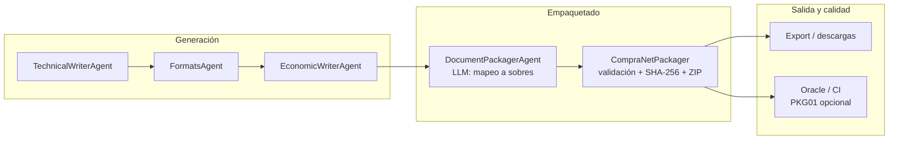

# Contexto del Proyecto: LicitAI (Forensic & Compliance Multi-Agent System)

## 📌 Arquitectura General
LicitAI es un sistema multi-agente para la extracción, análisis y auditoría forense de licitaciones.
- **Backend:** Python con FastAPI (ubicado en `./backend`)
- **Frontend:** React con Vite (ubicado en `./frontend`)
- **Base de Datos:** PostgreSQL para persistencia de datos relacionales y estado de auditorías.
- **RAG & Vectores:** ChromaDB para búsqueda semántica.
- **Inteligencia Artificial:** Orquestación de Agentes con LangChain/LlamaIndex, ejecutando modelos mediante Ollama localmente (ej. qwen2.5-coder, llama3, etc.).
- **Infraestructura:** Todo está contenerizado con Docker (orquestado vía `docker-compose.yml`).

## 🧠 Flujo de Análisis Forense
El sistema sigue un flujo especializado "Pipeline" para analizar licitaciones:
1. **Intake / VisionExtractor:** Extracción de datos de PDFs (escaneados y nativos).
2. **Analyst Agent:** Comprensión de las bases y extracción de requisitos.
3. **Compliance Agent (Forensic):** Auditoría que compara rigurosamente los requisitos con los documentos extraídos para identificar riesgos o faltantes, con mitigación de "Lost in the Middle". Exige extracción literal y formatos de salida JSON estrictos.
4. **Economic Agent:** Evaluación económica.

## Flujo de Empaquetado CompraNet

Capa posterior a la generación de documentos (`technical` → `formats` → `economic_writer`): organiza la propuesta para entrega y aplica reglas **deterministas** antes de cualquier export definitivo. Las bases suelen exigir sobres y formatos concretos; aquí se documenta el contrato implementado en código (sin valores fijos de convocante).

### Diagrama de flujo

Lista equivalente:

1. **DocumentPackagerAgent** (`document_packager.py`): copia archivos generados a carpetas de sobre (`SOBRE_1_ADMINISTRATIVO`, `SOBRE_2_TECNICO`, `SOBRE_3_ECONOMICO`), usando **LLM** solo para sugerir el mapeo documento → sobre; si el LLM falla, aplica **fallback determinístico** por claves (`administrativa` / `tecnica` / `economica`).
2. **Orquestador** (`orchestrator.py`): tras un `packager` exitoso, invoca **CompraNetPackager** (`packager.py`). No sustituye al agente anterior; **valida y normaliza** lo ya materializado en disco.
3. **CompraNetPackager**: renombra a convención canónica, valida extensiones, genera **MANIFIESTO_SHA256.json**, y opcionalmente un **ZIP** si el volumen supera el umbral.
4. **Persistencia**: resultado en `execution_results["compranet_packaging"]` y hito `stage_completed:compranet_pack` (exportable vía `scripts/export_oracle_inputs.py` → `packager.json`).
5. **Oracle / CI**: caso **PKG01** en `tests/oracle_v1.0.1-runtime-final.json`; si no se pasa `--packager` al validador, el caso queda en modo compatibilidad (export histórico sin etapa). Con `packager.json` presente, se exige coherencia del manifiesto.

### Reglas de nombrado canónico

Patrón aplicado a cada archivo al copiarse bajo `_compranet_validated/<Sobre…>/`:

`{RFC}_{Licitacion}_{SobreComplementaria|SobreTecnica|SobreEconomica}_{orden}{ext}`

- **RFC** y **Licitacion** provienen de `session_data` (`master_profile.rfc`, `licitacion_id` o `session_id`); se **sanitizan** para nombres de archivo (alfanumérico y separadores seguros), sin insertar datos inventados.
- **Sobre** se infiere de la clave/carpeta del `DocumentPackager` (administrativo → Complementaria, técnico → Tecnica, económico → Economica).
- **orden** coincide con el orden del documento en el sobre (o índice al escanear carpetas estándar).

**Extensiones permitidas:** variable de entorno `COMPRANET_ALLOWED_EXT` (lista separada por comas, con punto). Valor por defecto en código: `.doc`, `.docx`, `.pdf`, `.jpg`, `.jpeg`, `.png`, `.xlsx`. Cualquier otra extensión provoca fallo de validación.

**Tamaño y compresión:** `COMPRANET_PACKAGE_MAX_BYTES` (por defecto 50 MiB). Si el total de bytes de los archivos validados lo supera, se genera un ZIP en la raíz de salida con **`ZIP_DEFLATED` y nivel 6** (comportamiento estándar de `zipfile` en la biblioteca, compatible con descompresores habituales en entornos tipo CompraNet / Windows).

### Manejo de errores

| Situación | Comportamiento |
|-----------|----------------|
| Extensión no permitida, archivo faltante, RFC/licitación ausente, o cero archivos válidos | `CompraNetPackager` devuelve `success=False`; orquestador responde con error y **`stop_reason="PACKAGING_VALIDATION_FAILED"`**. No se registra `stage_completed:compranet_pack`. |
| Éxito | `validation_passed: true`, manifiesto escrito, `stage_completed:compranet_pack` persistido. |

**CI / Oracle:** `blocking_issues` solo sube cuando un caso con criticidad `blocking` entra en estados `missing`, `rule_fail` o `blocking`. **PKG01** con `packager.json` que indique `validation_passed: false` puede elevar hallazgos bloqueantes según el contrato del validador. En exports sin `packager.json`, PKG01 no invalida la corrida (compatibilidad).

### Alcance y límites actuales

- La **última capa** antes del ZIP/manifiesto es **100 % determinista** (sin LLM).
- **No** se validan hoy metadatos ni texto de cabecera dentro del PDF por página; eso queda como **incremento futuro** (por ejemplo `pypdf` o motor tipo MuPDF) si las bases lo exigen de forma verificable.
- El alineamiento con el **anexo** concreto de cada licitación es responsabilidad de quien configure `COMPRANET_ALLOWED_EXT` / umbrales y de revisar que el `DocumentPackager` haya colocado cada documento en el sobre correcto; las reglas anteriores aseguran **nomenclatura y trazabilidad por hash**, no la sustitución del criterio legal del anexo.

### Fixtures y sesión de referencia

- Snapshot anónimo para Oracle/regresión: `backend/tests/fixtures/real_sessions/compranet_pack_ok.json` (estructura típica de `stage_completed:compranet_pack`).
- Sesión de negocio documentada en tests de regresión del packager: `la-51-gyn-051gyn025-n-8-2024_vigilancia` (datos anonimizados en el mismo árbol de fixtures).

## 🛠️ Reglas de Código y Desarrollo
- **Backend (Python):** 
  - Usar siempre type hints (`typing`).
  - Escribir `docstrings` en español describiendo entrada/salida y posibles excepciones.
  - La persistencia de auditorías o "Dictámenes Forenses" debe hacerse directamente a PostgreSQL para evitar pérdida de datos del contenedor. Poner atención a la correcta sanitización Pydantic -> SQLAlchemy.
- **Frontend (React):**
  - Los componentes UI deben ceñirse a un formato de "Tarjeta Forense" estricto: (Ubicación, Sección, Texto Literal).
  - Mantener unificado el conteo de requisitos de auditoría a través de todos los componentes.
- **General:**
  - Todas las explicaciones de código y planeación en la conversación se harán en **español**.
  - No usar TailwindCSS a menos que se solicite específicamente, priorizamos Vanilla CSS y componentes estructurados. 
  - Si implementas Prompt Engineering, usa ejemplos con refuerzo positivo y "few-shot learning".

## 🚀 Comandos Útiles y Utilidades
- **Correr entorno local:** `docker-compose up -d --build`
- **Verificar Logs Backend:** `docker-compose logs -f backend`
- **(Si en WSL/Host):** La instancia de Ollama se expone en `http://localhost:11434` o su respectivo endpoint en el `.env`.

> ⚠️ Nota para IA: Revisa el esquema de base de datos o modelos Pydantic en `backend/app` antes de proponer cambios estructurales a la base de datos persistente.
