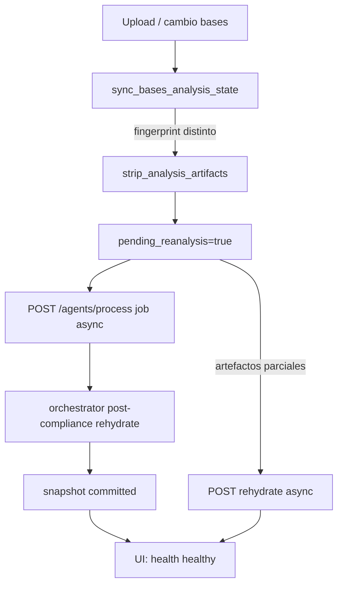

# Ciclo de vida de artefactos de sesión

Política universal para **invalidación**, **preservación** y **reconstrucción** tras cambio de bases, re-análisis o generación. Sin reglas por licitación.

**Implementación:** `session_bases_analysis_invalidation.py`, `analysis_artifacts_rehydrate_service.py`, orquestador.

---

## 1. Huella de bases (`bases_analysis_snapshot`)

| Campo | Significado |
|-------|-------------|
| `fingerprint` | SHA-256 truncado del set de PDFs de bases/convocatoria |
| `pending_reanalysis` | `true` → análisis/compliance no confiables para la huella actual |
| `invalidated_at` / `reason` | Auditoría de la última invalidación |

**Disparadores de invalidación:** upload/reemplazo de bases, cambio de texto ingestado, `force_invalidate_analysis_artifacts`.

---

## 2. Qué se borra al invalidar análisis

Función: `strip_analysis_artifacts` / `apply_analysis_invalidation`.

### Tasks eliminados de `tasks_completed`

- `stage_completed:analysis`
- `stage_completed:compliance`
- `analisis_bases`, `master_compliance_list`, `go_no_go_result`

### Claves de sesión eliminadas

| Clave | Efecto en UI |
|-------|----------------|
| `compliance_master_list` | Dictamen / zonas de requisitos |
| `document_inventory`, `intake_plan` | Inventario y plan intake |
| `analyst_result`, `analysis_result` | Resultado crudo analista |
| `forensic_dictamen`, `dictamen_forense`, `dictamen` (si presente en limpieza extendida) | Dictamen forense |
| `junta_aclaraciones_questions` | Preguntas junta |
| `mini_dictamen_anexos`, `delivery_coverage_report` | Anexos / cobertura |
| `last_orchestrator_decision` | Stop reason previo |

---

## 3. Qué se conserva (por diseño)

Documentado en `PRESERVED_TOP_LEVEL_KEYS` (rehydrate) e invalidación:

| Clave | Motivo |
|-------|--------|
| `economic_user_inputs`, `session_line_items` | Captura HITL económica |
| `generation_state` | Cola formats → packager |
| `go_no_go_override` | Decisión usuario Go/No-Go |
| `pending_questions` | Cola chat HITL (salvo hard reset) |
| `submission_checklist` | Hitos persistidos (puede quedar desalineado → rehydrate) |
| `document_candidates_*` | Hasta rehydrate o nuevo análisis |
| Outputs en disco `/data/outputs/{session_id}/` | No se borran en invalidación automática |

**Hard reset** (`should_hard_reset_session_artifacts`): solo en modo `full` cuando **cambió la huella de bases**. Limpia además `pending_questions`, `document_inventory`, candidatos v1, `economic_user_inputs` (orquestador). **No** aplica en `analysis_only` ni `generation*`.

---

## 4. Quién reconstruye qué

| Artefacto | Reconstructor | Cuándo |
|-----------|---------------|--------|
| Compliance + dictamen | Orquestador → Compliance / Analyst | «Analizar bases» (job async `/agents/process`) |
| Candidatos documentales | `ensure_session_document_candidates` | Rehydrate o dictamen lazy |
| Hitos / calendario | `ensure_session_cronograma_and_checklist` | Rehydrate; fast-path si checklist válido |
| Junta aclaraciones | `junta_aclaraciones_questions_service` | Rehydrate o post-compliance hook |
| Snapshot committed | `commit_bases_analysis_snapshot` | Fin de pipeline análisis o rehydrate OK |

**Servicio unificado:** `rehydrate_after_analysis_pipeline` (POST `/sessions/{id}/rehydrate-analysis-artifacts`).

---

## 5. Flujo recomendado operativo



---

## 6. Señales de salud (`GET /sessions/{id}/health`)

- `rehydrate_recommended=true` → ejecutar rehydrate (async) o re-analizar.
- `stale` incluye: `bases_pending_reanalysis`, `dictamen_missing_with_compliance`, `baseline:…`.
- `healthy=true` → paneles pueden servirse sin trabajo pesado en GET.

---

## 7. Anti-patrones (no hacer)

- Borrar `economic_user_inputs` en invalidación suave (pierde HITL).
- Llamar enrichment RAG de cronograma en cada GET `/dictamen` (P0-03).
- Parchear conteos por sesión en lugar de rehydrate/baseline.
- Hard reset en `generation_only` (rompe cola de generación).

---

## 8. Referencias

- Rehydrate: `backend/app/services/analysis_artifacts_rehydrate_service.py`
- Invalidación: `backend/app/services/session_bases_analysis_invalidation.py`
- Smoke: `scripts/smoke_session_stability.py`, `scripts/smoke_ui_artifacts.py`
- Handoff: `docs/INFORME_ESTABILIZACION_HANDOFF.md`

---

## 9. Cambio de empresa (`company_binding`) — HRU integridad R2/R3

**Implementación:** `company_binding_service.py`, `artifact_fingerprint_service.py`, `generation_wipe_policy.py`.

Disparador: `POST /sessions/{id}/bind-company` con `company_id` distinto al anterior, o auto-bind en orquestador cuando perfil sesión ≠ catálogo DB.

### 9.1 Qué se invalida en sesión (PostgreSQL)

| Clave / task | Efecto |
|--------------|--------|
| `tasks_completed.economic_proposal` | Snapshot marcado stale / removido según policy |
| `stage_completed:economic` | No es fuente de «validada» tras cambio |
| `expediente_guided_v1.economic_validated_at` | Ignorado por readiness gates |
| `generation_state.jobs.economic_writer` | Reset a `pending` o `blocked` |
| `artifact_fingerprints` (sesión) | Recalculados tras regeneración |

### 9.2 Qué se borra en disco

Subdirs definidos en `company_binding_policy.json` → por defecto:

- `2.propuesta_economica/` (completo)
- Sidecar `_LICITAI_FINGERPRINT.json` del scope económico

**No se borran** en cambio de empresa:

- `1.propuesta tecnica/`
- `3.documentos administrativos/`
- `_compranet_validated/` (hasta empaquetado/regeneración explícita)

### 9.3 Entrega bloqueada sin wipe físico

Si quedan archivos stale (ej. incidente pre-R3): `delivery_scope_resolver` + readiness gates devuelven `artifact_count=0` y `empty_reason=artifact_fingerprint_mismatch` aunque existan bytes en disco. Oracle **CONTAM01**.

### 9.4 Precedencia

```
Usuario bind-company > companies.master_profile (DB) > master_profile en sesión > inferencia
```

### 9.5 Factory reset sesión contaminada (operación)

1. `POST /sessions/{id}/bind-company` — empresa válida del catálogo.
2. Verificar `GET /sessions/{id}/readiness` → `binding_valid=true`, blockers esperados.
3. Regenerar económica (`generation_mode=economic`) cuando `economic_writer_allowed=true`.
4. Confirmar `GET /downloads/artifacts?scope=economic` → `readiness_integrity_blocked=false`.

Sesión piloto limpia recomendada: `vigilancia_issste_mayo_v1` (sin arrastrar artefactos jun-2026).

Ver playbook: `DEPLOY_HARDENING_PLAYBOOK.md` §10.

---

## 10. Referencias integridad expediente

- Readiness: `backend/app/services/expediente_readiness_service.py`
- Binding: `backend/app/services/company_binding_service.py`
- Fingerprint: `backend/app/services/artifact_fingerprint_service.py`
- SPEC: `docs/SPEC_EXPEDIENTE_READINESS_AND_INTEGRITY_HRU.md`
- Smoke R5: `backend/scripts/smoke_expediente_readiness_integrity.py`
