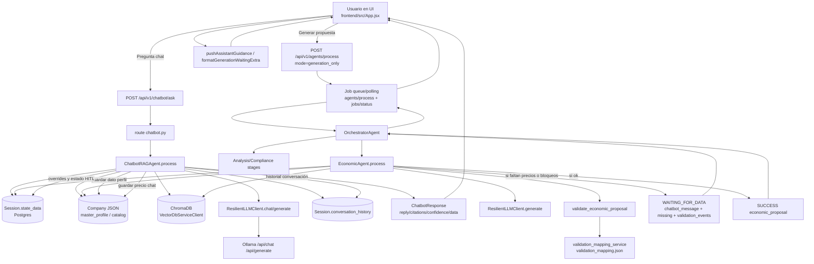

# Flujo Chat RAG y Generacion

Este documento describe, de forma operativa, como fluye una interaccion de usuario en LicitAI cuando:

1. pregunta en el chat (RAG), y/o
2. pulsa "Generar propuesta" (pipeline multi-agente).

La meta es que el equipo pueda diagnosticar rapido por que aparece cierto mensaje y en que capa corregir.

---

## 1) Diagrama end-to-end

---

## 2) Que endpoint atiende cada accion del usuario

- Chat (mensaje manual del usuario): `POST /api/v1/chatbot/ask`
  - Ruta: `backend/app/api/v1/routes/chatbot.py`
  - Agente: `ChatbotRAGAgent`
- Generar propuesta: `POST /api/v1/agents/process` + polling de job
  - Ruta: `backend/app/api/v1/routes/agents.py`
  - Orquestacion: `OrchestratorAgent`
  - Modulo economico: `EconomicAgent`

---

## 3) Fuentes de verdad que usa el sistema

## 3.1 Sesion (estado transaccional)
Persistida en Postgres (JSON `Session.state_data`):

- `pending_questions`
- `current_question_index`
- `hitl_deferred_reminders`
- `economic_user_inputs`
- `economic_user_overrides`
- `tasks_completed`
- `go_no_go_result`

Uso: controla el estado de la conversacion y del pipeline.

## 3.2 Empresa
Persistida en Postgres (JSON de `Company`):

- `master_profile` (RFC, domicilio, representante, etc.)
- `catalog` (precios de negocio, incluyendo capturas por chat)

Uso: datos corporativos y base de precios de oferta.

## 3.3 Documentos de sesion
Persistidos en Postgres (`Document.content` + `metadata_info`):

- `extracted_text`
- nombre de archivo
- estado de analisis

Uso: respaldo textual para extraccion y trazabilidad.

## 3.4 Vector DB (Chroma)
Persistencia semantica por `session_id`:

- chunks de texto
- metadatos (`source`, `page`, `session_id`, `doc_id`)

Uso: recuperar contexto RAG con citas.

---

## 4) Como decide el ChatbotRAGAgent que hacer

Orden simplificado de decision dentro de `process()`:

1. Carga estado de sesion (`pending_questions`, indice actual).
2. Si el usuario manda override economico directo, lo guarda.
3. Si no hay pendientes y hay saludo/mensaje vacio, lanza `DataGapAgent` proactivo.
4. Si hay pendientes:
   - puede responder "que falta"
   - puede posponer (`siguiente`, `mas tarde`, etc.)
   - puede intentar "tomar de fuentes" para ciertos campos (ej. INE)
5. Clasifica el mensaje en:
   - `DATA_INTAKE`
   - `QUERY`
   - `META`
6. Si `QUERY` y hay pendientes:
   - bloquea RAG salvo whitelist de consulta explicita de pliego.
7. Si `QUERY` permitido: ejecuta flujo RAG con Chroma + LLM.

---

## 5) Como se arma una respuesta RAG

Dentro de `_handle_rag_query`:

1. Obtiene fuentes con `vector_db.get_sources(session_id)`.
2. Intenta priorizar documento principal (`bases`, `convocatoria`).
3. Recupera hasta N fragmentos (`query_texts` o `query_texts_filtered`).
4. Construye `context_str` con marca de fuente/pagina.
5. Inyecta contexto de pendiente actual (si aplica).
6. Construye:
   - `system_prompt` (voz, reglas de literalidad, no inventar, citas)
   - `prompt` con fragmentos + pregunta
7. Llama a `self.llm.chat(...)`.
8. Devuelve:
   - `respuesta`
   - `citas` unicas (`documento`, `pagina`)
   - `confianza`
   - `tipo="rag_answer"`

Si el LLM falla, devuelve mensaje guiado de recuperacion (reintento, revisar Ollama, etc.).

---

## 6) Como se arma la interaccion economica por chat

Cuando hay faltantes de precio:

1. `EconomicAgent` detecta gaps (`price_missing` o precio vacio).
2. Guarda `pending_questions` tipo `economic_price`.
3. Devuelve `WAITING_FOR_DATA` con mensaje de accion al usuario.
4. El frontend lo muestra en chat + tarjeta de validacion.
5. El usuario responde precio en chat.
6. `ChatbotRAGAgent` captura y guarda:
   - en `Company.catalog` (`source=chatbot_intake`)
   - en `Session.economic_user_inputs` para overrides y trazabilidad
7. Se avanza `current_question_index`.
8. Cuando corresponde, se revalida economia.

---

## 7) Donde se almacena cada cosa (mapa rapido)

- Historial conversacion:
  - `Session.conversation_history`
- Estado de cola HITL:
  - `Session.state_data.pending_questions`
  - `Session.state_data.current_question_index`
- Overrides economicos:
  - `Session.state_data.economic_user_overrides`
  - `Session.state_data.economic_user_inputs`
- Datos de empresa:
  - `Company.master_profile`
  - `Company.catalog`
- Fragmentos para RAG:
  - ChromaDB (coleccion por sesion o fallback cross-collection)

---

## 8) Puntos de falla comunes y sintoma visible

## 8.1 Falta indexacion de bases
Sintoma:
- RAG responde "no se encontro informacion" o muy generico.
Chequeo:
- Fuentes en sesion
- estado de analisis de documentos
- Chroma con chunks y metadatos

## 8.2 Mensaje tecnico duplicado en chat
Sintoma:
- misma alerta repetida en tarjeta y chat.
Chequeo:
- composicion frontend (`formatGenerationWaitingExtra`)
- dedupe de `pushAssistantGuidance`

## 8.3 RAG bloqueado por pendientes
Sintoma:
- "primero cierra dato pendiente".
Chequeo:
- `pending_questions` activos
- consulta no cumple whitelist de pliego

## 8.4 Usuario da precio pero no avanza
Sintoma:
- vuelve a pedir el mismo concepto.
Chequeo:
- formato de entrada (numero limpio)
- conversion a `float`
- guardado en `Company.catalog`
- avance de `current_question_index`

## 8.5 Ollama saturado/no disponible
Sintoma:
- respuesta de fallback de servicio no disponible.
Chequeo:
- `LLM_URL`
- salud de Ollama host
- timeout/circuit breaker

---

## 9) Checklist de demo para evitar incidentes

Antes de demo:

1. Backend/Frontend/DB/Vector levantados.
2. Ollama activo y modelo cargado.
3. Sesion con bases ya analizadas.
4. Empresa seleccionada en UI.
5. Prueba de una pregunta RAG corta.
6. Prueba de un precio de ejemplo por chat.

Durante demo:

1. Una pregunta por turno.
2. Si aparece waiting por precios, seguir tarjeta + chat.
3. No mezclar "pregunta de pliego" y "captura de precio" en el mismo mensaje.

---

## 10) Referencias de archivos clave

- Chat route: `backend/app/api/v1/routes/chatbot.py`
- Chat agent: `backend/app/agents/chatbot_rag.py`
- Economic agent: `backend/app/agents/economic.py`
- Vector client: `backend/app/services/vector_service.py`
- LLM resiliencia: `backend/app/services/resilient_llm.py`
- LLM HTTP client: `backend/app/services/llm_service.py`
- MCP context: `backend/app/agents/mcp_context.py`
- Memory adapter: `backend/app/memory/adapters/postgres_adapter.py`
- Frontend orchestration: `frontend/src/App.jsx`

