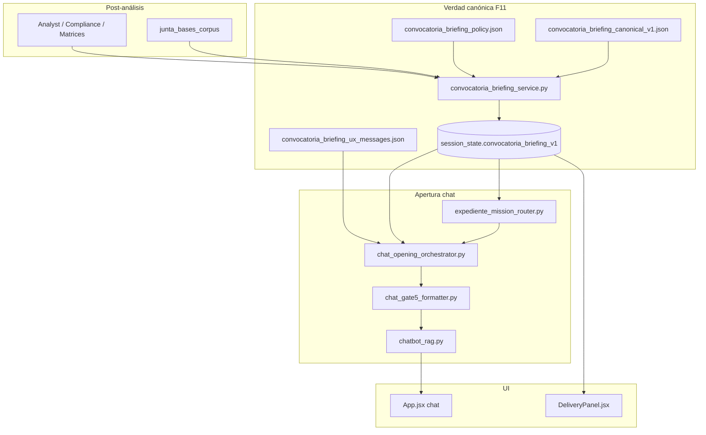

# SPEC + Arquitectura + Plan — Briefing de convocatoria y apertura unificada del chat (HRU)

**Versión:** 1.0.0  
**Fecha:** 2026-07-07  
**Decisión de producto:** F11 — sustituir parches de copy y carreras de handlers por **verdad canónica del pliego** + **un solo orquestador de apertura**  
**Normativa:** [`ESTANDAR_ENTERPRISE_CANONICO_HITL.md`](ESTANDAR_ENTERPRISE_CANONICO_HITL.md)  
**Predecesores:** [`SPEC_DUAL_STREAM_GENERATION_AND_CHAT_COPILOT_COMPLETO_HRU.md`](SPEC_DUAL_STREAM_GENERATION_AND_CHAT_COPILOT_COMPLETO_HRU.md) (F6–F10), [`SPEC_DECOUPLED_GENERATION_AND_CHAT_ECONOMIC_HITL.md`](SPEC_DECOUPLED_GENERATION_AND_CHAT_ECONOMIC_HITL.md)  
**Relacionado:** [`CONTRATO_COLA_CHAT_UNIVERSAL.md`](CONTRATO_COLA_CHAT_UNIVERSAL.md), [`SUPER_ISSUE_CHAT_INTENCION_Y_UX_CONVERSACIONAL.md`](SUPER_ISSUE_CHAT_INTENCION_Y_UX_CONVERSACIONAL.md), [`PILOT_SIGNOFF_CHECKLIST.md`](PILOT_SIGNOFF_CHECKLIST.md)  
**Sucesor (pedagogía + página exacta):** [`SPEC_PLIEGO_PEDAGOGICO_ANCHORS_AND_EXPLAIN_HRU.md`](SPEC_PLIEGO_PEDAGOGICO_ANCHORS_AND_EXPLAIN_HRU.md) (F12)

---

## 0. Resumen ejecutivo

### 0.1 Problema

Tras F6–F10 el backend **sí lee las bases** (compliance, inventario, matrices económicas/técnicas), pero el chat **no explica** al licitante qué pide la convocante ni **por qué** el primer paso es cotizar, capturar técnica o adjuntar documentos. Varios handlers compiten en la apertura (`_try_expediente_mission_bootstrap`, `_proactive_economic_capture_offer`, `_proactive_technical_capture_offer`, cola `pending_questions`), lo que produce mensajes mezclados, jerga de producto (`price_source`, `metodología:`) y titulares incorrectos («Propuesta técnica» cuando lo urgente es la cotización).

**Esto no se corrige con más `if` ni copy puntual:** requiere una capa de **briefing canónico del pliego** y un **orquestador único** de apertura.

### 0.2 Decisión (experto)

Implementar **F11 — Convocatoria Briefing HRU**:

| Pilar | Qué es | Por qué es de fondo |
|-------|--------|---------------------|
| **A. Verdad canónica** | `convocatoria_briefing_canonical_v1` persistido en sesión tras análisis | Una sola síntesis auditable de «qué pide la convocante» derivada de datos forenses, no del LLM libre |
| **B. Orquestación** | `ChatOpeningOrchestrator` — único funnel de apertura post-empresa | Elimina carreras entre handlers; precedencia explícita |
| **C. Lenguaje llano** | `convocatoria_briefing_ux_messages.json` + glosario HRU | Cero jerga interna visible; anexos citados con nombre humano |
| **D. Misión derivada** | `expediente_mission_router` consume briefing, no keywords sueltas | Prioridad «cotizar primero» justificada por bloque económico del pliego |

**Fuera de alcance F11:** re-análisis completo del PDF en cada saludo; mapas por convocante (ISSSTE/IMSS); sustituir RAG en consultas libres del usuario.

### 0.3 Resultado esperado para el licitante

Al seleccionar empresa, **un solo mensaje** en lenguaje llano:

1. **Qué es la licitación** (objeto en una frase, desde estado).
2. **Tres bloques** que pide la convocante: documentos de tu empresa · propuesta técnica · cotización económica (con 1–2 ejemplos reales del expediente, no genéricos).
3. **Primer paso concreto** («empecemos por el precio de *Control de Pases*») con **procedencia** (bases / numeral / anexo si está anclado).
4. **Un CTA** accionable sin sintaxis mágica.

---

## 1. Especificaciones funcionales

### 1.1 User stories

| ID | Como… | Quiero… | Para… |
|----|--------|---------|-------|
| US-11.1 | Licitante nuevo | Que el asistente me diga **en español claro** qué partes tiene mi propuesta según las bases | Entender el expediente sin leer 80 páginas |
| US-11.2 | Licitante comercial | Que me indique **por qué empiezo cotizando** antes que la técnica | Alinear expectativas con el pliego |
| US-11.3 | Licitante técnico | Ver qué falta de **metodología/personal** sin que eso robe el foco de la apertura | Saber qué viene después sin confusión |
| US-11.4 | Coordinador | Que el briefing sea **el mismo** en chat y panel de entrega | Una sola verdad, no dos narrativas |
| US-11.5 | Auditor | Ver `provenance_ui` del briefing (páginas, numerales, fuente) | Confianza y corrección HITL |
| US-11.6 | Operador on-prem | Smoke que valide briefing + apertura en fixture ISSSTE vigilancia **sin** strings hardcodeados | HRU universal |

### 1.2 Comportamiento requerido

#### 1.2.1 Generación del briefing (post-análisis)

Tras `stage_completed:analysis` (hook en orquestador o post-commit de análisis):

1. Invocar `build_convocatoria_briefing_canonical_v1(session_state, bases_corpus?)`.
2. Persistir en `session_state["convocatoria_briefing_v1"]` (merge idempotente por `schema_version`).
3. Recomputar si cambian señales críticas: `compliance_master_list`, `document_candidates_consolidated`, `capture_matrix_blocks`, `session_line_items` (misma política que invalidación de inventario).

**Entrada (cascada de precedencia):**

```
Usuario override (futuro HITL) > ítems normalizados del análisis > catálogo de bloques HRU > inferencia acotada (solo si política lo permite)
```

**Salida canónica (mínimo):**

```json
{
  "schema_version": "convocatoria-briefing-v1.0.0",
  "tender_object_plain": "Servicio de vigilancia en instalaciones del hospital…",
  "blocks": [
    {
      "block_id": "administrative",
      "title_plain": "Documentos de tu empresa",
      "summary_plain": "Opiniones fiscales, actas, visita a instalaciones…",
      "example_items": ["Opinión de cumplimiento SAT", "Constancia de visita"],
      "item_count": 24,
      "envelope_hint": "documentación complementaria",
      "provenance_ui": { "source": "compliance_master_list.administrativo", "page_refs": [22, 23] }
    },
    {
      "block_id": "technical",
      "title_plain": "Propuesta técnica",
      "summary_plain": "Cómo ejecutarás el servicio, personal, equipo y experiencia",
      "example_items": ["Descripción del servicio (Anexos 2 y 3)", "Organigrama y CV"],
      "item_count": 12,
      "envelope_hint": "sobre técnico",
      "provenance_ui": { "source": "compliance_master_list.tecnico", "page_refs": [25, 26] }
    },
    {
      "block_id": "economic",
      "title_plain": "Cotización económica",
      "summary_plain": "Precio por operario o zona, desglosado según formatos del pliego",
      "example_items": ["Integración de precio unitario", "Resumen de cotización"],
      "item_count": 4,
      "envelope_hint": "sobre económico",
      "provenance_ui": { "source": "session_line_items", "page_refs": [27, 63] }
    }
  ],
  "recommended_first_track": "economic",
  "recommended_first_track_reason_plain": "Las bases piden cerrar precios por zona antes de evaluar solvencia.",
  "recommended_first_action": {
    "track": "economic",
    "label_plain": "Control de Pases — precio mensual por operario",
    "field_key": "line_item:control_pases",
    "provenance_ui": { "source": "session_line_items", "page": 63, "snippet_id": "…" }
  },
  "quality_signals": {
    "blocks_complete": true,
    "economic_anchor_verified": true,
    "confidence": "alta"
  }
}
```

#### 1.2.2 Clasificación de bloques (universal)

Reglas en `convocatoria_briefing_policy.json` — **sin** `if convocante`:

| `block_id` | Fuentes de ítems | Heurística de sobre |
|------------|------------------|---------------------|
| `administrative` | `compliance.administrativo`, credenciales `presentar_fisico`, `requisitos_legales` | Texto bases: «documentación complementaria», «requisitos administrativos» |
| `technical` | `compliance.tecnico`, `sobre_1_tecnico` generables técnicos | Slots técnicos, anexos TE/T, numeral 6.2 patrón |
| `economic` | `compliance.economico`, `sobre_2_economico`, `session_line_items`, matrices | Numerales 6.3, «propuesta económica», «precio unitario» |

`recommended_first_track` — orden determinista:

1. Si hay pendiente económico verificado (`economic_validation_blocking` con ancla, o `missing` en matriz) → `economic`.
2. Si no hay matriz económica pero sí slots técnicos bloqueantes y categoría obra con política `obra_technical_first` → `technical`.
3. Si solo faltan documentos usuario → `administrative`.
4. Default servicios/bienes con líneas de cotización → `economic`.

#### 1.2.3 Apertura unificada del chat

**Nuevo servicio:** `ChatOpeningOrchestrator.resolve_opening(...)`

**Precedencia (única):**

```
1. Cola HITL bloqueante explícita del usuario (respuesta a pregunta en curso, no saludo)
2. ChatOpeningOrchestrator (saludo / empresa recién seleccionada / query vacía)
3. Intención clasificada (cotización, técnica, provenance…)
4. RAG libre
```

Dentro del orquestador, **orden de composición del mensaje:**

```
briefing_compact (2 frases máx. en apertura)
+ first_action_plain (1 frase)
+ cta_plain (1 línea)
```

**Prohibido en F11:**

- Delegar apertura económica a `_proactive_economic_capture_offer` si el orquestador ya resolvió misión.
- Delegar `technical_capture` a `_proactive_technical_capture_offer` en saludo cuando `recommended_first_track != technical`.
- Mezclar titular de técnica con cuerpo económico.

#### 1.2.4 Lenguaje llano (glosario HRU)

`convocatoria_briefing_ux_messages.json` define plantillas y **mapa de humanización**:

| Término interno | Texto usuario |
|-----------------|---------------|
| `price_source` | tu tabla de costos o cotización |
| `economic_price_source` | de dónde salen tus precios |
| `Integración del precio unitario` | cuánto cobras por cada operario (precio mensual o diario) |
| `metodología:` | cómo ejecutarás el servicio: |
| `Paso 1 de 1` | *(eliminar en apertura; usar progreso contextual)* |
| `Anexo 9A` | resumen de cotización por zonas *(si no hay display_name mejor)* |

Display names de anexos: reutilizar `formats_panel_hru_service.resolve_panel_display_name` + `official_format_text` cuando exista.

#### 1.2.5 Superficies UI

| Superficie | Comportamiento |
|------------|----------------|
| **Chat — apertura** | Mensaje Gate 5 extendido: permite **4 líneas visibles** solo cuando `opening_mode=briefing` (excepción documentada a SUPER ISSUE) |
| **Panel entrega / Delivery** | Card colapsable «Qué pide la convocante» leyendo `convocatoria_briefing_v1` |
| **API sesión** | Exponer `convocatoria_briefing_v1` en GET session (read-only) |

### 1.3 Criterios de aceptación

- [ ] **CA-11.1:** Tras análisis + selección empresa, un único `tipo=chat_opening` con `briefing_v1` en payload; sin segundo mensaje técnico/económico superpuesto.
- [ ] **CA-11.2:** Caso vigilancia servicios: `recommended_first_track=economic`; titular **no** contiene «Propuesta técnica».
- [ ] **CA-11.3:** Caso obra LOPSRM (fixture barda): briefing con bloques distintos; `recommended_first_track` coherente con política obra.
- [ ] **CA-11.4:** Cada bloque incluye `provenance_ui` con al menos `source`; si hay ancla de página, `page_refs` o `page`.
- [ ] **CA-11.5:** Cero referencias a ISSSTE/IMSS en política o plantillas; solo datos de sesión.
- [ ] **CA-11.6:** Regenerar briefing es idempotente (mismo input → mismo hash de contenido semántico).
- [ ] **CA-11.7:** Oracle JSON: `tests/fixtures/convocatoria_briefing/oracle_cases.json` ≥ 4 casos (servicios, obra, bienes, sparse).
- [ ] **CA-11.8:** Smoke `scripts/smoke_convocatoria_briefing_opening.py` verde en perfil piloto.
- [ ] **CA-11.9:** `pilot_onprem_policy.json` incluye contratos F11 en `contract_dependencies`.

### 1.4 Fuera de alcance F11

- Generar el briefing **solo** con LLM sin ancla en estado de análisis.
- Traducir íntegramente el PDF a resumen narrativo largo.
- Sustituir el panel «Formatos detectados» por el briefing.
- Multi-idioma.

---

## 2. Arquitectura

### 2.1 Diagrama de capas



### 2.2 Componentes nuevos

| Archivo | Responsabilidad |
|---------|-----------------|
| `backend/app/contracts/convocatoria_briefing_canonical_v1.json` | Esquema JSON Schema del briefing |
| `backend/app/contracts/convocatoria_briefing_policy.json` | Reglas de bloques, prioridad first_track, umbrales confianza |
| `backend/app/contracts/convocatoria_briefing_ux_messages.json` | Plantillas lenguaje llano + glosario |
| `backend/app/services/convocatoria_briefing_service.py` | `build_*`, `merge_*`, `briefing_content_hash` |
| `backend/app/services/chat_opening_orchestrator.py` | Funnel único de apertura |
| `backend/app/services/convocatoria_briefing_ux.py` | Render mensajes desde canónico + UX JSON |
| `backend/tests/oracle/test_convocatoria_briefing_oracle.py` | Regresión determinista |
| `backend/tests/test_chat_opening_orchestrator.py` | Precedencia handlers |
| `backend/scripts/smoke_convocatoria_briefing_opening.py` | Smoke piloto |

### 2.3 Componentes modificados (quirúrgico)

| Archivo | Cambio |
|---------|--------|
| `backend/app/agents/orchestrator.py` | Tras commit análisis: `persist_convocatoria_briefing_v1` |
| `backend/app/agents/chatbot_rag.py` | Reemplazar cadena apertura por `ChatOpeningOrchestrator`; deprecar rutas paralelas en saludo |
| `backend/app/services/expediente_mission_router.py` | Consumir `recommended_first_action` del briefing; eliminar dependencia fuerte de keywords en `expediente_mission_policy` |
| `backend/app/services/chat_gate5_formatter.py` | `format_gate5_briefing_opening` (4 líneas permitidas) |
| `backend/app/contracts/expediente_mission_policy.json` | `briefing_driven: true`; keywords solo fallback |
| `backend/app/contracts/pilot_onprem_policy.json` | Añadir contratos F11 |
| `frontend/src/components/DeliveryPanel.jsx` | Card briefing (opcional F11.4) |

### 2.4 Contrato API (fragmento respuesta chat)

```json
{
  "tipo": "chat_opening",
  "respuesta": "…",
  "convocatoria_briefing_v1": { "schema_version": "…", "blocks": […] },
  "opening_v1": {
    "mission_id": "economic_capture",
    "recommended_first_track": "economic",
    "provenance_ui": { "source": "convocatoria_briefing_v1" }
  }
}
```

### 2.5 Feature flag

| Variable | Default piloto | Efecto |
|----------|----------------|--------|
| `CONVOCATORIA_BRIEFING_ENABLED` | `true` en piloto | Calcula y persiste briefing |
| `CHAT_OPENING_ORCHESTRATOR_ENABLED` | `true` en piloto | Funnel único; `false` → comportamiento F10 (compat) |

**HRU:** flags off en producción conservadora → F10 sin regresión.

### 2.6 Inferencia LLM (límites)

| Uso | Permitido F11 |
|-----|----------------|
| Resumir `tender_object_plain` si Analyst no lo persistió | Sí, **una frase**, con `provenance_ui.source=inference_llm` y `confidence<=media` |
| Inventar requisitos no presentes en compliance/matriz | **No** |
| Redactar apertura completa sin plantilla | **No** — solo `format()` sobre canónico |

---

## 3. Plan de implementación

### Fase F11.1 — Canónico y builder (3–4 días)

| # | Tarea | Entregable |
|---|--------|------------|
| 1 | JSON Schema + policy + UX messages | Contratos versionados |
| 2 | `convocatoria_briefing_service.build_convocatoria_briefing_canonical_v1` | Builder determinista |
| 3 | Hook post-análisis en orquestador | Persistencia en sesión |
| 4 | Tests unitarios + oracle fixtures | `oracle_cases.json`, tests verdes |

**DoD:** briefing generado para fixture `vigilancia_issste` anonimizado con 3 bloques y `recommended_first_track=economic`.

### Fase F11.2 — Orquestador de apertura (2–3 días)

| # | Tarea | Entregable |
|---|--------|------------|
| 1 | `ChatOpeningOrchestrator` con precedencia documentada | Servicio + tests |
| 2 | Integración en `chatbot_rag.py` (saludo / empresa seleccionada) | Un solo handler |
| 3 | Desactivar delegaciones conflictivas en apertura | Sin carrera proactive_* |
| 4 | `expediente_mission_router` briefing-driven | Prioridad desde canónico |

**DoD:** CA-11.1, CA-11.2 en test de integración.

### Fase F11.3 — Lenguaje llano y copy (1–2 días)

| # | Tarea | Entregable |
|---|--------|------------|
| 1 | Glosario HRU aplicado en render | Sin `price_source` visible |
| 2 | Migrar strings conflictivos de `document_quality_ux_messages.json` | Una fuente para apertura |
| 3 | Gate 5 briefing (4 líneas) | Formatter + tests línea |

**DoD:** CA-11.5; revisión manual copy vigilancia.

### Fase F11.4 — UI + operación (1–2 días)

| # | Tarea | Entregable |
|---|--------|------------|
| 1 | Card en DeliveryPanel | Paridad chat/panel |
| 2 | Smoke script + entrada en `pilot_onprem_policy` | CA-11.8, CA-11.9 |
| 3 | Actualizar `PILOT_SIGNOFF_CHECKLIST.md` ítem «briefing convocatoria» | Sign-off |
| 4 | `DEPLOY_HARDENING_PLAYBOOK.md` — env vars F11 | Rollback documentado |

**DoD:** validación UI usuario en `vigilancia_issste`; commit único F11.

### Estimación total

**7–11 días** de ingeniería enfocada (1 dev), incluyendo prueba manual piloto.

### Orden de merge recomendado

```
F11.1 → F11.2 → F11.3 → validación UI → F11.4 → commit
```

No desplegar F11.2 sin F11.1 (orquestador sin canónico repite el problema).

### Riesgos y mitigación

| Riesgo | Mitigación |
|--------|------------|
| Análisis sparse (pocos ítems en compliance) | `quality_signals.confidence=baja`; copy honesto «aún organizo requisitos del pliego» |
| Gate 5 demasiado corto para briefing | Modo `opening_mode=briefing` con 4 líneas; detalle completo en panel |
| Regresión saludo obra | Oracle obra en fixtures; flag off |
| Doble mantenimiento UX | Apertura solo desde `convocatoria_briefing_ux_messages.json` |

### Rollback

1. `CHAT_OPENING_ORCHESTRATOR_ENABLED=false`
2. `CONVOCATORIA_BRIEFING_ENABLED=false`
3. Sesiones existentes ignoran `convocatoria_briefing_v1` si flags off.

---

## 4. Relación con trabajo reciente (F6–F10)

| Artefacto actual | Destino F11 |
|------------------|-------------|
| `expediente_mission_router.py` | Se **conserva**; fuente de prioridad pasa a briefing |
| `service_dual_opening` copy | Se **absorbe** en plantillas briefing; no borrar hasta F11.3 |
| `_proactive_economic_capture_offer` | Solo cola activa mid-conversation; no apertura |
| `chat_expediente_bootstrap_service` | Plan documental pasa a **bloque administrativo** del briefing |
| Fix puntual bootstrap ISSSTE | **Reemplazado** por F11; no más parches |

---

## 5. Checklist de cierre ENTERPRISE_CANONICO_HITL

- [ ] Esquema versionado `convocatoria_briefing_canonical_v1`
- [ ] Merge idempotente en sesión
- [ ] `error_type` / `quality_signals` en briefing incompleto
- [ ] Mensajes UX centralizados (JSON)
- [ ] Cascada de precedencia en `ChatOpeningOrchestrator`
- [ ] `provenance_ui` por bloque y first_action
- [ ] Smoke E2E + playbook rollback
- [ ] Sin hardcode por convocante

---

## 6. Próximo paso inmediato

Implementar **F11.1** (contratos + builder + hook post-análisis) y validar en sesión `vigilancia_issste` que el JSON canónico refleje los tres bloques antes de tocar el chat.

*Documento listo para ejecución. Commit del spec cuando el usuario autorice.*
