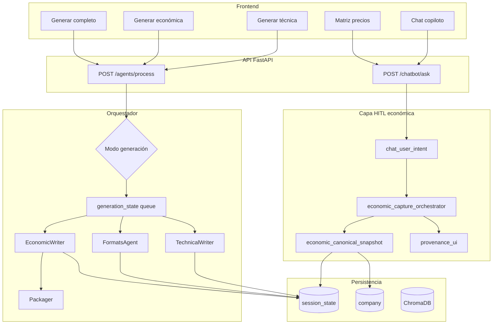
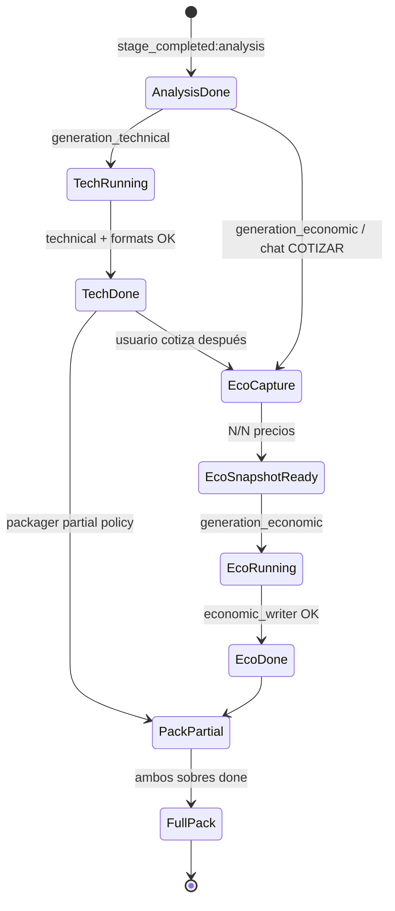
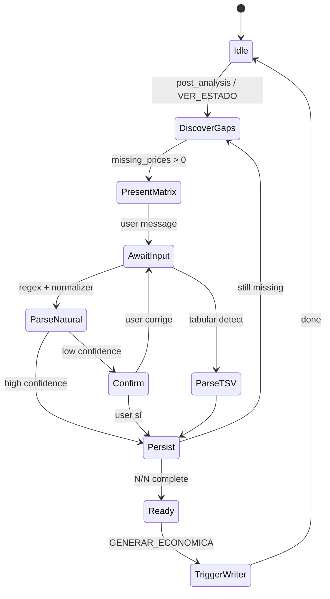

# SPEC + Arquitectura + Plan — Generación desacoplada y copiloto económico conversacional

**Versión:** 1.0.0  
**Fecha:** 2026-07-02  
**Origen:** Requerimientos post-demo cliente (fase piloto on‑premise)  
**Normativa:** [`ESTANDAR_ENTERPRISE_CANONICO_HITL.md`](ESTANDAR_ENTERPRISE_CANONICO_HITL.md)  
**Relacionado:** [`FLUJO_CHAT_RAG_Y_GENERACION.md`](FLUJO_CHAT_RAG_Y_GENERACION.md), [`ISSUE_HITL_MATRIZ_CAPTURA_ECONOMICA_UNIVERSAL.md`](ISSUE_HITL_MATRIZ_CAPTURA_ECONOMICA_UNIVERSAL.md), [`CONTRATO_COLA_CHAT_UNIVERSAL.md`](CONTRATO_COLA_CHAT_UNIVERSAL.md), [`SUPER_ISSUE_CHAT_INTENCION_Y_UX_CONVERSACIONAL.md`](SUPER_ISSUE_CHAT_INTENCION_Y_UX_CONVERSACIONAL.md)

---

## 0. Resumen ejecutivo

El cliente solicita dos capacidades para la siguiente fase en sus instalaciones:

| ID | Requerimiento | Intención de negocio |
|----|---------------|----------------------|
| **REQ-1** | Generar **propuesta económica** independiente de la **propuesta técnica** | Paralelizar trabajo comercial vs técnico; no bloquear cotización por anexos técnicos incompletos |
| **REQ-2** | Chatbot que **solicite proactivamente** precios/datos faltantes (con o sin Excel) y **materialice** la propuesta económica | Reducir fricción: el usuario no debe adivinar comandos ni depender de plantillas perfectas |

Este documento define **especificaciones funcionales**, **arquitectura objetivo**, **contrato del copiloto conversacional** (comportamiento “inteligente”) y **plan de implementación** por fases.

**Principio rector:** separar **ejecución de pipelines** (técnico vs económico) sin separar **verdad canónica** — un solo snapshot económico auditable alimenta writer, gates y empaquetado.

---

## 1. Especificaciones funcionales

### 1.1 REQ-1 — Generación económica independiente de la técnica

#### 1.1.1 User stories

| ID | Como… | Quiero… | Para… |
|----|--------|---------|-------|
| US-1.1 | Licitante comercial | Pulsar **Generar propuesta económica** sin haber generado la técnica | Cotizar en paralelo mientras técnica elabora metodología |
| US-1.2 | Licitante técnico | Pulsar **Generar propuesta técnica** sin tener precios cerrados | Avanzar admin/técnico sin esperar cotización |
| US-1.3 | Coordinador | Ver en UI el **estado por sobre** (técnico listo / económico listo / empaquetado parcial) | Saber qué falta antes del acto de entrega |
| US-1.4 | Auditor interno | Descargar **solo sobre económico** con manifiesto SHA parcial | Entregar incrementalmente sin ZIP “falso completo” |

#### 1.1.2 Comportamiento requerido

1. **Modos de generación explícitos** (API + UI):
   - `generation_technical` — ejecuta: `datagap` → `technical` → `formats` (no `economic_writer`).
   - `generation_economic` — ejecuta: verificación snapshot → `economic_writer` (no re-ejecuta `technical`/`formats` salvo flag de regeneración).
   - `generation_full` — comportamiento actual: secuencia completa hasta `delivery`.

2. **Gate económico acotado:**
   - `_ensure_economic_snapshot_ready()` **solo** bloquea la rama `generation_economic` / paso `economic_writer`.
   - **No** debe impedir `generation_technical` por precios faltantes.

3. **Cola `generation_state` con jobs omitibles:**
   - Jobs: `datagap`, `technical`, `formats`, `economic_writer`, `packager`, `delivery`.
   - Cada job: `pending` | `running` | `done` | `blocked` | `skipped`.
   - `resume_generation=true` reanuda desde el primer `pending`/`blocked` del modo elegido.

4. **Empaquetado parcial (política configurable):**
   - `PACKAGING_REQUIRE_ALL_SOBRES=false` (piloto): permite ZIP/manifiesto con sobres disponibles; marca `coverage_status: partial`.
   - `PACKAGING_REQUIRE_ALL_SOBRES=true` (producción estricta): falla si falta sobre obligatorio.

5. **Anexos admin con referencia económica:**
   - Si un formato administrativo exige tarifa (ej. cálculo de costos), política `ADMIN_ECONOMIC_DEFERRAL`:
     - `defer` (default piloto): warning + pendiente en cola económica, **no** `blocked` en `formats`.
     - `enforce`: bloqueo duro (comportamiento legacy).

#### 1.1.3 Criterios de aceptación (REQ-1)

- [ ] **CA-1.1:** Con análisis completo y empresa seleccionada, `generation_economic` materializa archivos en `2.propuesta_economica/` sin ejecutar `TechnicalWriterAgent`.
- [ ] **CA-1.2:** Con precios incompletos, `generation_technical` completa técnica + formatos admin (o pausa solo por datos de perfil, no por tarifa).
- [ ] **CA-1.3:** UI muestra cola con estados independientes por etapa; no mensajes contradictorios (“sigue generando” con `formats: blocked`).
- [ ] **CA-1.4:** Re-ejecutar `generation_economic` tras captura chat es idempotente (merge de precios, no wipe salvo flag).
- [ ] **CA-1.5:** Oracle/regresión: casos `TECH_ONLY`, `ECO_ONLY`, `FULL` en fixtures sintéticos.

#### 1.1.4 Fuera de alcance (REQ-1 v1)

- Generar técnica **sin** análisis de bases previo.
- Sustituir criterios legales del pliego (solo desacopla ejecución).
- Multi-licitación en una sesión.

---

### 1.2 REQ-2 — Copiloto económico conversacional (chat inteligente)

#### 1.2.1 User stories

| ID | Como… | Quiero… | Para… |
|----|--------|---------|-------|
| US-2.1 | Usuario sin Excel | Que el asistente me diga **qué precios faltan**, en lenguaje claro, con tabla | Completar cotización en minutos |
| US-2.2 | Usuario con Excel incompleto | Que detecte huecos y **no me bloquee** toda la generación | Corregir solo lo necesario |
| US-2.3 | Usuario con Excel contaminado | Que avise **otra licitación** y sugiera acción concreta | Evitar descalificación |
| US-2.4 | Usuario impaciente | Decir “cotiza zona A 45250” y que **entienda** sin comando mágico | No memorizar sintaxis |
| US-2.5 | Usuario mixto | Pegar bloque TSV desde Excel al chat | Captura masiva rápida |

#### 1.2.2 Comportamiento requerido del chatbot

**A. Proactividad post-análisis**

Tras `stage_completed:analysis` y empresa seleccionada:

1. Si faltan precios obligatorios → mensaje Gate 5 con:
   - Conteo: “Faltan **N** precios para la propuesta económica”.
   - Tabla markdown (o `InteractionBlock`) con filas ancladas a bases.
   - **Un solo CTA:** “Responde aquí” **o** “Sube cotización” **o** “Generar solo económica”.

2. **No** prometer avance de pipeline que el orquestador no ejecutará (alineado REQ-1).

**B. Captura transaccional (HITL)**

| Canal | Entrada | Persistencia |
|-------|---------|--------------|
| Frase natural | “Zona A 45,250 mensual” | `economic_user_overrides` + `catalog` |
| TSV/CSV pegado | `Ubicación\tPrecio` | `interaction_block_mass_save` |
| Matriz UI | Panel Matriz de precios | Mismo contrato canónico |
| Excel subido | Ingesta tabular | `concept_prices` con `provenance_ui` |

**Cascada de precedencia (obligatoria):**  
`Usuario directo (chat/UI) > documento normalizado (Excel/PDF) > catálogo maestro > inferencia LLM/RAG`

**C. Intención conversacional amplia**

El chatbot debe reconocer **paráfrasis** (no solo frase exacta):

| Intención | Ejemplos | Acción |
|-----------|----------|--------|
| `COTIZAR` | “falta precio”, “cuánto pongo en zona B”, “45250” | Captura / repregunta acotada |
| `GENERAR_ECONOMICA` | “generar económica”, “solo cotización”, “armar propuesta económica” | `generation_economic` o `EconomicAgent` + writer |
| `GENERAR_TECNICA` | “generar técnica”, “solo técnico”, “formatos admin” | `generation_technical` |
| `GENERAR_COMPLETO` | “generar todo”, “expediente completo” | `generation_full` |
| `VER_ESTADO` | “cómo vamos”, “qué falta” | Cola + pendientes sin jerga |
| `OMITIR` | “no aplica”, “después”, “lo capturo en económica” | Solo si política `defer`; audit `user_skip` |
| `PREGUNTAR_BASES` | RAG / excerpts HRU | No mezclar con captura de precio |

**D. Repreguntas inteligentes (máx. 1 por turno)**

- Ambigüedad numérica → “¿Es **mensual** o **unitario** para Partida 2?”
- Conflicto Excel vs chat → “En tu Excel dice X; escribiste Y. ¿Cuál prevalece?” (default: usuario).
- Confianza baja en parseo → mostrar interpretación: “Entendí: Zona A = $45,250.00 MXN/mes. ¿Correcto?”

**E. Anti-patrones prohibidos**

- Volcar `stop_reason`, Gate 12.1, conteos internos al usuario.
- Decir “no tengo información” cuando bases indexadas sí contienen ancla (usar excerpts HRU).
- Bloquear `formats` por `tarifa_mensual` si política `ADMIN_ECONOMIC_DEFERRAL=defer`.
- Mezclar identidad de empresa de sesión stale vs empresa seleccionada (resolver `company_id` del request).

#### 1.2.3 Criterios de aceptación (REQ-2)

- [ ] **CA-2.1:** Post-análisis, chat muestra matriz de precios pendientes sin comando del usuario.
- [ ] **CA-2.2:** ≥90% de batería `chat_intent_battery` económica pasa en CI (ampliar a 150+ utterances).
- [ ] **CA-2.3:** Captura por frase natural actualiza snapshot y `economic_proposal` status `complete` cuando N/N ítems cubiertos.
- [ ] **CA-2.4:** Cada precio persistido incluye `provenance_ui` (`source`, `raw_query`, `file_anchor` si aplica).
- [ ] **CA-2.5:** Usuario completa cotización ISAPEG sintética solo por chat en &lt;15 min (script smoke).
- [ ] **CA-2.6:** Mensajes copy alineados con estado real de `generation_state` (sin contradicciones).

---

### 1.3 Requisitos no funcionales

| Área | Requisito |
|------|-----------|
| **Trazabilidad** | Todo precio y skip con auditoría en sesión |
| **Idempotencia** | Re-captura mismo concepto → merge, no duplicar |
| **HRU** | Sin hardcode por convocante; política versionada JSON |
| **Latencia chat** | Respuesta determinista de captura &lt;2s; RAG/LLM cuando aplique &lt;60s |
| **Feature flags** | `DECOUPLE_GENERATION_ENABLED`, `ECONOMIC_CHAT_FIRST`, `ADMIN_ECONOMIC_DEFERRAL` |
| **Rollback** | Flags off → comportamiento legacy |

---

## 2. Arquitectura objetivo

### 2.1 Vista de contexto



### 2.2 Flujos de generación desacoplados



### 2.3 Componentes nuevos / extendidos

| Componente | Responsabilidad | Ubicación propuesta |
|------------|-----------------|---------------------|
| `GenerationMode` enum | `technical` \| `economic` \| `full` | `backend/app/contracts/generation_modes.py` |
| `generation_mode_policy.json` | Reglas por flags, defer admin | `backend/app/contracts/` |
| `economic_capture_orchestrator` | Unifica chat, TSV, matriz, Excel → snapshot | `backend/app/services/` |
| `generation_queue_controller` | Skip/resume jobs por modo | `backend/app/services/` o `orchestrator.py` |
| `admin_economic_deferral_policy` | tarifa en admin → warning vs block | `document_fill_quality_gate.py` |
| `chat_economic_copilot_service` | Proactividad, copy, repreguntas | `backend/app/services/` |
| `company_context_resolver` | Empresa activa = request `company_id` > session | `backend/app/services/` |
| `partial_packaging_service` | Manifiesto sobres parciales | extensión `packager.py` |

### 2.4 Modelo de datos (extensiones sesión)

```json
{
  "generation_state": {
    "status": "running",
    "mode": "economic",
    "jobs": [
      {"id": "technical", "status": "skipped"},
      {"id": "formats", "status": "skipped"},
      {"id": "economic_writer", "status": "pending"}
    ]
  },
  "economic_canonical_v1": {
    "schema_version": "1.0.0",
    "items": [
      {
        "concept_key": "p1|zona_a|tarifa_mensual",
        "label": "Partida 1 — Zona A — tarifa mensual",
        "unit_price": 45250.0,
        "currency": "MXN",
        "period": "monthly",
        "provenance_ui": {
          "source": "user_chat",
          "raw_query": "Zona A 45250 mensual",
          "confidence": 1.0,
          "precedence_rank": 1
        }
      }
    ],
    "totals": {"subtotal": 0, "iva": 0, "total": 0}
  },
  "last_orchestrator_decision": {
    "stop_reason": "ECONOMIC_PRICES_INCOMPLETE",
    "packaging_coverage": "partial"
  }
}
```

### 2.5 Contratos API

#### POST `/api/v1/agents/process`

```json
{
  "session_id": "isapeg_servicios_de_limpieza",
  "company_id": "co_…",
  "resume_generation": true,
  "company_data": {
    "mode": "generation_only",
    "generation_mode": "economic"
  }
}
```

Valores `generation_mode`: `technical` | `economic` | `full` (default `full` si omitido — compatibilidad).

#### POST `/api/v1/chatbot/ask`

Sin cambio de ruta; ampliación de ramas internas:

- Prioridad: `economic_capture` → `generation_intent` → `session_resume` → RAG.
- Respuesta incluye `data.economic_capture_v1` cuando aplique (matriz, pendientes, confirmación).

### 2.6 Política de gates (matriz decisión)

| Hallazgo | Etapa | Política `defer` | Política `enforce` |
|----------|-------|------------------|---------------------|
| `tarifa_mensual` missing | formats | Warning + cola económica | BLOCK formats |
| `cross_tender_reference` | formats/economic | BLOCK con mensaje acción | BLOCK |
| `rfc` missing | formats | BLOCK perfil | BLOCK |
| Precio faltante snapshot | economic_writer | BLOCK económica | BLOCK |
| Técnica incompleta | packager partial | ZIP sin sobre 1 | BLOCK ZIP |

---

## 3. Especificación del copiloto conversacional (“tan inteligente como el asistente experto”)

### 3.1 Principios de diseño conversacional

1. **Una idea por turno** — máximo 3 líneas visibles + 1 CTA (Gate 5).
2. **Honestidad operativa** — el mensaje refleja `generation_state` real.
3. **Anclaje forense** — citar archivo/página/bases cuando se pida normativa; no alucinar anexos.
4. **Memoria de sesión** — no re-preguntar lo ya capturado con procedencia usuario.
5. **Confirmación solo cuando hay riesgo** — ambigüedad, conflicto, o confianza &lt;0.85.
6. **Español natural mexicano** — licitaciones, no jerga de logs.

### 3.2 Máquina de estados del copiloto económico



### 3.3 Plantillas de respuesta (semánticas)

**Descubrimiento de brechas:**
```
**Cotización pendiente — {session_name}**

Faltan **{n_missing}** precio(s) para armar la propuesta económica según las bases indexadas.

| Concepto | Precio |
|----------|--------|
| {row_1} | *(pendiente)* |
…

**Siguiente paso:** Escríbeme los importes (ej. «Zona A 45,250 mensual») o pega tabla desde Excel. Cuando quieras materializar archivos: **Generar propuesta económica**.
```

**Confirmación de parseo:**
```
Quedó registrado: **{label}** = **{amount} MXN** ({period}).  
Procedencia: tu mensaje en chat.

{faltan_más}  
**Siguiente paso:** {siguiente_concepto o Generar propuesta económica}
```

**Conflicto Excel / chat:**
```
Detecté diferencia entre tu **Excel** («{excel_value}») y lo que escribiste («{chat_value}»).

**Siguiente paso:** Responde «usa Excel» o «usa chat» (o escribe el valor definitivo).
```

**Desacople técnico/económico:**
```
Puedes **generar la propuesta económica ahora** sin esperar la técnica. La propuesta técnica y formatos administrativos siguen en cola aparte.

**Siguiente paso:** Pulsa **Generar propuesta económica** o escribe los precios que faltan aquí.
```

### 3.4 Prioridad de enrutamiento en `ChatbotRAGAgent.process`

Orden propuesto (insertar antes de RAG genérico):

1. Gates HRU deterministas (anexos, muestras, junta, etc.) — existentes.
2. **`economic_capture_orchestrator.try_handle(query)`** — captura/confirmación/conflicto.
3. **`generation_intent_router`** — `technical` | `economic` | `full`.
4. `pending_questions` HITL (perfil, fill quality con política defer).
5. `session_resume` con empresa resuelta por `company_context_resolver`.
6. RAG / LLM.

### 3.5 Batería de regresión conversacional (ampliación)

Categorías mínimas para CI:

| Categoría | N casos | Ejemplo |
|-----------|---------|---------|
| Paráfrasis GENERAR_ECONOMICA | 25 | “solo cotización”, “armar lo económico” |
| Precio natural | 40 | “45k zona a”, “$13,326.63 diurno” |
| TSV pegado | 15 | 3 filas tab-separated |
| VER_ESTADO | 20 | “qué falta”, “cómo vamos” |
| Negación / defer | 15 | “después”, “en económica lo pongo” |
| Anti-META | 10 | “generar” una palabra → desambiguación |
| Conflicto | 10 | “usa el excel” |

Objetivo: **≥92%** routing correcto en CI.

---

## 4. Plan de implementación

### 4.1 Fases y duración estimada

| Fase | Duración | Objetivo | REQ |
|------|----------|----------|-----|
| **F0 — Alineación UX crítica** | 1 sprint | Eliminar contradicciones demo; defer admin económico | 2 |
| **F1 — Copiloto económico** | 1–2 sprints | Captura proactiva + intención amplia + provenance | 2 |
| **F2 — Desacople generación** | 2 sprints | Modos technical/economic/full en orquestador + API | 1 |
| **F3 — UI + empaquetado parcial** | 1 sprint | Botones, cola visual, ZIP parcial | 1 |
| **F4 — Piloto cliente** | 1 sprint | Flags, smoke on‑prem, capacitación | 1+2 |

**Total estimado:** 5–7 sprints (10–14 semanas con QA integrado).

---

### 4.2 Fase F0 — Alineación UX crítica (Sprint 1)

**Objetivo:** Que la demo no contradiga al orquestador.

| Tarea | Archivos / área | DoD |
|-------|-----------------|-----|
| F0.1 Política `ADMIN_ECONOMIC_DEFERRAL` | `document_fill_quality_gate.py`, `settings.py` | `tarifa_mensual` en formats → warning + pending económico |
| F0.2 Corregir copy `document_fill_ux_messages.py` | Mensajes “seguir generando” condicionados a modo | CA-2.6 parcial |
| F0.3 `company_context_resolver` en bootstrap chat | `chat_expediente_bootstrap_service.py`, `chatbot_rag.py` | Nombre empresa = selección UI |
| F0.4 Tests regresión ISAPEG fill gate | `tests/test_document_fill_quality_gate.py` | CI verde |

**Entregable cliente:** Mismo flujo demo sin bloqueo absurdo en admin por tarifa.

---

### 4.3 Fase F1 — Copiloto económico (Sprints 2–3)

**Objetivo:** Chat guía cotización como copiloto experto.

| Tarea | Descripción | DoD |
|-------|-------------|-----|
| F1.1 `economic_capture_orchestrator` | Orquesta parseo, merge, confirmación, conflictos | Servicio + unit tests |
| F1.2 `economic_canonical_v1` | Esquema versionado en sesión | Merge idempotente por `concept_key` |
| F1.3 Proactividad post-análisis | Hook tras analysis → matriz en chat | CA-2.1 |
| F1.4 Ampliar `chat_user_intent` | GENERAR_TECNICA / GENERAR_ECONOMICA / COTIZAR | +80 utterances CI |
| F1.5 Integrar TSV + matriz UI | Un solo pipeline hacia canónico | CA-2.3 |
| F1.6 `provenance_ui` en API chat | Campo en respuesta `data` | CA-2.4 |
| F1.7 Smoke `scripts/smoke_economic_chat_capture.py` | ISAPEG solo chat | CA-2.5 |

**Entregable cliente:** Usuario cotiza conversando; ve de dónde salió cada precio.

---

### 4.4 Fase F2 — Desacople de generación (Sprints 4–5)

**Objetivo:** Pipelines técnico y económico independientes.

| Tarea | Descripción | DoD |
|-------|-------------|-----|
| F2.1 `GenerationMode` + policy JSON | Contrato versionado | Feature flag |
| F2.2 Refactor `_ensure_economic_snapshot_ready` | Solo antes de `economic_writer` | CA-1.2 |
| F2.3 `generation_queue_controller` | skip/resume por modo | CA-1.1, CA-1.3 |
| F2.4 Endpoints `agents/process` | `generation_mode` en body | API docs |
| F2.5 Ajuste wipe disco | No borrar sobre económico al correr solo técnica | Idempotencia |
| F2.6 Oracle fixtures | TECH_ONLY, ECO_ONLY, FULL | CA-1.5 |

**Entregable cliente:** Generar económica sin técnica en entorno piloto.

---

### 4.5 Fase F3 — UI y empaquetado (Sprint 6)

| Tarea | Descripción | DoD |
|-------|-------------|-----|
| F3.1 Botones Generar técnica / económica / completo | `App.jsx` | Envía `generation_mode` |
| F3.2 Panel cola mejorado | Estados `skipped`, mensajes humanos | CA-1.3 |
| F3.3 Empaquetado parcial | `PACKAGING_REQUIRE_ALL_SOBRES` | Manifiesto partial |
| F3.4 Dictamen cobertura | Mini dictamen “expediente parcial” | Sin falsos OK |

---

### 4.6 Fase F4 — Piloto on‑premise (Sprint 7)

| Tarea | DoD |
|-------|-----|
| Playbook despliegue + flags | `DEPLOY_HARDENING_PLAYBOOK.md` actualizado |
| Smoke E2E en VM cliente | Script automatizado |
| Capacitación 2 flujos | Guía 1 página + demo grabada |
| Criterios sign-off cliente | Checklist abajo |

---

### 4.7 Checklist sign-off cliente (fase piloto)

- [ ] Cotización completada **solo por chat** en licitación de prueba.
- [ ] Propuesta económica generada **sin** propuesta técnica en la misma sesión.
- [ ] Propuesta técnica generada **sin** precios cerrados.
- [ ] Empaquetado parcial descargable con manifiesto claro.
- [ ] Trazabilidad visible de precios (chat vs Excel).
- [ ] Cero mensajes con códigos internos (`INCOMPLETE_*`, `MISSING_*`).

---

### 4.8 Riesgos y mitigación

| Riesgo | Mitigación |
|--------|------------|
| Anexos admin con tarifa obligatoria en pliego | Política defer + warning; excepciones por `error_type` en policy JSON |
| ZIP parcial rechazado por portal convocante | Flag strict para producción; educar en piloto |
| Regresión Oracle PKG01 | Casos nuevos sin romper PKG01 legacy |
| LLM inconsistente en parseo | Capa determinista primero; LLM solo desambiguación |
| Scope creep “chat general inteligente” | Mantener copiloto acotado a cotización + generación + bases HRU |

---

### 4.9 Métricas de éxito (90 días post-piloto)

| Métrica | Meta |
|---------|------|
| Tiempo medio captura económica (chat) | &lt;15 min |
| % generaciones bloqueadas por copy incorrecto | &lt;5% |
| % sesiones con desacople usado | ≥30% en piloto |
| NPS interno equipo comercial | ≥8/10 |
| Fallos empaquetado por sobres incompletos | Documentados, no sorpresa |

---

## 5. Trazabilidad requisito → entregable

| Requerimiento cliente | Spec ID | Fases | Componente principal |
|-----------------------|---------|-------|----------------------|
| Económica independiente de técnica | REQ-1, US-1.x | F2, F3 | `generation_queue_controller` |
| Chat pide precios faltantes | REQ-2, US-2.x | F1 | `economic_capture_orchestrator` |
| Acepta Excel pero no lo exige | REQ-2, US-2.1 | F1 | `structured_price_capture` + chat |
| Comportamiento inteligente | §3 | F0–F1 | `chat_economic_copilot_service` |
| Trazabilidad enterprise | NFR | F1 | `economic_canonical_v1` + `provenance_ui` |

---

## 6. Próximos pasos inmediatos (equipo interno)

1. **Review** de este documento con producto + cliente (30 min): validar `defer` vs `enforce` en admin.
2. **Crear issues** en backlog: F0.1–F0.4 como P0 antes de cualquier desacople grande.
3. **Ampliar** `docs/FLUJO_CHAT_RAG_Y_GENERACION.md` con diagrama de modos (PR doc-only tras F2).
4. **No implementar** empaquetado parcial en producción strict hasta sign-off legal del cliente.

---

*Documento generado para cierre de fase comercial y arranque de ingeniería. Versiónar junto con `generation_mode_policy.json` cuando exista.*
