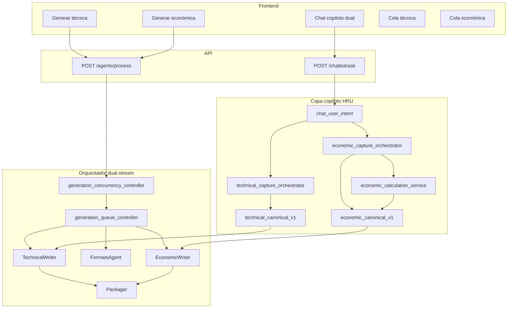

# SPEC + Arquitectura + Plan — Generación dual independiente y copiloto conversacional completo (técnica + económica)

**Versión:** 1.1.0  
**Fecha:** 2026-07-07  
**ADR-001:** Sesión única con streams concurrentes (decisión producto 2026-07-07)  
**Origen:** Cierre a cabalidad de requerimientos cliente post-análisis F0–F5  
**Normativa:** [`ESTANDAR_ENTERPRISE_CANONICO_HITL.md`](ESTANDAR_ENTERPRISE_CANONICO_HITL.md)  
**Predecesores:** [`SPEC_DECOUPLED_GENERATION_AND_CHAT_ECONOMIC_HITL.md`](SPEC_DECOUPLED_GENERATION_AND_CHAT_ECONOMIC_HITL.md) (F0–F4), [`SPEC_F5_CONTEXTUAL_DOWNLOAD_POST_GENERATION_HRU.md`](SPEC_F5_CONTEXTUAL_DOWNLOAD_POST_GENERATION_HRU.md) (F5)  
**Relacionado:** [`PILOT_SIGNOFF_CHECKLIST.md`](PILOT_SIGNOFF_CHECKLIST.md), [`GUIA_PILOTO_ONPREM_HRU.md`](GUIA_PILOTO_ONPREM_HRU.md), [`CONTRATO_COLA_CHAT_UNIVERSAL.md`](CONTRATO_COLA_CHAT_UNIVERSAL.md), [`DEPLOY_HARDENING_PLAYBOOK.md`](../DEPLOY_HARDENING_PLAYBOOK.md)

---

## 0. Resumen ejecutivo

F0–F5 entregaron el **esqueleto** del desacople y un **copiloto económico** maduro. El cliente exige dos cosas **sin matices**:

| ID | Requerimiento | Estado F0–F5 | Objetivo F6–F10 |
|----|---------------|--------------|-----------------|
| **REQ-1** | Propuesta **técnica** y **económica** totalmente independientes (áreas separadas, sin esperas cruzadas) | ~80 % código | **100 %** operación + paralelismo real |
| **REQ-2** | **Todo** dato que el LLM necesite para técnicas **y** económicas se solicite **vía asistente**, se capture ahí, se **calculen** importes y se **generen** propuestas | Económico ~75 %; técnico ~40 % | **Simetría** técnica/económica en chat |

Este documento define especificaciones funcionales, arquitectura objetivo, contratos de datos, comportamiento del **copiloto dual** y plan de implementación **F6–F10**.

### Principios rectores (HRU + HITL)

1. **H — Cero hardcoding:** reglas en JSON versionado (`technical_capture_policy.json`, `generation_concurrency_policy.json`, etc.); cero `if convocante`.
2. **R — Cero regresiones:** F0–F5 permanecen; flags off → comportamiento actual; Oracle PKG01 intacto.
3. **U — Universalidad:** servicios, obra, suministros comparten el mismo copiloto; variación solo por política y slots detectados en bases.
4. **Verdad canónica dual:** `economic_canonical_v1` (existente) + **`technical_canonical_v1`** (nuevo); writers consumen canónico, no texto libre del LLM para campos estructurados.
5. **Un canal, dos dominios:** el chat es el **canal principal** de captura; paneles (matriz, formatos) son vistas del mismo canónico, no fuentes paralelas divergentes.
6. **Separar ejecución, unificar verdad:** pipelines desacoplados; snapshots auditable por dominio.

### ADR-001 — Sesión única, streams concurrentes (decisión adoptada)

| Opción | Descripción | Decisión |
|--------|-------------|----------|
| A — Sesiones separadas por equipo | Comercial y técnico en `session_id` distintos | ❌ Rechazada |
| **B — Misma sesión, streams paralelos** | Un expediente, dos colas/locks, generación simultánea | ✅ **Adoptada** |

**Contexto:** El cliente tiene áreas separadas que no toleran esperas cruzadas, pero el coordinador necesita **un solo expediente** coherente para empaquetado, manifiesto y entrega.

**Consecuencias (compromiso de ingeniería):**

1. **Orquestador:** `generation_state.streams.technical` y `.economic` con locks independientes; `shared` (packager/delivery) serializado.
2. **Disco:** wipe y escritura con file-lock por subdirectorio; nunca borrar carpeta de un stream `running`.
3. **UI:** botones TÉCNICA / ECONÓMICA habilitados de forma independiente; chat único compartido con canónicos dual.
4. **API:** `generation_stream` obligatorio en modos parciales; jobs async no devuelven 409 por stream hermano activo.
5. **Operación:** un análisis de bases alimenta ambos streams; no duplicar intake.

**No objetivos:** no se diseña sincronización multi-sesión ni merge de expedientes post-hoc (fuera de alcance F6–F10).

---

## 1. Especificaciones funcionales

### 1.1 REQ-1 — Independencia total técnica / económica (cierre F6–F7)

#### 1.1.1 User stories (ampliación)

| ID | Como… | Quiero… | Para… |
|----|--------|---------|-------|
| US-1.5 | Equipo comercial | Lanzar **Generar económica** mientras el equipo técnico tiene una generación en curso | No esperar 20–40 min de redacción técnica |
| US-1.6 | Equipo técnico | Lanzar **Generar técnica** mientras comercial captura precios en chat | Trabajo real en paralelo |
| US-1.7 | Coordinador | Ver **dos colas** (técnica / económica) con estados independientes en la misma sesión | Una sola fuente de verdad del expediente |
| US-1.8 | Operador on-prem | Sign-off con checklist firmado en VM cliente | Cierre contractual del piloto |

#### 1.1.2 Comportamiento requerido

**A. Concurrencia por dominio — ADR-001 (obligatorio en F6)**

> Una sola sesión (`session_id`), dos equipos trabajando en paralelo sin bloqueo mutuo.

- Sustituir el lock UI monolítico `isGenerating` por **`generation_locks`** por dominio:
  - `technical_stream` — jobs: `datagap`, `technical`, `formats`
  - `economic_stream` — jobs: `economic_writer`
  - `shared_stream` — jobs: `packager`, `delivery` (serializados; requieren política explícita)
- Reglas en `generation_concurrency_policy.json`:
  - `technical` y `economic` **pueden** ejecutarse en paralelo sobre la misma sesión.
  - `packager` **no** corre si cualquier stream activo del dominio que aporta archivos está `running`.
  - Wipe selectivo existente se mantiene; añadir **file-lock por subdirectorio** durante escritura de writer.

**B. API — jobs por stream**

```json
POST /api/v1/agents/process
{
  "session_id": "...",
  "company_id": "...",
  "generation_mode": "technical",
  "generation_stream": "technical",
  "resume_generation": true,
  "company_data": { "mode": "generation_only", "generation_mode": "technical" }
}
```

- `generation_stream`: `technical` | `economic` | `full` (default = valor de `generation_mode`).
- Respuesta incluye `generation_state.technical` y `generation_state.economic` como sub-colas opcionales (compat: `generation_state.jobs` sigue siendo vista plana derivada).

**C. UI**

- Botones **TÉCNICA** y **ECONÓMICA** deshabilitados **solo** si su stream está activo, no mutuamente.
- `GenerationQueuePanel` muestra dos secciones o tabs: **Cola técnica** / **Cola económica**.
- Banner honesto: *«Generación económica en curso — puedes seguir capturando precios en chat»* / *«Generación técnica en curso — puedes cotizar en paralelo»*.

**D. Prerrequisito compartido (sin cambio)**

- Ambos streams requieren `stage_completed:analysis` + empresa seleccionada.
- No se relaja: generar sin análisis de bases.

#### 1.1.3 Criterios de aceptación REQ-1 (cierre)

- [ ] **CA-1.6:** Con generación técnica `running`, `generation_economic` se encola/ejecuta sin error 409.
- [ ] **CA-1.7:** Tras técnica `done` + económica `done`, empaquetado parcial con `coverage_status: partial|full` coherente.
- [ ] **CA-1.8:** Wipe modo técnico no borra `2.propuesta_economica/` con económica `running`.
- [ ] **CA-1.9:** Checklist [`PILOT_SIGNOFF_CHECKLIST.md`](PILOT_SIGNOFF_CHECKLIST.md) ítems funcionales marcados en VM cliente.
- [ ] **CA-1.10:** Smoke F6 `scripts/smoke_dual_stream_concurrency.py` verde.

---

### 1.2 REQ-2 — Copiloto conversacional completo (F8–F10)

#### 1.2.1 User stories (ampliación técnica)

| ID | Como… | Quiero… | Para… |
|----|--------|---------|-------|
| US-2.7 | Licitante técnico | Que el asistente me diga **qué datos técnicos faltan** (metodología, personal, cronograma, equipos…) tras el análisis | No descubrir huecos al pulsar Generar |
| US-2.8 | Licitante técnico | Responder en lenguaje natural: *«metodología: limpieza hospitalaria por zonas con EPA»* | Sin formularios ocultos |
| US-2.9 | Licitante comercial | Ver **subtotal, IVA y total** recalculados en chat tras cada precio | Confianza antes de materializar archivos |
| US-2.10 | Ambos equipos | Que **todo** dato estructurado tenga `provenance_ui` (chat / documento / catálogo / inferencia) | Auditoría y corrección HITL |
| US-2.11 | Usuario obra | Capturar en chat solo lo que las bases exigen en texto; experiencia documental sigue por **upload** con aviso claro | Respetar realidad LOPSRM sin fingir chat universal |

#### 1.2.2 Comportamiento requerido — dominio económico (cierre F8)

**A. Loop de cálculo conversacional (nuevo)**

Tras cada captura de precio(s) exitosa:

1. Recalcular `economic_canonical_v1.totals` vía motor determinista (`economic_normalizer` / reglas en `economic_calculation_policy.json`).
2. Responder Gate 5 con bloque:

```
Quedó registrado: **Zona A — tarifa mensual** = **$45,250.00 MXN**.

**Totales actualizados (cotización):**
| Concepto | Importe |
|----------|---------|
| Subtotal | $… |
| IVA (16 %) | $… |
| **Total** | **$…** |

Faltan **N** precio(s). **Siguiente paso:** …
```

3. Si totales dependen de reglas de bases (ej. IVA exento), citar ancla HRU (`bases_excerpt`) en `provenance_ui.calculation_basis`.
4. Conflicto Excel vs chat: flujo existente; tras resolución → recalcular totales.

**B. Cierre conversacional → generación**

- Intención `GENERAR_ECONOMICA` con snapshot incompleto → repregunta acotada (máx. 1 turno) con tabla de faltantes, **no** delegar a panel.
- Snapshot `N/N` → delegar a orquestador `generation_economic` con mensaje: *«Materializando propuesta económica…»*.
- Eliminar CTAs *«usa el panel Generar»* en rutas de captura económica activa (`chat_stop_reason_map`, ramas chatbot).

**C. Proactividad (refuerzo)**

- Mantener `economic_post_analysis_hook`; añadir flag `ECONOMIC_CHAT_CALC_ON_CAPTURE=true` (default piloto).

#### 1.2.3 Comportamiento requerido — dominio técnico (nuevo F9)

**A. Inventario de slots técnicos (HRU)**

Fuente de slots (merge idempotente, orden de precedencia):

1. Requisitos `compliance_master_list.tecnico` + `formatos` con `tipo_accion=generar|rellenar`.
2. Plantillas detectadas (`session_template_catalog`, `document_candidates_consolidated`).
3. Campos estructurados del perfil no cubiertos por `formats_pilot_slots` (solo admin).
4. Reglas en `technical_capture_policy.json` → `slot_kinds`: `methodology`, `workforce`, `equipment`, `schedule`, `quality_plan`, `te03_clients`, `free_text_annex`, etc.

Cada slot:

```json
{
  "concept_key": "tech|metodologia|propuesta_principal",
  "label": "Metodología de ejecución — propuesta técnica",
  "slot_kind": "methodology",
  "required_for_generation": true,
  "capture_mode": "chat_natural|chat_tsv|upload_only|catalog_pick",
  "status": "pending|captured|deferred|upload_satisfied",
  "provenance_ui": { "source": "pending", "precedence_rank": 0 }
}
```

**B. Hook post-análisis técnico (simétrico al económico)**

`technical_post_analysis_hook` tras `stage_completed:analysis`:

1. Construye matriz de slots pendientes → `technical_canonical_v1`.
2. Encola mensaje Gate 5 proactivo si `missing_count > 0`.
3. Persiste `technical_capture_mode`: `matrix` | `one_by_one` (misma semántica que económico).

**C. `technical_capture_orchestrator`**

Responsabilidades (espejo de `economic_capture_orchestrator`):

| Entrada | Acción |
|---------|--------|
| Frase natural | Parseo determinista + normalizer; LLM solo si confianza &lt; 0.85 |
| TSV pegado | Filas → slots por `concept_key` |
| Intención `CAPTURAR_TECNICO` / paráfrasis | Estado / matriz / siguiente slot |
| `GENERAR_TECNICA` | Si canónico incompleto → faltantes; si completo → delegar `generation_technical` |
| `VER_ESTADO` | Resumen dual técnica+económica sin códigos internos |
| `OMITIR` / defer | Solo si política `technical_defer_policy` lo permite; audit `user_skip` |

**D. Política «no redactar sin canónico»**

- `TechnicalWriterAgent` y `FormatsAgent` en modo `chat_first`:
  - **Antes** de invocar LLM para campos estructurados, leer `technical_canonical_v1`.
  - Si `required_for_generation` pendiente → `WAITING_FOR_DATA` + cola chat (no placeholders inventados).
  - LLM solo para **narrativa libre** explícitamente marcada `slot_kind: narrative` y solo cuando slots estructurados del anexo estén `captured`.
- `ADMIN_ECONOMIC_DEFERRAL` se mantiene; análogo: `TECHNICAL_NARRATIVE_DEFERRAL` para narrativa larga si política piloto lo permite (warning, no block en `formats`).

**E. Excepciones documentadas (obra y anexos)**

| Caso | Comportamiento |
|------|----------------|
| Experiencia obra (T-2, T-B-2) | `capture_mode: upload_only`; chat muestra checklist y enlace a Fuentes, no pregunta años en chat |
| Plantilla con `[Consignar]` sin dato | Si política `template_shell_defer=defer`: warning + slot en cola técnica; si `enforce`: block |
| Mini dictamen blocking | Promover a chat con pregunta accionable; no solo «ve al panel» |

**F. Repreguntas (máx. 1 por turno)**

- Ambigüedad de unidad/cantidad en cronograma.
- Conflicto documento corporativo vs chat (precedencia: usuario).
- Confirmación: *«Entendí: 12 personas en turno matutino. ¿Correcto?»*

#### 1.2.4 Criterios de aceptación REQ-2 (cierre)

- [ ] **CA-2.7:** Post-análisis, chat muestra matriz técnica pendiente sin comando del usuario.
- [ ] **CA-2.8:** Captura técnica por frase actualiza `technical_canonical_v1` con `provenance_ui`.
- [ ] **CA-2.9:** Tras cada precio capturado, chat muestra subtotal/IVA/total recalculados.
- [ ] **CA-2.10:** `GENERAR_TECNICA` con canónico incompleto lista faltantes; con completo ejecuta writer sin placeholders críticos.
- [ ] **CA-2.11:** Batería CI ampliada: +60 utterances técnicas; ≥92 % routing.
- [ ] **CA-2.12:** Smoke `scripts/smoke_technical_chat_capture.py` + `smoke_isapeg_dual_copilot_e2e.py` verdes.
- [ ] **CA-2.13:** Cotización ISAPEG sintética solo-chat &lt; 15 min; expediente técnico sintético solo-chat &lt; 25 min (UAT).

---

### 1.3 Requisitos no funcionales

| Área | Requisito |
|------|-----------|
| Latencia captura determinista | &lt; 2 s |
| Latencia parseo LLM desambiguación | &lt; 60 s; timeout → repregunta acotada |
| Idempotencia | Re-captura mismo `concept_key` → merge por precedencia |
| Auditoría | `technical_user_overrides` / `economic_user_overrides` con `raw_query`, `source`, timestamp |
| Feature flags | Ver §6 |
| Rollback | Flags off → F5 behavior |

---

## 2. Arquitectura objetivo

### 2.1 Vista de contexto (F6–F10)



### 2.2 Modelo de sesión (extensiones)

```json
{
  "generation_state": {
    "status": "running",
    "generation_mode": "full",
    "streams": {
      "technical": {
        "status": "running",
        "generation_mode": "technical",
        "jobs": [
          {"id": "datagap", "status": "done"},
          {"id": "technical", "status": "running"},
          {"id": "formats", "status": "pending"}
        ],
        "lock": { "holder": "job:technical", "since": "2026-07-07T16:00:00Z" }
      },
      "economic": {
        "status": "idle",
        "generation_mode": "economic",
        "jobs": [
          {"id": "economic_writer", "status": "pending"}
        ],
        "lock": null
      },
      "shared": {
        "jobs": [
          {"id": "packager", "status": "pending"},
          {"id": "delivery", "status": "pending"}
        ]
      }
    },
    "jobs": []
  },
  "technical_canonical_v1": {
    "schema_version": "technical-canonical-v1.0.0",
    "items": [],
    "capture_complete": false,
    "summary": { "total": 0, "captured": 0, "missing": 0 }
  },
  "economic_canonical_v1": {
    "schema_version": "economic-canonical-v1.0.0",
    "items": [],
    "totals": { "subtotal": 0, "iva": 0, "total": 0 }
  },
  "technical_user_overrides": {},
  "technical_user_inputs": {},
  "copilot_state": {
    "last_domain": "technical",
    "economic_calc_snapshot_at": null,
    "technical_matrix_offered_at": null
  }
}
```

> **Compatibilidad:** `generation_state.jobs` se deriva como merge de streams para consumidores legacy (F3 UI, exports Oracle).

### 2.3 Prioridad de enrutamiento en `ChatbotRAGAgent.process`

Orden definitivo F9:

1. Gates HRU deterministas existentes (anexos, muestras, junta, contaminación).
2. **`technical_capture_orchestrator.try_handle`** — captura / confirmación / conflicto técnico.
3. **`economic_capture_orchestrator.try_handle`** — captura / cálculo / conflicto económico.
4. **`generation_intent_router`** — modos y streams.
5. `pending_questions` HITL unificadas (perfil, fill quality con política defer revisada).
6. `session_resume` + `company_context_resolver`.
7. RAG / LLM general (solo si no hay captura activa).

### 2.4 Cascada de precedencia (ambos dominios)

```
Usuario directo (chat/UI) > documento normalizado (upload/OCR/Excel) > catálogo maestro > inferencia LLM/RAG
```

Implementación única por dominio: `merge_technical_canonical_v1` / `merge_economic_canonical_v1`.

### 2.5 Componentes nuevos / extendidos

| Componente | Responsabilidad | Ubicación |
|------------|-----------------|-----------|
| `generation_concurrency_policy.json` | Reglas paralelismo streams | `backend/app/contracts/` |
| `generation_concurrency_controller.py` | Locks por stream/subdir | `backend/app/services/` |
| `technical_capture_policy.json` | Slot kinds, defer, frases | `backend/app/contracts/` |
| `technical_canonical_v1.json` | Esquema + precedencia | `backend/app/contracts/` |
| `technical_canonical_v1.py` | Merge / sync sesión | `backend/app/services/` |
| `technical_slot_mapper.py` | Bases + compliance → slots | `backend/app/services/` |
| `technical_capture_orchestrator.py` | Copiloto técnico | `backend/app/services/` |
| `technical_post_analysis_hook.py` | Proactividad post-análisis | `backend/app/services/` |
| `economic_calculation_policy.json` | IVA, redondeo, reglas | `backend/app/contracts/` |
| `economic_calculation_service.py` | Totales deterministas para chat | `backend/app/services/` |
| `copilot_unified_status_service.py` | VER_ESTADO dual | `backend/app/services/` |
| `chat_copilot_ux_messages.json` | Plantillas Gate 5 técnicas + totales | `backend/app/contracts/` |
| `TechnicalCapturePanel.jsx` (opcional) | Espejo UI de matriz técnica | `frontend/src/components/` |

### 2.6 Contratos API

#### POST `/api/v1/chatbot/ask` (ampliación respuesta)

```json
{
  "respuesta": "...",
  "tipo": "technical_capture|economic_capture|...",
  "data": {
    "technical_capture_v1": {
      "capture_complete": false,
      "missing": 3,
      "filled": 5,
      "total": 8,
      "matrix_preview": [],
      "totals": null
    },
    "economic_capture_v1": {
      "capture_complete": false,
      "missing": 2,
      "totals": { "subtotal": 125000, "iva": 20000, "total": 145000 }
    },
    "copilot_unified_status": {
      "technical_ready_for_generation": false,
      "economic_ready_for_generation": true
    }
  }
}
```

#### GET `/api/v1/sessions/{id}/copilot-status` (nuevo, opcional F9)

- Agregado de ambos canónicos + locks de generación para UI sin polling pesado.

---

## 3. Especificación conversacional (copiloto dual)

### 3.1 Plantillas semánticas — técnico

**Descubrimiento de brechas:**

```
**Propuesta técnica pendiente — {session_name}**

Faltan **{n_missing}** dato(s) para redactar anexos técnicos según las bases indexadas.

| Requisito | Estado |
|-----------|--------|
| Metodología de ejecución | *(pendiente)* |
| Personal mínimo por turno | *(pendiente)* |
…

**Siguiente paso:** Escríbeme los datos (ej. «metodología: limpieza por zonas con EPA») o pega tabla. Cuando esté completo: **Generar propuesta técnica**.
```

**Confirmación con procedencia:**

```
Quedó registrado: **{label}**
Procedencia: tu mensaje en chat.

{faltan_más}
**Siguiente paso:** {siguiente_slot o Generar propuesta técnica}
```

### 3.2 Plantillas — totales económicos (F8)

Ver §1.2.2.A; copy centralizado en `chat_copilot_ux_messages.json`.

### 3.3 Intenciones nuevas / ampliadas (`chat_user_intent`)

| Intención | Ejemplos |
|-----------|----------|
| `CAPTURAR_TECNICO` | «falta metodología», «personal turno noche 8», «equipo: 3 barredoras» |
| `CAPTURAR_ECONOMICO` | (existente `COTIZAR`) |
| `GENERAR_TECNICA` | (existente, reforzado con gate canónico) |
| `GENERAR_ECONOMICA` | (existente, reforzado con gate canónico) |
| `VER_ESTADO_DUAL` | «cómo vamos técnica y económica», «qué falta en total» |

### 3.4 Anti-patrones prohibidos (refuerzo)

- Redactar metodología con LLM mientras slots `required_for_generation` están `pending`.
- Mostrar `INCOMPLETE_*`, `Gate 12.1`, rutas de disco al usuario.
- Decir «sube a Fuentes» sin explicar **qué** anexo y **por qué** (upload_only slots).
- Bloquear stream económico por stream técnico activo o viceversa.

---

## 4. Plan de implementación

### 4.1 Resumen de fases

| Fase | Duración | Objetivo | REQ |
|------|----------|----------|-----|
| **F6** | 1 sprint | Concurrencia dual-stream (API + orquestador + locks) | REQ-1 cierre |
| **F7** | 0.5 sprint | UI colas independientes + sign-off piloto | REQ-1 |
| **F8** | 1 sprint | Loop cálculo económico en chat + CTAs limpios | REQ-2 económico |
| **F9** | 2 sprints | Copiloto técnico completo (canónico + orchestrator + hooks) | REQ-2 técnico |
| **F10** | 1 sprint | E2E dual, batería CI, capacitación, sign-off cliente | REQ-1 + REQ-2 |

**Total estimado:** 5.5–6 sprints (~11–12 semanas con QA).

### 4.2 F6 — Concurrencia dual-stream

| Tarea | Archivos / área | DoD |
|-------|-----------------|-----|
| F6.1 `generation_concurrency_policy.json` | `contracts/` | Versión + reglas streams |
| F6.2 `generation_concurrency_controller.py` | `services/` | acquire/release lock por stream |
| F6.3 Refactor `generation_queue_controller` | streams anidados + vista plana legacy | CA-1.6 |
| F6.4 Orquestador: ramas paralelas | `orchestrator.py` | No 409 técnica+económica |
| F6.5 Wipe + file-lock subdirs | `generation_wipe_policy.py` | CA-1.8 |
| F6.6 Tests integración | `test_dual_stream_concurrency.py` | CI verde |
| F6.7 Smoke | `scripts/smoke_dual_stream_concurrency.py` | CA-1.10 |

### 4.3 F7 — UI y sign-off REQ-1

| Tarea | DoD |
|-------|-----|
| F7.1 `isGenerating` → `generationStreams.technical/economic` | Botones independientes |
| F7.2 `GenerationQueuePanel` dual | CA-1.3 ampliado |
| F7.3 Actualizar `GUIA_PILOTO_ONPREM_HRU.md` flujo paralelo | Capacitación |
| F7.4 Ejecutar checklist en VM cliente | CA-1.9 |

### 4.4 F8 — Cierre copiloto económico

| Tarea | DoD |
|-------|-----|
| F8.1 `economic_calculation_policy.json` + service | Totales deterministas |
| F8.2 Integrar en `economic_capture_orchestrator` | CA-2.9 |
| F8.3 `chat_copilot_ux_messages.json` | Copy totales |
| F8.4 Limpiar CTAs panel en rutas captura | CA-2.6 reforzado |
| F8.5 Tests + smoke económico ampliado | CA-2.12 parcial |

### 4.5 F9 — Copiloto técnico

| Tarea | DoD |
|-------|-----|
| F9.1 `technical_canonical_v1.json` + merge service | Esquema versionado |
| F9.2 `technical_slot_mapper.py` | Slots desde compliance/catalog |
| F9.3 `technical_capture_policy.json` | HRU slot kinds + obra upload_only |
| F9.4 `technical_capture_orchestrator.py` | CA-2.7, CA-2.8 |
| F9.5 `technical_post_analysis_hook.py` | Proactividad |
| F9.6 Integración `chatbot_rag.py` prioridad §2.3 | Routing |
| F9.7 `TechnicalWriter` / `Formats` modo `chat_first` | CA-2.10 |
| F9.8 Revisar `chat_fill_quality_queue_policy` + obra | Menos «solo panel» |
| F9.9 Ampliar `chat_intent_battery` +60 casos | CA-2.11 |
| F9.10 `technical_capture_v1` en API chat | Paridad económico |

### 4.6 F10 — Integración y sign-off

| Tarea | DoD |
|-------|-----|
| F10.1 `smoke_isapeg_dual_copilot_e2e.py` | CA-2.12, CA-2.13 |
| F10.2 Actualizar `smoke_pilot_onprem_hru.py` → F10 | Suite unificada |
| F10.3 `PILOT_SIGNOFF_CHECKLIST.md` ítems técnicos + cálculos | Cliente firma |
| F10.4 Playbook §9 F6–F10 en `DEPLOY_HARDENING_PLAYBOOK.md` | Operación |
| F10.5 Capacitación 3 flujos (técnica / económica / paralelo) | Guía actualizada |

---

## 5. Contratos JSON a crear (checklist)

| Archivo | Fase |
|---------|------|
| `generation_concurrency_policy.json` | F6 |
| `technical_capture_policy.json` | F9 |
| `technical_canonical_v1.json` | F9 |
| `economic_calculation_policy.json` | F8 |
| `chat_copilot_ux_messages.json` | F8–F9 |
| `copilot_unified_status_policy.json` | F9 (opcional) |

---

## 6. Feature flags

| Variable | Default piloto | Efecto off |
|----------|----------------|------------|
| `LICITAI_DUAL_STREAM_ENABLED` | `true` | Lock monolítico F5 |
| `LICITAI_TECHNICAL_CHAT_FIRST` | `true` | TechnicalWriter legacy (LLM sin canónico) |
| `LICITAI_TECHNICAL_POST_ANALYSIS_HOOK_ENABLED` | `true` | Sin matriz técnica proactiva |
| `LICITAI_ECONOMIC_CALC_ON_CAPTURE` | `true` | Sin totales en chat |
| `LICITAI_COPILOT_UNIFIED_STATUS` | `true` | VER_ESTADO separado por dominio |

Flags F0–F5 existentes se mantienen (`DECOUPLED_GENERATION_ENABLED`, `ADMIN_ECONOMIC_DEFERRAL`, etc.).

---

## 7. Matriz de trazabilidad

| Requerimiento cliente | Spec | Fases | Componente principal |
|-----------------------|------|-------|----------------------|
| Áreas técnica/económica sin esperarse | REQ-1 | F6–F7 | `generation_concurrency_controller` |
| Todo dato vía asistente (económico) | REQ-2 | F8 | `economic_calculation_service` |
| Todo dato vía asistente (técnico) | REQ-2 | F9 | `technical_capture_orchestrator` |
| Cálculos en chat | REQ-2 | F8 | `economic_calculation_policy.json` |
| Generar desde chat | REQ-2 | F8–F9 | intenciones + delegación orquestador |
| Trazabilidad enterprise | NFR | F8–F9 | canónicos v1 + `provenance_ui` |
| Descarga contextual | REQ-3 | F5 (hecho) | `GenerationDownloadActions` |

---

## 8. Riesgos y mitigación

| Riesgo | Mitigación |
|--------|------------|
| Carrera al escribir mismo subdirectorio | File-lock + wipe policy por stream |
| Explosión de slots técnicos por licitación | Mapper HRU + `required_for_generation` por política, no por convocante |
| LLM inventa narrativa | Modo `chat_first`: block hasta canónico estructurado |
| Obra: chat promete lo que es documental | `capture_mode: upload_only` + copy explícito |
| Scope creep «chat general inteligente» | Copiloto acotado a slots detectados + RAG bases |
| Regresión Oracle | Fixtures `TECH_ONLY`, `ECO_ONLY`, `DUAL_PARALLEL` sin romper PKG01 |

---

## 9. Checklist sign-off cliente (ampliado F10)

### Funcional

- [ ] Cotización **solo por chat** con totales visibles tras cada captura
- [ ] Propuesta técnica: datos estructurados **solo por chat** (salvo anexos `upload_only`)
- [ ] **Económica sin técnica** y **técnica sin precios** — **en paralelo en la misma sesión** (ADR-001)
- [ ] Empaquetado parcial con manifiesto honesto
- [ ] `provenance_ui` en precios y datos técnicos
- [ ] UX sin códigos internos

### Operación

- [ ] `smoke_pilot_onprem_hru.py` F10 verde
- [ ] `smoke_isapeg_dual_copilot_e2e.py` verde
- [ ] Flags F6–F10 documentados
- [ ] Capacitación 3 flujos completada

---

## 10. Próximos pasos inmediatos (equipo)

1. ~~Review paralelismo misma sesión vs. sesiones separadas~~ → **Cerrado:** ADR-001 opción B (sesión única, streams concurrentes).
2. **Review 30 min** con producto + cliente: solo excepciones obra (`upload_only`) y política packager con streams paralelos.
3. **Crear issues** backlog: F6.1–F6.7 como **P0** — primer entregable de valor percibido.
4. **Spike 2 días** F9.2 `technical_slot_mapper`: inventariar slots en 2 sesiones piloto (ISAPEG servicios + obra) **en la misma sesión** que usará comercial.
5. **No mezclar** F9 con F6 en el mismo PR — riesgo de regresión en orquestador.
6. **Orden de implementación fijado:** F6 → F7 → F8 → F9 → F10 (sin saltos).

---

*Documento normativo F6–F10. Versionar junto con los contratos JSON al implementar cada fase.*
