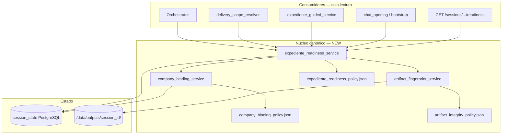
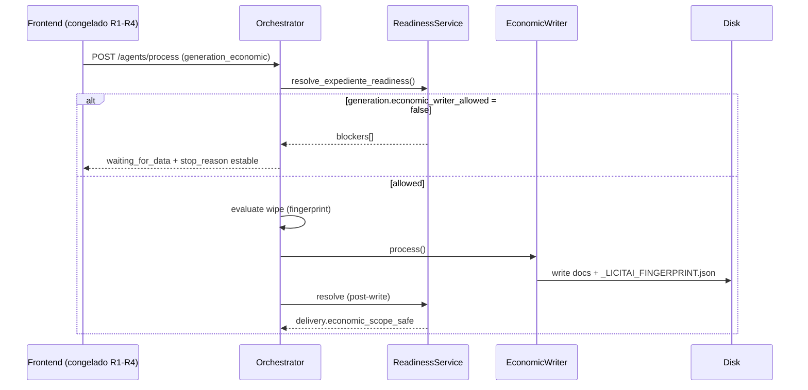
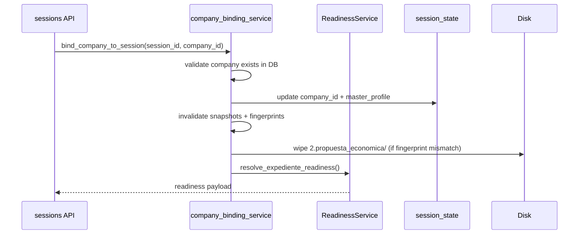

# SPEC + Arquitectura + Plan — Expediente Readiness e Integridad de Artefactos (HRU)

**Versión:** 1.0.0  
**Fecha:** 2026-07-08  
**Estado:** **Release 5 — Backend completo + smoke + playbook + handoff UI (sin implementación frontend)**  
**Normativa:** [`ESTANDAR_ENTERPRISE_CANONICO_HITL.md`](ESTANDAR_ENTERPRISE_CANONICO_HITL.md)  
**Origen:** Incidente piloto `vigilancia_issste` — UI “8/8 validada”, generación pausada, descarga económica con RFC Manavil (jun-2026) mientras admin reflejaba Mayo y Torres (jul-2026).  
**Relacionado:** [`ARTIFACT_LIFECYCLE.md`](ARTIFACT_LIFECYCLE.md), [`generation_mode_policy.json`](../backend/app/contracts/generation_mode_policy.json), [`AGENDA_ANTI_CONTAMINACION_DOCUMENTAL.md`](AGENDA_ANTI_CONTAMINACION_DOCUMENTAL.md), [`SPEC_F5_CONTEXTUAL_DOWNLOAD_POST_GENERATION_HRU.md`](SPEC_F5_CONTEXTUAL_DOWNLOAD_POST_GENERATION_HRU.md)

---

## 0. Acuerdo operativo

| Regla | Descripción |
|-------|-------------|
| **R0** | Este documento se libera **antes** de cualquier implementación. |
| **R1–R5** | Implementación **backend + tests + oracles** únicamente. **Sin cambios de UI** hasta Release 5. |
| **Reporte** | Cada release cerrado se comunica con: alcance, archivos, tests verdes, criterios CA cumplidos. |
| **HRU** | Sin hardcode por licitación; políticas versionadas JSON; mensajes UX en contratos; un CTA por paso (cuando UI se reactive). |
| **Decisión técnica** | Prioridad absoluta: **integridad empresa + artefactos** sobre features conversacionales o guided UX. |

### Mapa de releases

| Release | Entregable | UI |
|---------|------------|-----|
| **R0** | SPEC + arquitectura + plan (este doc) | — |
| **R1** | Contrato `expediente_readiness_v1` + servicio + policy JSON + tests oracle | — |
| **R2** | `company_binding_service` + invalidación sesión al cambiar empresa | — |
| **R3** | `artifact_fingerprint` + wipe por mismatch + eliminar atajos `already_materialized` | — |
| **R4** | Gates orquestador + delivery integrity + oracle CONTAM01 | — |
| **R5** | Integración API (sessions, downloads, agents) + smoke E2E backend + playbook | **Reactivación UI** (fuera de alcance R1–R4) |

---

## 1. Resumen ejecutivo

### 1.1 Problema

LicitAI tiene **múltiples fuentes de verdad** que compiten:

1. `expediente_guided_service` (barra P0, “8/8 validada”)
2. `economic_capture_matrix_service` + `pending_questions`
3. `tasks_completed.economic_proposal` + `stage_completed:economic`
4. `generation_state.jobs` (orquestador)
5. Archivos en disco `/data/outputs/{session_id}/`

Cuando divergen, el usuario puede:

- Ver cotización “lista” con generación **pausada**
- Descargar documentos de **otra empresa** y **otra fecha**
- Arrastrar inputs de **otra licitación** (FSR/GYN) en sesión ISSSTE

### 1.2 Solución

Introducir **`expediente_readiness_v1`**: capa canónica única que responde, de forma determinista:

- ¿Está la empresa correctamente ligada a la sesión?
- ¿Está la captura económica completa (matriz + motor HITL)?
- ¿Puede el orquestador ejecutar cada writer?
- ¿Son seguros los artefactos en disco para entrega?

**Ningún módulo** calcula “listo” por su cuenta; **todos leen readiness**.

### 1.3 Principio rector HRU

> Separar verdad de negocio de opinión del modelo: una representación canónica auditable, precedencia explícita, HITL transaccional, procedencia visible — **incluyendo integridad de archivos materializados**.

---

## 2. Especificaciones funcionales

### 2.1 REQ-INT-1 — Verdad canónica de readiness

#### User stories

| ID | Como… | Quiero… | Para… |
|----|--------|---------|-------|
| US-INT-1.1 | Orquestador | Consultar un solo payload antes de cada writer | No ejecutar generación incoherente |
| US-INT-1.2 | API descargas | Saber si los archivos en disco son entregables | No ofrecer Manavil con Mayo seleccionado |
| US-INT-1.3 | Chat bootstrap | Recibir blockers honestos | No prometer descarga si hay pausa |
| US-INT-1.4 | Auditor | Ver procedencia y fingerprint por scope | Trazabilidad forense |

#### Comportamiento requerido

1. Servicio **`resolve_expediente_readiness(session_state, *, company_profile=None, session_output_path=None)`** retorna dict conforme a `expediente_readiness_v1.json`.
2. Campos obligatorios del payload: ver §4.1.
3. **`error_type` estable** por blocker (lista cerrada en policy).
4. Función **idempotente**: mismos inputs → mismo output.
5. Sin LLM en readiness (100 % determinista).

#### Criterios de aceptación

- [ ] **CA-INT-1.1:** Tests oracle con ≥12 fixtures (ver §7.1) — todos verdes.
- [ ] **CA-INT-1.2:** `expediente_guided_service`, orquestador y `delivery_scope_resolver` **delegan** a readiness (R4); no duplican lógica.
- [ ] **CA-INT-1.3:** Payload incluye `provenance_ui` por blocker principal.

---

### 2.2 REQ-INT-2 — Company binding transaccional

#### User stories

| ID | Como… | Quiero… | Para… |
|----|--------|---------|-------|
| US-INT-2.1 | Usuario | Cambiar empresa en sesión | Que todo lo económico previo quede invalidado |
| US-INT-2.2 | Sistema | Rechazar `company_id` huérfano | No generar con perfil inexistente |
| US-INT-2.3 | Operador | Ver blocker `COMPANY_BINDING_INVALID` | Saber que debe re-seleccionar empresa |

#### Comportamiento requerido

1. **`bind_company_to_session(session_id, company_id)`** (API interna + endpoint):
   - Valida existencia en tabla `companies`.
   - Persiste `company_id` + `master_profile` fresco de DB.
   - Invalida: snapshot económico stale, `stage_completed:economic` como fuente de “validada”, fingerprint de artefactos.
   - Marca outputs económicos como **stale** (no entregables hasta regeneración).

2. **Precedencia única** (documentada en `company_binding_policy.json`):

   ```
   Usuario UI (company_id válido) > companies.master_profile (DB)
   > session.master_profile (solo si binding_valid)
   > NUNCA inferencia LLM
   ```

3. Orquestador **deja de** hidratar `company_id` huérfano desde sesión sin validar DB.

#### Criterios de aceptación

- [ ] **CA-INT-2.1:** Cambio Mayo ↔ Manavil invalida entrega económica.
- [ ] **CA-INT-2.2:** `company_id` inexistente → `readiness.company_binding.binding_valid=false`.
- [ ] **CA-INT-2.3:** Test: sesión con ID huérfano → blocker explícito.

---

### 2.3 REQ-INT-3 — Fingerprint de artefactos e integridad

#### User stories

| ID | Como… | Quiero… | Para… |
|----|--------|---------|-------|
| US-INT-3.1 | EconomicWriter | Escribir manifiesto lateral por corrida | Trazabilidad por archivo |
| US-INT-3.2 | Sistema | Wipe selectivo al cambiar fingerprint | No mezclar empresas en disco |
| US-INT-3.3 | Descargas | Listar solo archivos con fingerprint válido | Evitar CONTAM01 |

#### Comportamiento requerido

1. **Fingerprint de corrida** (`artifact_fingerprint_v1`):

   ```json
   {
     "schema_version": "artifact_fingerprint_v1",
     "company_id": "...",
     "company_rfc": "...",
     "bases_fingerprint": "...",
     "economic_snapshot_hash": "...",
     "generation_job_id": "...",
     "materialized_at": "ISO-8601"
   }
   ```

2. Persistencia:
   - Sesión: `session_state.artifact_fingerprints_v1` (mapa `scope → fingerprint`).
   - Disco: `_LICITAI_FINGERPRINT.json` en raíz de cada scope writer (`2.propuesta_economica/`, etc.).

3. **Wipe policy revisada** (`artifact_integrity_policy.json`):
   - Cambio de fingerprint → wipe del scope afectado **sin excepción** por `blocked`.
   - `preserve_artifacts_when_job_blocked` solo aplica si fingerprint **coincide**.

4. **Eliminar** (R3):
   - `_economic_writer_already_materialized` como atajo a `done`.
   - Promoción `blocked → done` por presencia de archivos (orquestador L2598–2604, L3138–3141).

5. **Gate post-writer (opcional R4, mínimo R4):** extracción determinista de RFC desde DOCX generado vs `company_rfc`.

#### Criterios de aceptación

- [ ] **CA-INT-3.1:** Archivos jun-2026 + empresa jul-2026 → `delivery.economic_scope_safe=false`.
- [ ] **CA-INT-3.2:** Regeneración económica tras binding nuevo materializa archivos con fingerprint nuevo.
- [ ] **CA-INT-3.3:** Oracle **CONTAM01** verde.

---

### 2.4 REQ-INT-4 — Captura económica honesta (consolidación)

#### Comportamiento requerido

1. **`capture.ready`** = matriz completa **Y** `motor_pending_count == 0` **Y** inputs no contaminados por tender ajeno.
2. **`generation.economic_writer_allowed`** = `capture.ready` **Y** snapshot `economic_proposal` coherente **Y** binding válido.
3. Deprecar señal independiente `_economic_validated()` basada solo en `stage_completed:economic`.
4. Inputs legacy FSR (`sar`, `imss`, …) **no cuentan** si `triage_context` / policy indica vertical ≠ FSR.

#### Criterios de aceptación

- [ ] **CA-INT-4.1:** Sesión ISSSTE con inputs GYN no reporta `capture.ready=true`.
- [ ] **CA-INT-4.2:** `economic_price_source` pendiente → `capture.ready=false`.

---

### 2.5 REQ-INT-5 — Entrega contextual segura

#### Comportamiento requerido

1. `delivery_scope_resolver` consulta readiness:
   - Si `delivery.{scope}_scope_safe == false` → lista vacía + `empty_reason` ∈ `artifact_fingerprint_mismatch` | `company_contamination` | `job_blocked`.
2. **Regla crítica:** `artifact_count > 0` **no implica** entrega segura.
3. Mensajes UX desde `expediente_readiness_ux_messages.json` (no strings en routes).

#### Criterios de aceptación

- [ ] **CA-INT-5.1:** CONTAM01: archivos viejos presentes → API artifacts económica retorna 0 entregables + reason estable.
- [ ] **CA-INT-5.2:** Tras regeneración válida → artifacts listados con `provenance_ui`.

---

### 2.6 Fuera de alcance (v1 integridad)

| Item | Motivo |
|------|--------|
| Rediseño UI / ExpedienteGuidedStepBar | Release 5+ |
| Nuevos intents chat / routing Excel | Post R5 |
| Multi-empresa por sesión | Futuro |
| Validación PDF página por página CompraNet | Incremento futuro |
| Reescritura completa orquestador | Solo gates + delegación readiness |

---

## 3. Arquitectura objetivo

### 3.1 Diagrama de capas



### 3.2 Flujo de decisión — generación económica



### 3.3 Flujo — cambio de empresa



### 3.4 Componentes nuevos (backend)

| Módulo | Ruta | Responsabilidad |
|--------|------|-----------------|
| Policy readiness | `backend/app/contracts/expediente_readiness_policy.json` | error_types, reglas capture/generation/delivery |
| Schema readiness | `backend/app/contracts/expediente_readiness_v1.json` | JSON Schema del payload |
| UX readiness | `backend/app/contracts/expediente_readiness_ux_messages.json` | Mensajes humanos por error_type |
| Policy binding | `backend/app/contracts/company_binding_policy.json` | Precedencia, invalidaciones |
| Policy integridad | `backend/app/contracts/artifact_integrity_policy.json` | Wipe, fingerprint, scopes |
| Servicio readiness | `backend/app/services/expediente_readiness_service.py` | Resolver canónico |
| Servicio binding | `backend/app/services/company_binding_service.py` | Bind + invalidate |
| Servicio fingerprint | `backend/app/services/artifact_fingerprint_service.py` | Hash, compare, persist |
| Gate contaminación RFC | `backend/app/services/artifact_contamination_gate.py` | Extracción RFC DOCX vs binding |

### 3.5 Componentes modificados (sin UI)

| Módulo | Cambio |
|--------|--------|
| `orchestrator.py` | Pre-gates vía readiness; eliminar atajos materialized |
| `generation_wipe_policy.py` | Wipe condicionado a fingerprint |
| `delivery_scope_resolver.py` | Entrega segura vía readiness |
| `expediente_guided_service.py` | Delegar flags a readiness (backend only; UI congelada) |
| `economic_capture_matrix_service.py` | Namespace/tender guard para inputs |
| `sessions.py` | `POST .../bind-company`, `GET .../readiness` |
| `downloads.py` | Filtrar por fingerprint válido |

### 3.6 Precedencia de datos (única, todo el sistema)

| Prioridad | Fuente | Uso |
|-----------|--------|-----|
| 1 | Override usuario (`economic_user_inputs`, chat ack) | Captura HITL |
| 2 | Documento normalizado (Excel, PDF cotización) | Ingesta |
| 3 | `companies.master_profile` (DB) | Identidad legal materialización |
| 4 | Catálogo / compliance_master_list | Requisitos |
| 5 | Inferencia LLM/RAG | Solo donde no hay regla verificable |

**Regla integridad:** capa 3 (DB) **siempre gana** sobre `session.master_profile` stale en **generación y entrega**.

---

## 4. Contratos

### 4.1 Payload `expediente_readiness_v1` (resumen)

```json
{
  "schema_version": "expediente_readiness_v1",
  "policy_version": "1.0.0",
  "session_id": "vigilancia_issste",
  "evaluated_at": "2026-07-08T22:00:00Z",
  "company_binding": {
    "company_id": "co_1780079004578",
    "company_rfc": "CMT160107S83",
    "company_label": "Comercializadora Mayo y Torres",
    "binding_valid": true,
    "orphan_company_id": false,
    "session_profile_stale": false
  },
  "capture": {
    "matrix_filled": 8,
    "matrix_total": 8,
    "motor_pending_count": 1,
    "motor_pending_fields": ["economic_price_source"],
    "cross_tender_contamination": false,
    "ready": false
  },
  "generation": {
    "technical_writer_allowed": true,
    "formats_allowed": false,
    "economic_writer_allowed": false,
    "packager_allowed": false,
    "blockers": [
      {
        "error_type": "ECONOMIC_PRICE_SOURCE_PENDING",
        "scope": "capture",
        "field": "economic_price_source",
        "provenance_ui": { "source": "pending_questions", "badge": "HITL" }
      }
    ]
  },
  "delivery": {
    "technical_scope_safe": true,
    "economic_scope_safe": false,
    "admin_scope_safe": true,
    "blockers": [
      {
        "error_type": "ARTIFACT_FINGERPRINT_MISMATCH",
        "scope": "economic",
        "provenance_ui": { "source": "disk", "detail": "SPI060200AG5 vs CMT160107S83" }
      }
    ]
  },
  "artifact_fingerprints": {
    "economic": {
      "expected": { "company_rfc": "CMT160107S83", "..." : "..." },
      "on_disk": { "company_rfc": "SPI060200AG5", "materialized_at": "2026-06-06T03:18:00Z" },
      "match": false
    }
  },
  "recommended_action": {
    "error_type": "BIND_COMPANY_AND_REGENERATE_ECONOMIC",
    "cta_kind": "api",
    "cta_id": "BIND_COMPANY"
  }
}
```

### 4.2 Catálogo `error_type` (v1, cerrado)

| error_type | Scope | Bloquea |
|------------|-------|---------|
| `COMPANY_BINDING_INVALID` | binding | generación + entrega |
| `COMPANY_ORPHAN_ID` | binding | generación + entrega |
| `SESSION_PROFILE_STALE` | binding | entrega económica |
| `ECONOMIC_CAPTURE_INCOMPLETE` | capture | economic_writer |
| `ECONOMIC_PRICE_SOURCE_PENDING` | capture | economic_writer |
| `ECONOMIC_MOTOR_HITL_PENDING` | capture | economic_writer |
| `ECONOMIC_CROSS_TENDER_INPUTS` | capture | economic_writer |
| `ECONOMIC_SNAPSHOT_MISSING` | generation | economic_writer |
| `ECONOMIC_SNAPSHOT_STALE` | generation | economic_writer |
| `FORMATS_DATA_INCOMPLETE` | generation | formats |
| `DOCUMENT_QUALITY_GATE_PENDING` | generation | formats/technical |
| `ARTIFACT_FINGERPRINT_MISMATCH` | delivery | descarga scope |
| `ARTIFACT_RFC_CONTAMINATION` | delivery | descarga scope |
| `GENERATION_JOB_BLOCKED` | generation | scope afectado |
| `GENERATION_NOT_RUN` | delivery | descarga scope |

Mensajes UX: **`expediente_readiness_ux_messages.json`** — una plantilla por `error_type`.

---

## 5. Plan de implementación

### 5.1 Release 1 — Readiness core (3–4 días)

**Archivos nuevos:**
- `contracts/expediente_readiness_policy.json`
- `contracts/expediente_readiness_v1.json`
- `contracts/expediente_readiness_ux_messages.json`
- `services/expediente_readiness_service.py`
- `tests/oracle/test_expediente_readiness_oracle.py`
- `tests/fixtures/expediente_readiness/oracle_cases.json`

**Tareas:**
1. Implementar resolver determinista (capture, generation, delivery preliminar sin RFC scan).
2. Delegación mínima: solo tests + endpoint `GET /sessions/{id}/readiness`.
3. Fixtures derivados de incidente `vigilancia_issste` (anonimizados).

**CA release:** CA-INT-1.1, CA-INT-4.1, CA-INT-4.2.

**Reporte:** lista tests + ejemplo payload JSON real.

---

### 5.2 Release 2 — Company binding (2–3 días)

**Archivos nuevos:**
- `contracts/company_binding_policy.json`
- `services/company_binding_service.py`
- `tests/test_company_binding_service.py`

**Tareas:**
1. `bind_company_to_session` con invalidación de snapshot/fingerprint.
2. Endpoint `POST /sessions/{id}/bind-company`.
3. Orquestador: validar binding antes de generación.

**CA release:** CA-INT-2.1, CA-INT-2.2, CA-INT-2.3.

---

### 5.3 Release 3 — Artifact fingerprint + wipe (3–4 días)

**Archivos nuevos:**
- `contracts/artifact_integrity_policy.json`
- `services/artifact_fingerprint_service.py`
- `tests/test_artifact_fingerprint_service.py`
- `tests/test_generation_wipe_fingerprint.py`

**Tareas:**
1. Calcular `economic_snapshot_hash` determinista.
2. Escribir/leer `_LICITAI_FINGERPRINT.json`.
3. Revisar `generation_wipe_policy.py` — wipe on mismatch.
4. **Eliminar** atajos `_economic_writer_already_materialized → done`.

**CA release:** CA-INT-3.1, CA-INT-3.2.

---

### 5.4 Release 4 — Gates orquestador + entrega + CONTAM01 (3–4 días)

**Archivos nuevos/modificados:**
- `services/artifact_contamination_gate.py`
- `tests/oracle/test_artifact_contamination_oracle.py`
- Modificar: `orchestrator.py`, `delivery_scope_resolver.py`, `downloads.py`, `expediente_guided_service.py`

**Tareas:**
1. Pre-gate writers con `readiness.generation.*_allowed`.
2. `delivery_scope_resolver`: entrega segura; fix `artifact_count > 0` falso positivo.
3. Oracle **CONTAM01** en CI.
4. Flag `EXPEDIENTE_GUIDED_ENABLED=false` por defecto hasta R5.

**CA release:** CA-INT-5.1, CA-INT-5.2, CA-INT-3.3, CA-INT-1.2.

---

### 5.5 Release 5 — Integración + smoke + playbook (2–3 días)

**Tareas:**
1. Smoke script: `scripts/smoke_expediente_readiness_integrity.py`
2. Actualizar `DEPLOY_HARDENING_PLAYBOOK.md` — factory reset sesión, rollback.
3. Actualizar `ARTIFACT_LIFECYCLE.md` — cambio empresa como disparador wipe.
4. Regresión completa backend: `pytest tests/oracle/test_expediente_readiness_oracle.py tests/test_company_binding* tests/test_artifact* tests/test_generation_wipe* tests/oracle/test_artifact_contamination*`
5. **Documento handoff UI** (spec separado, no implementación): qué debe consumir frontend cuando se reactive.

**CA release:** todos los CA §2.

**Reporte final:** tabla releases + comandos smoke + criterios piloto ISSSTE.

---

## 6. Estrategia de pruebas

### 6.1 Oracle fixtures (mínimo 12)

| ID | Escenario | readiness esperado |
|----|-----------|-------------------|
| OR-01 | Sesión limpia, sin captura | capture.ready=false |
| OR-02 | Matriz 8/8, sin pending | capture.ready=true |
| OR-03 | Matriz 8/8 + economic_price_source | capture.ready=false |
| OR-04 | Inputs GYN en sesión ISSSTE | cross_tender_contamination=true |
| OR-05 | company_id huérfano | binding_valid=false |
| OR-06 | Binding Mayo, disco Manavil jun-06 | delivery.economic_scope_safe=false |
| OR-07 | Binding Mayo, disco Mayo post-write | delivery.economic_scope_safe=true |
| OR-08 | formats blocked | generation.formats_allowed=false |
| OR-09 | Cambio empresa mid-session | fingerprint mismatch → wipe |
| OR-10 | preserve_artifacts blocked same fingerprint | no wipe |
| OR-11 | preserve_artifacts blocked diff fingerprint | wipe |
| OR-12 | **CONTAM01** — archivos viejos + empresa nueva | API artifacts vacía + reason |

### 6.2 Smoke E2E backend (sin UI)

```powershell
docker-compose exec backend pytest tests/oracle/test_expediente_readiness_oracle.py -q
docker-compose exec backend python scripts/smoke_expediente_readiness_integrity.py --session vigilancia_issste_mayo_v1
```

### 6.3 Regla CI

Nuevo job **`integrity-gate`**: oracle readiness + CONTAM01 deben pasar antes de merge a rama piloto.

---

## 7. Operación — factory reset sesión (playbook preview)

Procedimiento documentado en R5 (no ejecutar en producción sin backup):

1. `POST /sessions/{id}/bind-company` con empresa válida.
2. `POST /sessions/{id}/wipe-generated-outputs?scopes=economic` (endpoint existente o nuevo).
3. Limpiar `economic_user_inputs` cross-tender vía policy.
4. Verificar `GET /sessions/{id}/readiness` → blockers esperados.
5. Re-análisis si bases invalidadas.

**Sesión piloto recomendada:** `vigilancia_issste_mayo_v1` (nueva, sin arrastrar jun-2026).

---

## 8. Riesgos y mitigaciones

| Riesgo | Mitigación |
|--------|------------|
| Romper regresiones orquestador | Oracle fixtures + tests existentes en CI |
| Wipe agresivo borra trabajo válido | Fingerprint match preserva; tests OR-10 |
| RFC scan DOCX frágil | Gate opcional v1; fingerprint es línea principal |
| Scope creep UI | UI congelada contractualmente hasta R5 handoff |
| Sesiones legacy irreparables | Factory reset + sesión nueva piloto |

---

## 9. Handoff UI (Release 5 — solo documentación)

Cuando backend esté verde, frontend deberá:

1. Consumir **`GET /sessions/{id}/readiness`** como única fuente de blockers.
2. Llamar **`POST /sessions/{id}/bind-company`** al cambiar `<select>` empresa.
3. Eliminar lógica local de “8/8 validada” / latches duplicados.
4. `ScopeDownloadBlock`: mostrar blockers de `delivery.*_scope_safe`.
5. Reactivar `EXPEDIENTE_GUIDED_ENABLED` solo tras sign-off.

**Spec UI detallado:** se generará en R5 como `SPEC_UI_READINESS_INTEGRATION_HRU.md` — **no antes**.

---

## 10. Aprobación y siguiente paso

| Item | Estado |
|------|--------|
| SPEC funcional | ✅ Release 0 |
| Arquitectura | ✅ Release 0 |
| Plan implementación R1–R5 | ✅ Release 0 |
| Implementación | ⏳ Inicia Release 1 |
| UI | 🔒 Congelada hasta Release 5 |

**Próximo reporte al usuario:** **Release 1 liberado** — contrato JSON + servicio readiness + oracle tests verdes.

---

*Documento generado como parte del programa de remediación estructural HRU — LicitAI piloto ISSSTE.*
