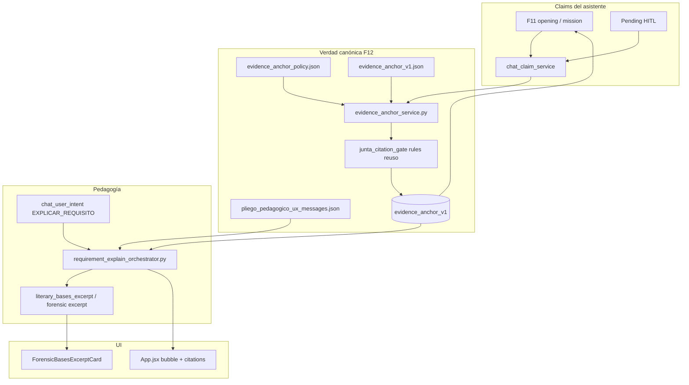

# SPEC + Arquitectura + Plan — Anclas de evidencia en chat y pedagogía conversacional del pliego (HRU)

**Versión:** 1.0.0  
**Fecha:** 2026-07-08  
**Decisión de producto:** F12 — el asistente **señala el pliego** (página + párrafo) y **aclara requisitos por partes** sin presuponer que el usuario leyó las bases  
**Normativa:** [`ESTANDAR_ENTERPRISE_CANONICO_HITL.md`](ESTANDAR_ENTERPRISE_CANONICO_HITL.md)  
**Predecesores:** [`SPEC_CONVOCATORIA_BRIEFING_AND_UNIFIED_CHAT_OPENING_HRU.md`](SPEC_CONVOCATORIA_BRIEFING_AND_UNIFIED_CHAT_OPENING_HRU.md) (F11), [`SPEC_DUAL_STREAM_GENERATION_AND_CHAT_COPILOT_COMPLETO_HRU.md`](SPEC_DUAL_STREAM_GENERATION_AND_CHAT_COPILOT_COMPLETO_HRU.md) (F6–F10)  
**Relacionado:** [`CONTRATO_COLA_CHAT_UNIVERSAL.md`](CONTRATO_COLA_CHAT_UNIVERSAL.md), [`SUPER_ISSUE_CHAT_INTENCION_Y_UX_CONVERSACIONAL.md`](SUPER_ISSUE_CHAT_INTENCION_Y_UX_CONVERSACIONAL.md), `junta_citation_gate.py`, `forensic_risk_bases_excerpt_service.py`

---

## 0. Resumen ejecutivo

### 0.1 Problema

F11 unificó la apertura («qué pide la convocante» + cotización primero). El cliente confirma el orden, pero el usuario **no ha leído las bases**. Hoy el chat:

1. Afirma requisitos **sin página** («Las bases piden cerrar la cotización…» es copy de política, no cita del PDF).
2. Trata «no te entiendo / ¿a qué te refieres…?» como **`AYUDA` de captura** (pide un número), no como **aclaración del pliego**.
3. Tiene infra forense de citas (Chroma, `bases_excerpt_v1`, junta) **desconectada** del canal de apertura/misión HITL.

**Esto no se corrige con un string más en Gate 5.** Requiere **verdad canónica de ancla**, **fail-closed en claims** y un **intent/orquestación de pedagogía**.

### 0.2 Decisión (experto)

Implementar **F12 — Pliego Pedagógico Anclado (HRU)** en dos pilares inseparables:

| Pilar | Qué es | Por qué es de fondo |
|-------|--------|---------------------|
| **A. Evidence Anchor** | Contrato `evidence_anchor_v1` + política de claims | Toda afirmación «la convocante pide X» lleva locus verificable o se degrada honestamente |
| **B. Explain Requirement** | Intent `EXPLICAR_REQUISITO` + orquestador pedagógico | Confusión post-briefing abre diálogo por partes **con cita**, sin empujar captura |

**Principio rector:** *No afirmar el pliego sin señalarlo; no empujar un dato hasta que el usuario sepa qué es.*

**Fuera de alcance F12:** reescribir análisis LLM de compliance; mapas por convocante; sustituir junta de aclaraciones (es otro canal: licitante → convocante).

### 0.3 Resultado esperado para el licitante

**Mensaje de pedido (punto 1):**

```
Para armar la cotización, las bases piden el precio por operario/zona
(ver p. 27 · «Integración del precio unitario…»).

**Siguiente paso:** escribe un precio… o di «muéstrame el párrafo».
```

**Card / acción:** «Ver párrafo en las bases — pág. 27» → `ForensicBasesExcerptCard`.

**Diálogo (punto 2):**

> Usuario: *no te entiendo, ¿a qué te refieres con “cerrar la cotización”?*  
> Asistente: *Voy por partes. En el pliego (pág. N, numeral/bloque…), la convocante exige… [extracto]. En la práctica yo te pido el importe por zona/operario. ¿Quieres el párrafo completo o el ejemplo de la primera zona?*

---

## 1. Especificaciones funcionales

### 1.1 User stories

| ID | Como… | Quiero… | Para… |
|----|--------|---------|-------|
| US-12.1 | Licitante que no leyó bases | Ver **página exacta** cuando el asistente diga que la convocante pide X | Ir al PDF o pedir el párrafo |
| US-12.2 | Licitante | Pulsar / pedir **«muéstrame el párrafo»** y ver el extracto en chat | Entender el requisito a cabalidad |
| US-12.3 | Licitante confundido | Decir «no te entiendo / vayamos por partes» y recibir **explicación**, no un empujón a cotizar | Dilucidar juntos el requisito |
| US-12.4 | Coordinador | Misma ancla (`provenance_ui`) en chat, panel y card de excerpt | Una sola verdad |
| US-12.5 | Auditor | Distinguir ancla **verificada** vs **insuficiente** (nunca página sintética como real) | Confianza forense |
| US-12.6 | Operador | Oracle/smoke HRU sin strings de convocante | Universalidad |

### 1.2 REQ-A — Ancla de evidencia en cada claim de convocante

#### 1.2.1 Contrato canónico `evidence_anchor_v1`

```json
{
  "schema_version": "evidence-anchor-v1.0.0",
  "source_name": "LA-….pdf",
  "page": 27,
  "snippet": "Integración del precio unitario mensual y diario…",
  "numeral_hint": "6.3",
  "annex_hint": "Anexo 9A",
  "anchor_quality": "verified",
  "verification": {
    "method": "substring_on_page",
    "passed": true
  },
  "provenance_ui": {
    "source": "bases_document",
    "page": 27,
    "label": "Bases · p. 27"
  }
}
```

**`anchor_quality` (obligatorio):**

| Valor | Significado | Visible al usuario |
|-------|-------------|-------------------|
| `verified` | Página int ≥ 1 + snippet/literal verificable en corpus de esa página | «Bases · p. N» |
| `document_only` | Hay documento/anexo pero no página cerrada | «Según el pliego (sin página localizada aún)» |
| `insufficient` | No hay ancla real | **No** afirmar «las bases piden…» como hecho localizado; copy degradado |
| `synthetic` | Ancla fabricada (legacy `page=1` inventado) | **Prohibido** en copy de claim; se trata como `insufficient` |

#### 1.2.2 Cascada de construcción de ancla

```
Usuario override HITL (futuro)
  > original_item / pending verificado
  > compliance item (page|pagina + snippet)
  > session_line_items evidence
  > briefing.blocks[].provenance_ui.page_refs + corpus match
  > RAG top-hit verificado por junta_citation_gate rules
  > insufficient
```

**Nunca:** `_ensure_chat_anchor` con página inventada contabiliza como `verified`.

#### 1.2.3 Superficies que DEBEN emitir ancla

| Superficie | Comportamiento |
|------------|----------------|
| Apertura F11 (`reason_plain` / first_action) | Si hay ancla `verified` → insertar «(Bases · p. N)»; si no → reason degradado sin fingir lectura del PDF |
| Mission / pending económico-técnico | Toda instrucción «necesito X porque las bases…» lleva ancla o degradación |
| `blocking_items` price_source | Reusar path con `page_number` + snippet; unificar a `evidence_anchor_v1` |
| Briefing canónico | Popular `page_refs` reales; `recommended_first_action.evidence_anchor` obligatorio (puede ser `insufficient`) |
| Panel Delivery «Qué pide la convocante» | Badge de páginas por bloque cuando existan |

#### 1.2.4 Mostrar párrafo a demanda

1. Intent/markers: existentes (`_detect_support_evidence_intent`) + CTA sugerida **«muéstrame el párrafo» / «ver en bases»**.
2. Handler preferente: usar ancla del **pending o briefing activo** → `fetch_bases_excerpt_v1` / `fetch_page_documents(page)`.
3. Respuesta adjunta `bases_excerpt_v1` (+ `evidence_anchor_v1`).
4. UI: `ForensicBasesExcerptCard` en **App.jsx** (ya existe).
5. Renderizar también `citations[]` en el bubble principal (hoy se persisten y no se pintan).

**Fail-closed:** sin ancla `verified`/`document_only` no inventar excerpt; mensaje UX: *«Aún no localicé la página exacta; ¿quieres que busque en el índice por palabra clave?»*.

#### 1.2.5 Criterios de aceptación REQ-A

- [ ] **CA-12.A1:** Apertura con first_action económico y ancla verified incluye `p. N` en el mensaje visible.
- [ ] **CA-12.A2:** Con `anchor_quality=insufficient`, el copy **no** dice «en las bases (pág. …)» ni página 1 falsa.
- [ ] **CA-12.A3:** Pedido «muéstrame el párrafo» tras pending anclado entrega `bases_excerpt_v1.page == anchor.page`.
- [ ] **CA-12.A4:** Oracle ≥ 4 casos (verified, document_only, insufficient, synthetic→treated_as_insufficient).
- [ ] **CA-12.A5:** Cero hardcode ISSSTE/IMSS en policy/UX.
- [ ] **CA-12.A6:** `App.jsx` muestra citations o card excerpt cuando la API las envía.

### 1.3 REQ-B — Pedagogía conversacional (dilucidar requisito)

#### 1.3.1 Nuevo intent: `EXPLICAR_REQUISITO`

En `UserChatIntent` + policy JSON (`chat_explain_requirement_policy.json`):

**Disparadores (deterministas, ordenados):**

1. Markers de confusión (`no te entiendo`, `no entiendo`, `explícame`, `a qué te refieres`, `vayamos por partes`, `qué significa`) **y**
2. Uno de:
   - referencia a frase reciente del asistente (entre comillas o eco parcial del briefing),
   - tokens de bases/pliego/convocante/requisito/cotización/sobre,
   - ancla activa en sesión (`last_chat_claim_anchor_v1`).

**Precedencia (sustituye el bug actual AYUDA > bases):**

```
EXPLICAR_REQUISITO  >  PREGUNTAR_BASES  >  AYUDA(captura)
escape HITL evidencia  >  captura DATA_INTAKE
```

`AYUDA` queda para: “cómo escribo el precio / sintaxis / tabla”, **no** para “qué es este requisito”.

#### 1.3.2 Orquestador pedagógico `RequirementExplainOrchestrator`

Pasos (máx. 1 turno, Gate 5 extendido ≤ 5 líneas + excerpt opcional):

1. **Reconocer** la confusión en llano.
2. **Descomponer** el claim en 2–3 partes: (a) qué pide la convocante, (b) dónde está, (c) qué te pido yo ahora.
3. **Anclar** con `evidence_anchor_v1` + excerpt corto si verified.
4. **Ofrecer elección:** «¿te muestro el párrafo completo / el primer concepto a cotizar / otro requisito?».
5. **No** exigir número en el mismo turno salvo que el usuario ya lo pida.

#### 1.3.3 Estado de sesión

```json
{
  "last_chat_claim_v1": {
    "claim_id": "briefing.first_action",
    "plain_text": "Las bases piden cerrar la cotización…",
    "evidence_anchor": { "...": "..." },
    "uttered_at": "ISO-8601"
  },
  "explain_requirement_turn": {
    "active": true,
    "step": "parts",
    "parent_claim_id": "briefing.first_action"
  }
}
```

Cada mensaje del asistente que haga un claim de convocante **persiste** `last_chat_claim_v1` (auditable).

#### 1.3.4 Early router

- `_route_early_user_intent` **debe** despachar `EXPLICAR_REQUISITO` y `PREGUNTAR_BASES`.
- Batería de utterances en `chat_intent_utterances_battery.json` (casos de confusión + bases).

#### 1.3.5 Criterios de aceptación REQ-B

- [ ] **CA-12.B1:** «no te entiendo… ¿a qué te refieres con "Las bases piden cerrar la cotización"?» → `EXPLICAR_REQUISITO`, **no** `AYUDA`/`economic_help_pending`.
- [ ] **CA-12.B2:** Respuesta contiene explicación por partes + referencia a página **o** degradación honesta.
- [ ] **CA-12.B3:** Con pending económico activo, explicar **no** bloquea cola; deja pendiente vivo pero no exige número en ese turno.
- [ ] **CA-12.B4:** Tras explicación, usuario puede seguir con captura **o** pedir párrafo.
- [ ] **CA-12.B5:** «cómo escribo el precio» sigue siendo `AYUDA` de captura (regresión consciente).

### 1.4 Fuera de alcance F12

- Traducir el PDF entero a chatbot.
- Cross-session memory de “preguntas frecuentes” por convocante.
- Sustituir junta de aclaraciones.
- Rediseño visual completo del chat.

---

## 2. Arquitectura

### 2.1 Diagrama



### 2.2 Componentes nuevos

| Archivo | Responsabilidad |
|---------|-----------------|
| `contracts/evidence_anchor_v1.json` | Esquema |
| `contracts/evidence_anchor_policy.json` | Calidad, fail-closed, mapeo fuentes |
| `contracts/chat_explain_requirement_policy.json` | Markers intent + precedencia vs AYUDA |
| `contracts/pliego_pedagogico_ux_messages.json` | Copy llano (pedido con página, degradación, por partes) |
| `services/evidence_anchor_service.py` | Normalizar / verificar / merge anclas |
| `services/chat_claim_service.py` | Emitir claim + persistir `last_chat_claim_v1` |
| `services/requirement_explain_orchestrator.py` | Flujo pedagógico |
| `services/pliego_pedagogico_ux.py` | Render plantillas |
| `tests/oracle/test_evidence_anchor_oracle.py` | Regresión |
| `tests/test_explain_requirement_intent.py` | Precedencia intents |
| `scripts/smoke_pliego_pedagogico_hru.py` | Smoke piloto |

### 2.3 Componentes modificados

| Archivo | Cambio |
|---------|--------|
| `chat_user_intent.py` | `EXPLICAR_REQUISITO`; reordenar help vs explain vs bases |
| `chatbot_rag.py` | Early route; anexar ancla a respuestas; matar path AYUDA que traga confusión de requisito; desactivar ancla sintética como verified |
| `economic.py` | `_ensure_chat_anchor` marca `synthetic` / no verified |
| `convocatoria_briefing_service.py` | First action + blocks con `evidence_anchor` |
| `convocatoria_briefing_ux.py` | Plantillas con «Bases · p. N» |
| `chat_opening_orchestrator.py` | Persistir `last_chat_claim_v1` al abrir |
| `App.jsx` | Render `citations` + CTA “ver párrafo” si hay ancla |
| `pilot_onprem_policy.json` | Contratos F12 + smoke |
| `settings.py` | Flags `EVIDENCE_ANCHOR_ENABLED`, `EXPLAIN_REQUIREMENT_ENABLED` |

### 2.4 Feature flags

| Variable | Default piloto | Efecto |
|----------|----------------|--------|
| `EVIDENCE_ANCHOR_ENABLED` | `true` | Emite anclas en claims |
| `EXPLAIN_REQUIREMENT_ENABLED` | `true` | Intent + orquestador pedagógico |
| Combinación `false` | — | F11 + F10 sin regresión de captura |

### 2.5 Relación con reuso forense

| Capacidad existente | Reuso F12 |
|---------------------|-----------|
| `junta_citation_gate` | Verificación substring/tokens en página |
| `forensic_risk_bases_excerpt_service` | Payload `bases_excerpt_v1` |
| `VectorDbService.fetch_page_documents` | Lectura página exacta |
| `ForensicBasesExcerptCard` | UI párrafo |
| F11 briefing | Superficie que ahora **obliga** ancla en first_action |

**No** reinventar indexación; **sí** unificar el contrato hacia el chat.

### 2.6 Precedencia de intents (normativa)

```
1. Mid-answer DATA_INTAKE numérico / TSV explícito
2. EXPLICAR_REQUISITO
3. Support evidence («muéstrame el párrafo»)
4. PREGUNTAR_BASES
5. AYUDA (sintaxis de captura)
6. COTIZAR / CAPTURAR_TECNICO / RESPONDER_PENDIENTE
7. UNKNOWN → RAG / pipeline
```

---

## 3. Plan de implementación

### Fase F12.1 — Contrato de ancla + verificación (3–4 días)

| # | Tarea | DoD |
|---|--------|-----|
| 1 | Schema + policy + UX messages | Contratos versionados |
| 2 | `evidence_anchor_service` (normalize, verify_on_corpus, quality) | Unit tests |
| 3 | Refactor: pendientes económicos / briefing first_action emiten ancla | Oracle A |
| 4 | Eliminar efecto “verified” de anclas synthetic | CA-12.A2 |

### Fase F12.2 — Copy + excerpt a demanda (2–3 días)

| # | Tarea | DoD |
|---|--------|-----|
| 1 | Plantillas F11/misión con «Bases · p. N» | CA-12.A1 |
| 2 | Handler «muéstrame el párrafo» desde ancla activa | CA-12.A3 |
| 3 | `App.jsx`: citations + CTA si hay ancla | CA-12.A6 |
| 4 | DeliveryPanel: páginas en card briefing | Paridad |

### Fase F12.3 — Intent + orquestador pedagógico (3–4 días)

| # | Tarea | DoD |
|---|--------|-----|
| 1 | `EXPLICAR_REQUISITO` + battery utterances | Intent tests |
| 2 | `RequirementExplainOrchestrator` + early route | CA-12.B1–B2 |
| 3 | Persistencia `last_chat_claim_v1` | Auditoría |
| 4 | Separar AYUDA captura vs explicación | CA-12.B5 |

### Fase F12.4 — Operación y sign-off (1–2 días)

| # | Tarea | DoD |
|---|--------|-----|
| 1 | Smoke `smoke_pliego_pedagogico_hru.py` | Verde |
| 2 | Pilot policy + ENV_VARS + `.env.example` | Flags documentados |
| 3 | Actualizar PILOT_SIGNOFF + playbook rollback | Operable |
| 4 | Validación UI en `vigilancia_issste` | Aceptación cliente |

### Estimación total

**9–13 días** de ingeniería enfocada (1 dev), tras F11 estable.

### Orden de merge

```
F12.1 → F12.2 → validación UI anclas → F12.3 → F12.4 → commit
```

**No** mezclar F12.3 sin F12.1: explicar sin ancla = pedagogía vacía.

### Riesgos y mitigación

| Riesgo | Mitigación |
|--------|------------|
| Compliance sin `page` en muchos ítems | Degradación `insufficient` + búsqueda RAG verificada opcional; no inventar |
| Excerpt lento / vacío | Timeout + mensaje honesto; cache por `(session, page, snippet_hash)` |
| AYUDA legítima rota | Battery: «cómo escribo el precio» vs «no entiendo el requisito» |
| Gate 5 demasiado corto | Modo `pedagogy_mode` ≤ 5 líneas (documentado, como briefing F11) |
| Falsos positivos intent | Require confusión **y** (claim reciente **o** tokens pliego) |

### Rollback

1. `EXPLAIN_REQUIREMENT_ENABLED=false`
2. `EVIDENCE_ANCHOR_ENABLED=false`
3. Sesiones: claims sin ancla se comportan como F11 (sin páginas).

---

## 4. Relación con F11 y trabajo previo

| Artefacto | Destino F12 |
|-----------|-------------|
| F11 briefing / opening | Gana anclas reales; `reason_plain` deja de ser claim “desnudo” |
| `_detect_support_evidence_intent` | Se convierte en CTA de primer clase |
| `_handle_user_confusion_help` | Solo sintaxis captura; confusión de requisito → F12.3 |
| `junta_citation_gate` | Reuso para verification |
| Spec F11 CA provenance | Se endurece: page_refs dejan de ser cosméticos vacíos |

---

## 5. Checklist ENTERPRISE_CANONICO_HITL

- [ ] Esquema `evidence_anchor_v1` versionado + merge/idempotencia por claim_id
- [ ] `anchor_quality` estable (error_type / quality signals)
- [ ] UX centralizado (JSON), cero jerga interna
- [ ] Cascada de precedencia de ancla documentada en un solo servicio
- [ ] `provenance_ui` en claim, excerpt y panel
- [ ] HITL: usuario aclara sin perder pending; puede corregir entendimiento
- [ ] Smoke + flags + rollback
- [ ] Cero hardcode por convocante

---

## 6. Criterio de “listo para cliente”

En sesión real de servicios (vigilancia) **sin** leer el PDF de antemano:

1. Apertura muestra **3 bloques + primer paso + página** (o degradación honesta).
2. Usuario pregunta «no te entiendo…»; recibe **partes + cita**, no «escribe el número».
3. Usuario dice «muéstrame el párrafo»; ve **card con texto y pág. N**.
4. Luego cotiza sin contradicciones de mensaje.

Si alguno falla, F12 no está cerrado aunque los tests unitarios pasen.

---

## 7. Próximo paso de código (cuando se autorice)

Comenzar **F12.1** (contratos + `evidence_anchor_service` + cableado al first_action del briefing) antes de tocar intents de AYUDA.

*Documento listo para ejecución. Commit del spec cuando el usuario autorice.*
