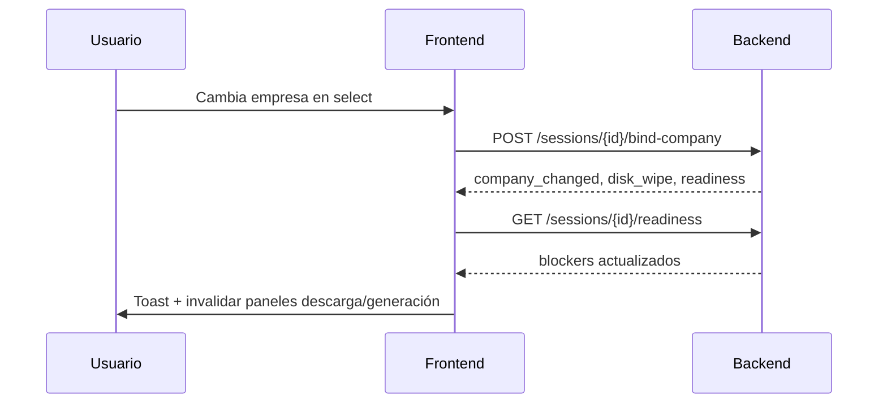

# SPEC UI — Integración Readiness e Integridad (HRU)

**Versión:** 1.0.0  
**Fecha:** 2026-07-08  
**Estado:** **Handoff R5 — documentación únicamente (sin implementación frontend)**  
**Normativa:** [`ESTANDAR_ENTERPRISE_CANONICO_HITL.md`](ESTANDAR_ENTERPRISE_CANONICO_HITL.md)  
**Backend:** [`SPEC_EXPEDIENTE_READINESS_AND_INTEGRITY_HRU.md`](SPEC_EXPEDIENTE_READINESS_AND_INTEGRITY_HRU.md)

---

## 0. Propósito

Este documento define **qué debe consumir el frontend** cuando se reactive la UI del expediente, sin duplicar lógica de negocio. Toda decisión de «listo / bloqueado / descargable» proviene del backend vía **`expediente_readiness_v1`**.

**Regla HRU:** el frontend **muestra** blockers y procedencia; **no calcula** readiness localmente.

---

## 1. Endpoints canónicos

| Endpoint | Uso UI | Frecuencia |
|----------|--------|------------|
| `GET /api/v1/sessions/{id}/readiness` | Fuente única de blockers, flags de generación y entrega | Al cargar sesión; tras bind-company; tras captura chat; tras generación |
| `POST /api/v1/sessions/{id}/bind-company` | Cambio de empresa en selector | Al confirmar `<select>` empresa |
| `GET /api/v1/downloads/artifacts?scope=` | Lista descargable honesta | Panel descargas; modal por alcance |
| `GET /api/v1/sessions/{id}/expediente-guided` | Barra P0 (opcional, flag) | Solo si `EXPEDIENTE_GUIDED_ENABLED=true` |

### 1.1 Payload readiness — campos UI críticos

```json
{
  "schema_version": "expediente_readiness_v1",
  "company_binding": {
    "company_id": "co_…",
    "company_rfc": "CMT160107S83",
    "company_label": "Mayo y Torres",
    "binding_valid": true,
    "orphan_company_id": false,
    "session_profile_stale": false
  },
  "capture": {
    "matrix_filled": 8,
    "matrix_total": 8,
    "motor_pending_count": 0,
    "ready": true
  },
  "generation": {
    "technical_writer_allowed": true,
    "formats_allowed": true,
    "economic_writer_allowed": true,
    "packager_allowed": false,
    "blockers": []
  },
  "delivery": {
    "technical_scope_safe": true,
    "admin_scope_safe": true,
    "economic_scope_safe": false,
    "blockers": []
  },
  "recommended_action": {
    "error_type": "REGENERATE_ECONOMIC",
    "cta_kind": "api",
    "cta_id": "REGENERATE_ECONOMIC"
  }
}
```

---

## 2. Eliminar lógica duplicada en frontend

### 2.1 Deprecar / no usar como fuente de verdad

| Patrón legacy | Sustituto |
|---------------|-----------|
| `expediente_guided_v1.economic_validated_at` como «validada» | `generation.economic_writer_allowed` |
| Conteo local matriz 8/8 | `capture.ready` + `capture.matrix_filled/total` |
| `generation_state.jobs` para habilitar descarga | `delivery.*_scope_safe` + `artifacts` API |
| Inferir empresa de `master_profile` en sesión sin bind | `company_binding.binding_valid` |
| Mostrar archivos en disco sin gate | `readiness_integrity_blocked` en artifacts |

### 2.2 Flags de entorno UI

| Variable | Piloto post-R5 | Comportamiento |
|----------|----------------|----------------|
| `READINESS_GATES_ENABLED` | `true` (backend) | Siempre asumir activo en prod |
| `EXPEDIENTE_GUIDED_ENABLED` | `false` → `true` tras sign-off | Barra P0 delegada a readiness |

**No reactivar `EXPEDIENTE_GUIDED_ENABLED` hasta:** smoke R5 verde + UAT bind-company + descarga bloqueada CONTAM01.

---

## 3. Flujos UI por componente

### 3.1 Selector de empresa



**UX obligatorio:**
- Si `company_changed=true`: mensaje «Se invalidaron artefactos económicos previos».
- Refrescar matriz captura, cola generación y lista descargas.
- Mostrar `company_binding.provenance_ui` (badge empresa activa + RFC).

### 3.2 Barra expediente guiada (P0)

Cuando `EXPEDIENTE_GUIDED_ENABLED=true`:

| Paso UI | Condición readiness |
|---------|---------------------|
| `bases` | `!analysis_done` |
| `cotizacion` | `!capture.ready` |
| `validar_economica` | `capture.ready && !generation.economic_writer_allowed` |
| `plan_documentos` | snapshot/plan pendiente (sin cambio R5) |
| `materializar` | `generation.economic_writer_allowed` |

**CTA primario:** derivar de `recommended_action.cta_id` cuando exista blocker principal.

### 3.3 Panel generación (Fuentes / Crear archivos)

| Botón | Gate |
|-------|------|
| Generar técnica | `generation.technical_writer_allowed` |
| Generar formatos | `generation.formats_allowed` |
| Generar económica | `generation.economic_writer_allowed` |
| Empaquetar | `generation.packager_allowed` |

Si bloqueado: mostrar **un** mensaje de `expediente_readiness_ux_messages` vía `blockers[0].message` (backend ya resuelve texto).

### 3.4 Descargas contextuales (F5.2)

Consumir `GET /downloads/artifacts?scope=technical|economic|full`:

| Campo | UI |
|-------|-----|
| `ready` | Habilitar botones descarga |
| `artifact_count` | Contador honesto (0 si contaminado) |
| `readiness_integrity_blocked` | Banner de advertencia |
| `empty_reason` | Clave estable para i18n/fallback |
| `empty_reason_message` | Texto usuario (centralizado backend) |
| `artifacts[].provenance_ui` | Badge job_id + tooltip |

**Anti-bypass:** no construir URLs `/downloads/file` manualmente sin pasar por lista artifacts.

---

## 4. Procedencia visible (badges)

Alinear semántica visual chat ↔ paneles:

| Badge | Fuente |
|-------|--------|
| Empresa activa | `company_binding.company_label` + RFC |
| Captura matriz | `capture.matrix_filled/matrix_total` |
| Motor HITL pendiente | `capture.motor_pending_count` |
| Artefacto stale | `delivery.blockers` tipo `ARTIFACT_FINGERPRINT_MISMATCH` |
| Job pausado | `generation.blockers` tipo `GENERATION_JOB_BLOCKED` |

Tooltips: usar `message` del blocker, nunca `error_type` crudo.

---

## 5. Mensajes UX — reglas

1. **Prohibido** mostrar al usuario: `INCOMPLETE_*`, `MISSING_*`, `READINESS_GATE_BLOCKED`, códigos SQL/HTTP.
2. **Permitido** mostrar: texto de `expediente_readiness_ux_messages.json` interpolado.
3. Un blocker principal visible; secundarios en panel expandible «Ver detalles».
4. Mismo copy en chat bootstrap y panel lateral (coherencia HRU).

---

## 6. Criterios de aceptación UI (sign-off)

| ID | Criterio |
|----|----------|
| CA-UI-1 | Cambiar empresa invalida descarga económica hasta regenerar |
| CA-UI-2 | «8/8 validada» solo si `capture.ready && generation.economic_writer_allowed` |
| CA-UI-3 | CONTAM01: panel económico vacío + mensaje fingerprint mismatch |
| CA-UI-4 | Generación pausada en backend = botón deshabilitado + razón legible |
| CA-UI-5 | Badge RFC visible en header sesión = `company_binding.company_rfc` |
| CA-UI-6 | Cero referencias a `expediente_guided_v1.economic_validated_at` en lógica |

---

## 7. Orden de implementación frontend sugerido

1. Hook `useExpedienteReadiness(sessionId)` — poll tras eventos chat/generación.
2. Integrar bind-company en selector empresa existente.
3. Refactor panel descargas → artifacts API + banners integridad.
4. Desacoplar contadores matriz del estado «validada».
5. Reactivar barra P0 (`EXPEDIENTE_GUIDED_ENABLED`) en staging.
6. UAT sesión limpia `vigilancia_issste_mayo_v1`.

---

## 8. Referencias

- Backend readiness: `backend/app/services/expediente_readiness_service.py`
- UX blockers: `backend/app/contracts/expediente_readiness_ux_messages.json`
- Smoke R5: `backend/scripts/smoke_expediente_readiness_integrity.py`
- Playbook operación: `DEPLOY_HARDENING_PLAYBOOK.md` §10
